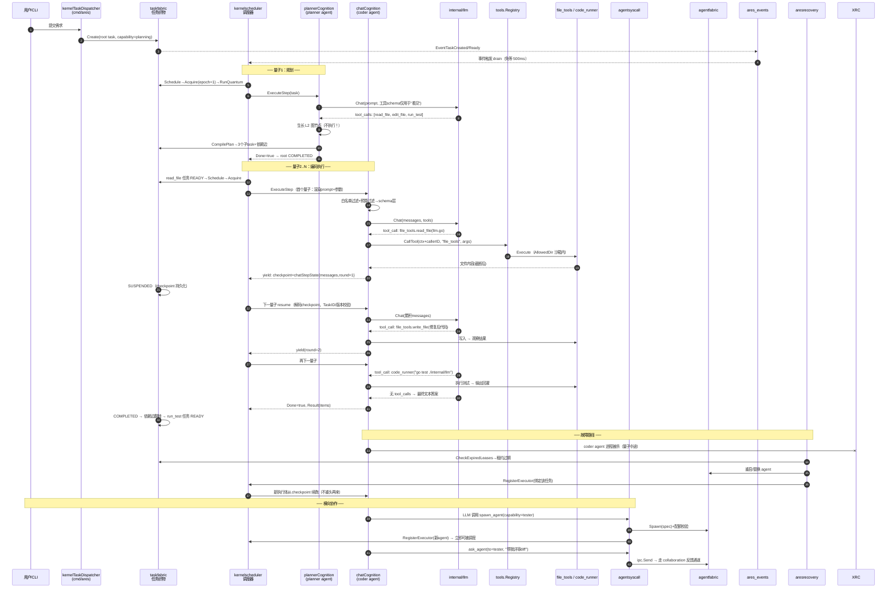

# ARES AgentOS 整体架构与数据流解析

> 基于代码库实际探索整理（分支 dev，2026-09）。项目定位：**"Agent 即操作系统进程"** —— Agent 不是被编排的工作流节点，而是被调度的进程。

---

# 一、整体架构

ARES 是一个 **"Agent 操作系统"**：Agent 不是被编排的工作流节点，而是被调度的进程。整个项目分为 6 层：

```mermaid
flowchart TB
    subgraph L1["① 入口层"]
        SDK["sdk/ 库模式<br/>rt.NewAgent().Run()"]
        CLI["cmd/ares<br/>serve / peer 模式（内核进程）"]
    end

    subgraph L2["② 装配层"]
        BOOT["ares_bootstrap<br/>组件注册·依赖装配·降级"]
        CONF["ares_config<br/>ares.yaml（agent/kernel/tools/memory）"]
    end

    subgraph L3["③ 内核层（Kernel Pillars）"]
        TF["taskfabric 任务织物<br/>Task 状态机·Lease+Epoch fencing<br/>DAG 就绪·事件溯源"]
        WF["workflow/engine 图引擎<br/>MutableDAG = L1能力图 ∪ L2执行图<br/>GraphEventHub·DAGPatchExecutor"]
        PP["planprojection 图→任务编译<br/>CompileCoordinator<br/>SubscribeGraphEvents→ApplyChange/Reconcile"]
        AF["agentfabric Agent织物<br/>Spawn/Suspend/Resume/Retire/Kill<br/>资源配额·治理(governance)"]
        KS["kernelscheduler 调度器<br/>drain 循环：Schedule→Acquire→RunQuantum"]
        IPC["agentipc 通信总线<br/>Send/Request/Reply/Delegate/Handoff"]
        SY["agentsyscall 系统调用<br/>spawn_agent/create_task/ask_agent"]
        RC["aresrecovery 恢复<br/>租约过期重排·checkpoint 续跑·agent 重启"]
    end

    subgraph L4["④ 认知层（Cognition = 可恢复的执行体）"]
        CHAT["chatCognition<br/>每量子=1轮ReAct"]
        PLAN["plannerCognition<br/>生长 L2 计划图，不执行工具"]
        SUB["sub cognition<br/>子 Agent 执行体"]
        LOOP["agentloop.Engine<br/>SDK 路径的整循环 ReAct"]
    end

    subgraph L5["⑤ 工具/资源层"]
        REG["tools/resources/core.Registry"]
        BUILTIN["builtin: file_tools·code_runner·web·<br/>knowledge·memory·planning·pdf..."]
        DISC["discovery: discover_tools 元工具<br/>运行时按需扩工具集"]
        MCP["ares_mcp：外部 MCP server 工具"]
        SK["ares_skills：SKILL.md 渐进披露"]
    end

    subgraph L6["⑥ 服务与存储层"]
        LLM["internal/llm（OpenAI 兼容 Chat/Stream）"]
        MEM["ares_memory 会话记忆"]
        EV["ares_events 事件存储（EventSourcing）"]
        EXP["ares_experience 经验蒸馏/置信度回灌"]
        DB[("Postgres / SQLite / 文件")]
    end

    SDK --> BOOT
    CLI --> BOOT
    CONF --> BOOT
    BOOT --> L3
    CLI -->|"任务提交"| TF
    KS -->|"ReadyTasks 消费"| TF
    KS -->|"候选池"| AF
    KS -->|"RunQuantum 驱动"| L4
    SY -->|"spawn/create_task"| AF
    SY -->|"create_task"| TF
    AF <--> IPC
    RC -->|"僵尸租约回收"| TF
    RC -->|"替换执行体注入"| KS
    PLAN -->|"AddNode 生长 L2 图"| WF
    WF -->|"GraphEvent(seq/drop)"| PP
    PP -->|"CompileNode/SetDependencies"| TF
    CHAT -->|"Chat+tools"| LLM
    CHAT -->|"CallTool"| REG
    LOOP --> LLM
    LOOP --> REG
    REG --> BUILTIN & DISC & MCP & SK
    CHAT & LOOP -->|"事件写入"| EV
    CHAT -->|"消息持久化"| MEM
    EV --> DB
    EXP -->|"confidence 先验"| KS
```



**关键设计不变量**（散落在各包注释中，非常一致）：

| 不变量 | 实现位置 |
|---|---|
| 无领导者调度："B 完成→C 就绪"由织物状态机推导，不靠中心编排 | `kernelscheduler/scheduler.go:21-29` |
| 执行量子（quantum）可恢复：yield 时 checkpoint 持久化，resume 从断点续跑 | `taskfabric/quantum.go:48`、`chat_cognition.go:190` |
| Epoch fencing：过期持有者不能驱动已易主的任务 | `fabric.go:267 Acquire` / `ownerLocked` |
| 协作式抢占（不做 OS 式硬抢占） | `fabric.go:570 Preempt` |
| 规划者不执行工具，只生长图；生长受 `DefaultMaxPlanDepth=10` 上限约束 | `planner_cognition.go:18-22`（`NewPlannerCognition` `:110`） |
| syscall 的调用者身份来自 `kernelctx`，绝不信任 LLM 参数 | `chat_cognition.go:473-476` |

> **当前主线边界（实事求是）**：L2 会话图执行体（`plannerCognition`/`routerCognition`/`rootCognition`/`SessionRegistry` 按 SessionID 建/查/释放会话图、`taskfabric/reaper.go` 回收终态任务）**都已落地并接线**，但生产在 `DAGExecution` 闸门之后——`kernel.dag_execution.enabled` 默认为 **false**（`Go` 零值），故**默认分支仍是 `chatCognition` ReAct**。开闸后 peer 才按 `ares/root + tool/<name> + ares/answer` 广告全量 capability、并以 `ares/plan` 能力路由到 planner。**下文路径 B 的"规划→生长→编译→调度"描述的是开闸后的主线形态**，不是默认分支。

---

# 二、两条执行路径

同一个项目里有**两条并行的执行通路**，共享工具层和 LLM 层：

**路径 A — SDK 库模式**（单进程内跑完）：

```
sdk/agent.go:138 Agent.Run()
  → buildMessages()          # system + 记忆/知识上下文 + 用户输入
  → resolveTools()           # LLM 工具定义 + 执行器 + (可选)运行时扩工具器
  → agentloop.Engine.Run()   # internal/agentloop/engine.go
      for round < MaxIter {
          LLM.Generate(messages, tools)
          if 无 tool_calls → 最终答案，break
          执行每个 tool → 观察结果 append 为 tool message
      }
  → 事件写 EventStore、消息写 Memory、返回 Result
```

**路径 B — Kernel 模式**（`cmd/ares` peer/serve，Agent 即进程）：

```
任务提交 → taskfabric.Create → READY
Scheduler.Run (scheduler.go:307) 每 500ms 或事件触发 → drain (scheduler.go:442)
  对每个 READY/SUSPENDED 任务（并发≤32，工作窃取）：
    execute (scheduler.go:586)
      → 候选池 = agentfabric 活体 IDLE agents（+ recovery 绑定执行体）
      → Fabric.Schedule (fabric.go:523)：打分 = capability重叠 × (1-load) × confidence
      → Acquire 拿 lease(epoch) → 心跳续租
      → RunQuantum (quantum.go:48)：驱动 Cognition 执行【一步】
          Done      → COMPLETED
          出错      → FAILED / 按重试策略回 READY
          未完成    → SUSPENDED + checkpoint 持久化 → 下个 drain 周期续跑
```

路径 B 的妙处在于：**一次 LLM 调用 + 一轮工具执行 = 一个量子**，任务在量子边界让出（yield），进程崩溃/被杀/预算耗尽后，`aresrecovery` 用 checkpoint 在别的 agent 上原地续跑——这就是"Agent 可被调度、可被恢复"的 OS 语义。

---

# 三、数据流：编码 Agent 具体场景

场景：**"把 `internal/llm` 里的超时 bug 修掉，并补一个回归测试"**，以 Kernel 模式（多 Agent 协作）为主线，标注 SDK 差异。



## 逐步拆解（含精确代码位置）

**① 提交与就绪**
`cmd/ares` 的 dispatcher 把用户需求包成 root `Task{Capability:"ares/plan", Payload:{...}}` 写入 `taskfabric`（规划任务路由到 planner；默认闸门关时则直接由 `chatCognition` 承接）。`Create`（`fabric.go:211`）落状态机并广播 `EventTaskCreated`。调度器订阅了 `Created/Ready/Completed/Failed/Yielded` 五类事件（`scheduler.go:361-370`），所以**依赖一满足就立刻 drain**，不用等轮询——这就是"DAG 完成是事件驱动的"。

**② 规划量子（plannerCognition，capability = `ares/plan`）**
`planner_cognition.go`（`NewPlannerCognition` `:110`）明确契约：planner **每量子只调一次 LLM**，拿到 tool_calls 后**不执行**，而是把每个调用 `AddNode` 进 L2 会话图（节点 = 一次工具执行）；前驱工具的输出按 `节点ID=任务ID` 从对应 fabric 任务的 checkpoint envelope 里 join 出来，作为后继的上下文输入。图的生长是**事件驱动**的：`workflow/engine.GraphEventHub` 发 `ChangeAddNode/AddEdge` 事件 → `planprojection.CompileCoordinator.SubscribeGraphEvents` → `ApplyChange`（增量）创建任务、`Reconcile`（对账补偿 seq 跳号/丢事件）补全；`CompileNode`/`SetDependencies`（`fabric.go:920`）落到 `taskfabric`。会话图生命周期由 `SessionRegistry` 按 `models.Task.SessionID` 建/查/释放。节点无工具调用时生长 `ares/answer` 终答节点，会话终止。生长深度上限 `DefaultMaxPlanDepth=10`。

**③ 编码量子（chatCognition）——数据流的心脏**
`chat_cognition.go:190 ExecuteStep` 每个量子的精确步骤：

1. **解码 checkpoint**（`:200`）：`task.Payload["checkpoint"]` 里是 `chatStepState{SchemaVersion, TaskID, Messages, Round, ToolUses...}`；版本不符或 TaskID 不匹配**拒绝续跑**（`:295-300`），防止串台。
2. **工具可见性三层闸门**（`:317-358`）：先按进化策略的**白名单**过滤 schema（LLM 根本"看不见"越权工具），再按**每工具预算** `ToolBudget` 剔除已耗尽的工具；两者全空时回退全集（避免功能性死路）。
3. **一次 Chat 调用**（`:373`）：`c.chatClient.Chat(ctx, st.Messages, llmTools, params)` → `internal/llm` → OpenAI 兼容 API。
4. **无 tool_calls** → `parseRecommendResult` 解析最终文本 → `Done=true` → 任务 COMPLETED（`:379-383`）。
5. **有 tool_calls** → 逐个执行（`:395-459`）：
   - 预算内先计数再执行（失败也扣预算，`:415-421`）；
   - `executeToolCall`（`:465`）把 **caller 身份盖进 ctx**（`kernelctx.WithCallerID`），syscall 据此强制 provenance，LLM 伪造参数无效；
   - 结果 JSON 化为 `role:"tool"` 消息追加进 `st.Messages`；
   - 全程发 `EventToolCallStarted/Completed`（含 success/error/arg_shape），供轨迹分析与进化反馈。
6. **yield**（`:262-266`）：`StepOutcome{Checkpoint: st}` → `RunQuantum` 把任务置 SUSPENDED、checkpoint 经 `CheckpointEnvelope` 重新包裹（保住 UserProfile 等提交元数据，`scheduler.go:756-766`）→ 下个 drain 周期 re-acquire 续跑。**累积的对话历史就是"进度"**，所以多轮工具循环可以跨进程重启存活。

**④ 工具执行（编码动作真正发生的地方）**
`file_tools`（`builtin/file/file_tools.go:217`）提供 read/write/list，注册时 `WithAllowedDir` 沙箱限定目录、阻断路径穿越；`code_runner`（`builtin/execution/code_runner.go:88`）执行代码，Python 默认禁用需显式开启。注册入口 `builtin.go:84 RegisterGeneralTools`，每个工具带 tag（domain/side_effects/mutates_state），供 discovery 与策略层做能力匹配。

**⑤ 横向协作（syscall 层）**
`agentsyscall/syscall.go` 把三个 OS 隐喻原语暴露成 LLM 可见工具：
- `spawn_agent`：经配额/能力校验后 `agentfabric.Spawn`（`lifecycle.go:69`）造一个**带真实执行体**的 peer（`cognitionFunc` 把 Executor 适配成 Cognition，`:82-94`），并 `RegisterExecutor` 进调度器——下一拍它就能接活；
- `create_task`：直接向任务织物投递子任务（分解）；
- `ask_agent`：经 `agentipc` 总线向目标 agent 发消息，落入 collaboration 反馈源。

**⑥ 故障恢复（数据流不断）**
agent 被杀/卡死 → `CheckExpiredLeases`（`fabric.go:474`）发现租约过期 → 任务回 READY（checkpoint 仍在）→ `aresrecovery` 重启 agent 或注入**绑定该任务的替换执行体**（`scheduler.go:599-616` 的 boundExecutor 逻辑，防止替换体劫持别的任务）→ 新执行体从 SUSPENDED 的 `chatStepState` 原地续跑。winner 死在候选构建与执行之间时，调度器按三档策略处理（release / release+nominate recovery / 等 TTL，`scheduler.go:716-753`）。

**⑦ 结果回流与经验闭环**
COMPLETED 时 `RunQuantum` 保留 checkpoint（worker result），dispatcher 订阅 `EventTaskCompleted` 读回真实结果返回用户；`ares_experience` 蒸馏成功轨迹，`LoadTracker`/`ConfidenceSource`（`ares_skills` 注入调度器）把历史成功率作为先验注入下次打分——**同类任务以后会优先派给更擅长的 agent**。

**⑧ 终态回收（Reaper）**
`taskfabric` 纯内存，`CompileNode`/`CompilePlan` 每生长一个图节点就建一个任务，若不回收则任务数与图大小在 server 生命周期内单调增长。`taskfabric/reaper.go` 的 `Reaper.Sweep()` 周期性收割已 `COMPLETED/FAILED` 的终态任务，把内存织物拉回有界。**这是 L2 运行时生长的内存护栏，和 `SessionRegistry` 释放会话图是同一件事的两面**。

## SDK 路径的差异（一句话版）

`agent.Run()`（`sdk/agent.go:138`）把上面 ②③⑥ 全部折叠进 `agentloop.Engine.Run()` 的**单进程 for 循环**：没有 lease、没有 checkpoint 持久化、没有跨进程恢复，但工具白名单/预算/事件发射语义一致（`engine.go:139-163` 的 Engine 与 `chatCognition` 是同构的两套实现——前者面向库用户，后者面向内核调度）。

---

**总结一句**：这个架构的核心数据流是 **"意图 → 任务织物状态机 → 调度器量子 → 认知体一步 LLM+工具 → checkpoint 回写"** 的循环；LLM 的对话历史被当作可持久化的进程状态来对待，于是 agent 获得了 OS 进程才有的三件事——**被调度、被抢占、死后原地复活**。
