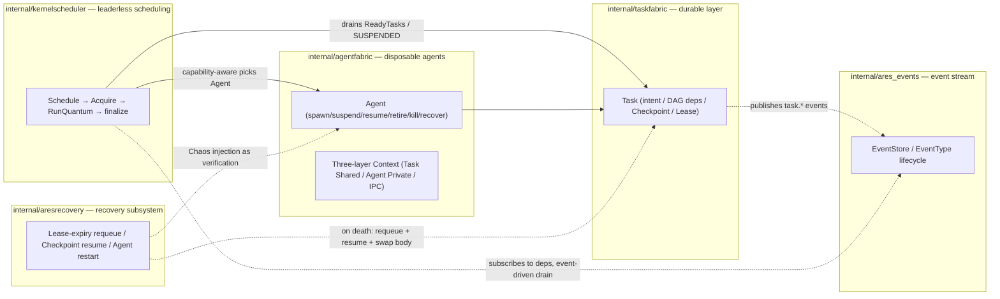
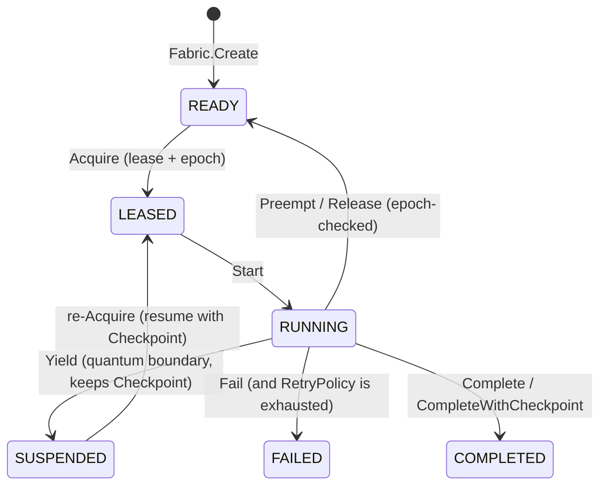

# ares Series: Building Your Own Agent Framework When You're Bored (0.3.1)

> I've always believed the best way to learn is to build your own wheel.
> Not because the wheels out there aren't good enough — but because once you've built one, you'll never get stuck by one again.

---

## Prologue

This is the opening post of what will become a series. The kind of writing where thoughts run free. I asked the admins if I could promote my own project — they said yes, so here I am, shamelessly self-promoting :rofl:

Let's start with some small talk.

AI has moved fast in the last two years. Agents are everywhere now. But here's the question: **how do *you* learn about agents?**

In this era of the AI revolution, not learning means falling behind. But learning? Work is already exhausting enough without forcing yourself to study new stuff after hours. My initial thought was: if you can't beat 'em, join 'em. But then I thought: **screw it, I'll just design my own.**

## A Quick Look Back

I'm not exactly the model employee who quietly churns out code, hhh. So yeah, my career hasn't been smooth sailing :rofl:

My first real encounter with agents was last year when I co-founded a **Music AI** startup with a friend. I designed the architecture myself, hand-crafted a music tool that could split audio by track and process each layer independently. What I wanted wasn't your typical AIGC — it was **restoration and enhancement**. Think of how AI can turn old movies into 4K — we wanted to perfect audio, find the dissonant parts, analyze them, and suggest fixes.

I had the LLM designed and trained — using MLX and PyTorch. But the capital market dried up, and the project died on the vine.

That frustration carried over. I kept learning, building two interactive visualization tools along the way:

- [**Model_explorer**](https://github.com/just-for-dream-0x10/Model_explorer) — interactive visualizations of ML math fundamentals
- [**Transformer_explorer**](https://github.com/just-for-dream-0x10/Transformer_explorer) — interactive Transformer internals

Both were built from my personal study notes. Then I shipped a Rust project to crates.io — good reception, even the foreign devs loved it.

And then came the main character of today's story: **ares**.

## Why Go?

I'm a backend developer by trade. I know Rust and Go.

**Python was ruled out first.** Not because it's bad — but it never felt quite right. The look, the feel, especially the concurrency story: slow, messy, painful.

Then it was a toss-up between Rust and Go:

- **Rust**: I love it. But the compile times are a dealbreaker for rapid iteration.
- **Go**: Clean, blazing fast, concurrency built into its DNA.

There was another reason: some HR person said I didn't know Go, that I had no Go projects. As a developer with professional pride — **I had to choose Go and silence every doubt.**

## From Python Pain to Go Rebirth

Like many others, I started with Python. Built a local knowledge base with vector database + Ollama.

The first time it worked, I was genuinely excited: document chunking, embedding, ingestion, querying... Ollama could actually answer questions about my local notes!

The excitement didn't last.

When I tried to add **tool calling, multi-step reasoning, cross-session memory, multi-agent collaboration** — everything fell apart. Python under concurrency was slow and messy. Memory management was a disaster. Workflow logic devolved into spaghetti code of callbacks and state machines. Every time I wanted to change the flow (add failover, add human-in-the-loop), I had to rewrite half the codebase. Debugging long-running tasks was like chasing ghosts.

I knew: **there has to be a better way.**

Go's simplicity, raw performance, and built-in concurrency primitives caught my eye. So I decided: rewrite the entire agent system from scratch in Go.

**Shedding old baggage, I designed my own agent framework** — that's the origin story of ares.

I started with the basics: LLM calls, simple RAG. But this time, everything felt different:

- **Goroutines** — concurrent agents that are naturally fast and lightweight
- **Strong types + clean interfaces** — designed clearer abstractions from day one
- **Channels and Context** — reliable workflow orchestration and cancellation

## ARES Kernel: Agents Are Disposable, Tasks Are Durable

As the project matured, the architecture settled on one core idea: **Tasks are durable, Agents are disposable (Agent death ≠ Task death).** That capability lives in several real Go modules. Here's how they fit together:



The division of labor (the module names ARE the real `internal/` directories):

| internal package | Responsibility | Key symbols (verified only) |
|------|------------|------------------------------|
| `internal/taskfabric` | Durable task intent + state machine + leases + checkpoints | `Task`, `TaskState` (READY/LEASED/RUNNING/SUSPENDED/COMPLETED/FAILED), `Fabric.Create/Acquire/Start/Yield/Complete/Fail/Renew/Release/Preempt/Schedule`, lease `Epoch` (fencing token), `RetryPolicy`, `ErrEpochMismatch` |
| `internal/agentfabric` | Disposable agent lifecycle + process tree + three-layer Context; **does NOT schedule** | `Fabric`, `spawn/suspend/resume/retire/kill/recover`, `AgentType`, `Cognition`, `SpawnSpec` |
| `internal/kernelscheduler` | "Agents are not orchestrated. They are scheduled." | `Scheduler`, `New`, `Run`, `Schedule→Acquire→RunQuantum→finalize`, `RegisterExecutor/UnregisterExecutor`, `PreemptLowerPriority` (cooperative preemption), `EventStore` event-driven drain |
| `internal/aresrecovery` | Recovery subsystem — proves the Runtime survives agent death | `Recovery`, `RestartPolicy`, `EvolutionAwareSpawner` (evolution-aware spawn gate), Chaos (failure-injection verification) |
| `internal/ares_experience` | Experience distillation | `DistillationService`, `Distill`, `TaskResult → Experience` (success / failure) |
| `internal/ares_events` | Event stream / flight-recorder substrate | `Event`, `EventType` (task.created/ready/acquired/started/yielded/checkpointed/preempted/released/completed/failed/expired/stolen), `EventStore` (Append/Read/Subscribe/StreamVersion) |
| `internal/ares_evolution` | Evolution (strategy state machine) | `StrategyLifecycle`: `CANDIDATE→SHADOW→ACTIVE→DEGRADED`, verification gates + `Submit`, rollback policy |
| `internal/agentipc` | Peer-mesh communication | `Bus`, `Send/Request/Reply/Delegate/Handoff/Subscribe`, broadcast `Broadcast/Unsubscribe`, `Message`, `DeadLetterStore` (bounded FIFO) |
| `internal/ares_bootstrap` + `sdk` | Component assembly + unified entry | `ares_bootstrap.Bootstrap`, `sdk.NewRuntime` |

## Key Mechanisms

### Task State Machine (`internal/taskfabric`)

A Task survives its owner. `TaskState` machine:



Every ownership-carrying operation carries an `Epoch` (fencing token). That's the guard against the classic bug: **"A's lease expired → B acquire → A's late Release" cannot kill B** — A's epoch is stale, so its Release returns `ErrEpochMismatch`.

### Execution Quantum: switching only at boundaries

An LLM agent can't be interrupted at an arbitrary instruction — it only hands control back at quantum boundaries. A task's full path is **Schedule → Acquire → RunQuantum → finalize (COMPLETED / FAILED / SUSPENDED)**. The `kernelscheduler.Scheduler` decides at the boundary whether to continue / suspend / preempt, using `PreemptLowerPriority` for **cooperative** preemption — not OS-style hard preemption.

### Recovery: Agent death ≠ Task death

`internal/aresrecovery.Recovery` wires the Task Fabric (durable tasks + lease expiry + checkpoints) to the Agent Fabric (disposable agents + cognitive state), covering three failure paths:

1. **Lease expiry → requeue**: the dead agent's lease expires; the task returns to READY and another agent can acquire it (`Fabric.CheckExpiredLeases`)
2. **Checkpoint recovery**: a fresh agent resumes the preserved checkpoint (the `SUSPENDED → LEASED` edge above)
3. **Agent restart**: a crashed agent is replaced by a new one that picks up the dead agent's cognitive state

Chaos in `aresrecovery` is a **verification** harness: it injects failures on purpose, then invokes Recovery to prove the Runtime restores the tasks — "Chaos breaks things on purpose; Recovery proves the Runtime survives."

### Experience Distillation (`internal/ares_experience`)

A task's outcome is distilled into a reusable experience. `DistillationService.Distill` takes a `TaskResult`, uses an LLM to extract Problem / Solution / Constraints, and produces a `success` or `failure` `Experience` (`ExperienceTypeSuccess` / `ExperienceTypeFailure`).

### Evolution (`internal/ares_evolution`)

Evolution isn't hand-waving — it's a `StrategyLifecycle` state machine:

```text
CANDIDATE → SHADOW → ACTIVE → DEGRADED → (rollback to previous)
```

Only `Submit(candidate)` can change the active strategy; verification gates run before promotion, and a background watch loop feeds live runtime samples into the rollback policy — degrade and it rolls back. (The exact number of gates and their details are marked as pending verification — 待核实.)

### Event Stream (`internal/ares_events`)

The Task Fabric appends `task.*` events (`EventTaskCreated`, etc.) to an `EventStore` on every state transition, and the Scheduler can subscribe to dependency-relevant events for **event-driven draining** (instead of waiting on the poll tick — though polling remains as the fallback). Appends use `expectedVersion` optimistic concurrency, and each stream has a `StreamHash` for integrity checking.

## Feature Overview

As the project grew I added the following capabilities (all in real code, not slides):

| Feature | Home (real module) | Notes |
|---------|-----------|-------|
| **ARES Kernel** | taskfabric + agentfabric + kernelscheduler | Durable tasks, disposable agents, platform-independent. **Agent death ≠ Task death**; the Kernel doesn't think — "Agent decides; Kernel enforces" |
| **Execution Quantum** | taskfabric (`Yield`) + kernelscheduler | A task = several quanta; control returns at the boundary, the Scheduler decides continue/suspend/preempt |
| **Fencing Token (epoch)** | taskfabric (`Lease.Epoch` / `Acquire`) | Gate against "late Release"; stale operations return `ErrEpochMismatch` |
| **Event System** | ares_events | `EventStore` stream, full `task.*` coverage; Scheduler event-driven drain |
| **Agent IPC** | internal/agentipc | Peer-mesh bus: `Send/Request/Reply/Delegate/Handoff/Subscribe` + broadcast; `DeadLetterStore` bounded FIFO |
| **Experience Distillation** | ares_experience | `Distill` turns TaskResult into success/failure Experiences |
| **Evolution State Machine** | ares_evolution | `StrategyLifecycle`: CANDIDATE→SHADOW→ACTIVE→DEGRADED, with gates + rollback |
| **Recovery Subsystem** | aresrecovery | Lease-expiry requeue + checkpoint resume + agent restart; Chaos as verification |
| **Pluggable stores / MCP / skills** | (related internal packages) | The capability surface exists; item-level detail is out of scope here (待核实) |

## The Craziest Feature: Agent Assassination

I built something a little unhinged — **a feature that randomly assassinates a running agent to see if it can truly resurrect**. This isn't magic; it's the chain assembled above: `CheckExpiredLeases` (lease-expiry requeue) + Agent Fabric lifecycle + Recovery swapping in a new execution body. The real log output looks roughly like this (sample output, not a verbatim match for this version):

```
2026/06/14 19:46:29 INFO arena: killed agent id=agent-1
2026/06/14 19:46:29 INFO orchestrator: agent killed, resurrecting id=agent-1 name="Architecture Review"
2026/06/14 19:46:29 INFO orchestrator: agent started id=agent-6 name="Architecture Review"
2026/06/14 19:46:29 INFO orchestrator: resuming agent from step id=agent-6 resume_from=agent-1 start_step=4 total_steps=3
```

> The `arena`/`orchestrator` identifiers shown above are from older/evolved text; don't treat them as the current modules' exact API. For verification, rely on `internal/ares_arena` and `internal/ares_runtime` (待核实).

## Final Thoughts

If you're going through a rough patch, I hope this story encourages you. **Be kind to yourself, keep shipping, embrace change.**

---

## 0.3.1 Update Notes

- **Version**: the repo's `VERSION` file is currently `0.3.1`
- **Leader/Sub is not the main path**: there is no central orchestrator in the Kernel; scheduling is done by `kernelscheduler.Scheduler` (`PolicyLegacy` stays only as a library constant in `agentipc`, for dual-track verification)
- **Communication is peer-mesh**: `internal/agentipc.Bus` six primitives — see the second article of the series
- **Recovery and evolution are real modules**: `aresrecovery` + `ares_evolution`, not concepts

The core philosophy hasn't changed: **Agents are disposable, Tasks are durable. Agent death ≠ Task death.**