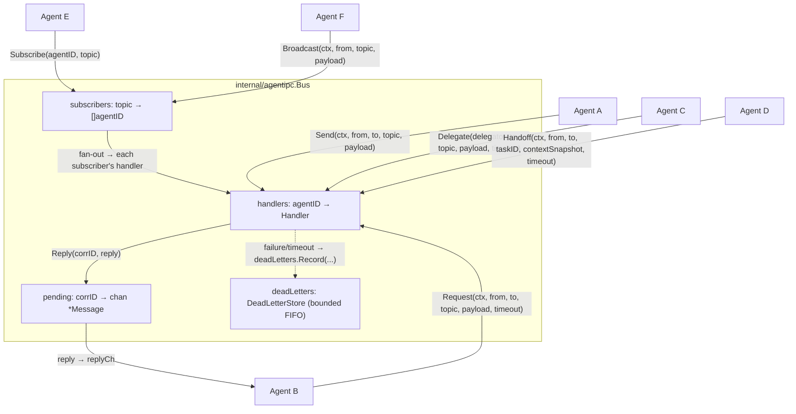
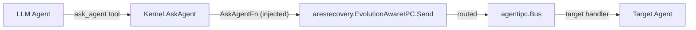

# ares Architecture Deep Dive (II): Agent IPC — Peer-Mesh Communication Primitives (0.3.x)

> When it comes to multi-Agent systems, most people's first reaction is: "How do Agents talk to each other? Via HTTP or WebSocket? Through a message queue?"
> ares's answer is **Agent IPC** — a purely in-process peer-mesh message bus with six primitives, no Leader relay.

## Foreword

The most annoying thing about a multi-Agent system isn't that the Agents aren't smart — it's that the Agents don't talk to each other.

ares's Agents are **peer cognitive processes (A ≡ B ≡ C)**: parent/child carries only spawn provenance (who spawned whom), NOT an authority hierarchy. Communication doesn't go through a Leader relay — it goes through `internal/agentipc` (the ARES Kernel IPC pillar).

I started on Python with Redis queues, then when I switched to Go I seriously wrestled with RabbitMQ — installing Erlang, configuring vhosts, setting up exchanges, mapping binding keys, then writing hundreds of lines of glue code just to get a single message from Agent A to Agent B. When I benchmarked it, the end-to-end latency was orders of magnitude higher than a Go channel — and none of that cost was network, because both Agents were in the same process. Pure serialization + routing overhead.

So ares's communication is purely in-process: **no network, no serialization, no middleware** — just channels + shared memory.

## I. Package Structure: one Bus, that's all the state

The core of `internal/agentipc/` is the `Bus`. It maps agent IDs to handlers and provides the full primitive set. All state is serialized under `mu sync.RWMutex`:

| Field | Purpose |
|-------|---------|
| `handlers map[string]Handler` | agentID → message handler function |
| `subscribers map[string][]string` | topic → subscriber agentIDs |
| `pending map[string]chan *Message` | correlationID → reply channel (buffered 1) |
| `pendingErr map[string]error` | correlationID → stashed handler error |
| `deadLetters *DeadLetterStore` | bounded store of failed requests (GAP-3) |
| `collabObserver CollaborationObserver` | collaboration receipts (Step Y.2, nil = unobserved) |



## II. The Six Primitives

The communication actions exposed by `Bus` are these methods (signatures are from the real code):

### 2.1 Send — Fire and Forget

```go
func (b *Bus) Send(ctx context.Context, from, to, topic string, payload any) error
```

The simplest primitive: deliver a message to a target Agent without waiting for a reply. The target's handler runs **synchronously in the caller's goroutine**; on failure it returns the error but doesn't block the sender. **Send does NOT pair with Reply** — for request/reply semantics use Request. If the target doesn't exist (`ErrAgentNotRegistered`) or the handler errors, it's recorded into `deadLetters`.

### 2.2 Request — Request/Reply

```go
func (b *Bus) Request(ctx context.Context, from, to, topic string, payload any, timeout time.Duration) (*Message, error)
```

Synchronous request/reply: send and wait for a reply. The Bus allocates a correlationID and registers a pending reply channel. The caller waits in a `select` over reply-arrival, ctx-cancel, or timeout.

Key implementation points:

- **managed goroutine + child ctx**: the handler runs in its own goroutine (`invokeHandler`) on a child context with a timeout — when the timeout fires the handler is cancelled, so it no longer leaks.
- **B16**: `timeout <= 0` defaults to 30s (`defaultRequestTimeout`) instead of blocking forever.
- **handler error**: woken via a "sentinel nil reply"; the real error is stashed in `pendingErr` and retrieved by the caller.
- **handler panic**: `invokeHandler` carries a `recover` boundary, containing the panic as `ErrHandlerPanic` so one bad handler fails one request instead of killing the process.
- **ctx cancel is NOT a delivery failure**: `ctx.Done()` means the caller walked away; the request may well have been delivered and handled. So cancel is deliberately NOT recorded into dead letters, to avoid evicting genuine delivery failures.

### 2.3 Reply — Asynchronous Reply

```go
func (b *Bus) Reply(corrID string, reply *Message) error
```

When a handler can't return immediately, it can call Reply later. The correlationID pairs the reply with the original request. For an already-timed-out/cancelled request, Reply is a best-effort drop (`deliverReply` returns nil if the pending entry is gone) — no block, no panic. Empty `corrID` or nil `reply` returns `ErrInvalidMessage`.

### 2.4 Delegate — Request Forwarding

```go
func (b *Bus) Delegate(ctx context.Context, delegator, to, topic string, payload any, timeout time.Duration) (*Message, error)
```

"I can't handle this — let me ask someone who can." Implemented as `return b.Request(ctx, delegator, to, topic, payload, timeout)`: the delegating agent uses its own ID as From, so the target sees the delegator. The original requester's correlationID is preserved end-to-end so the reply can chain back.

### 2.5 Handoff — Task Transfer

```go
func (b *Bus) Handoff(ctx context.Context, from, to, taskID string, contextSnapshot map[string]any, timeout time.Duration) (*Message, error)
```

Peer-to-peer task ownership transfer. Unlike Send, Handoff carries a structured payload `{task_id, context, artifacts}` with a fixed topic of `"handoff-task"`, and the receiver acknowledges acceptance. **The sender yields the task; the receiver takes it — without going through the Scheduler** (the "I know who should do this" path; the Scheduler is the "I don't know who should do this" path). Underneath, it's still a `Request`.

### 2.6 Subscribe / Broadcast — Subscribe/Broadcast

```go
func (b *Bus) Subscribe(agentID, topic string) error
func (b *Bus) Unsubscribe(agentID, topic string)
func (b *Bus) Broadcast(ctx context.Context, from, topic string, payload any) int
```

"I found X — anyone interested in X should know." An Agent subscribes to topics of interest; any Agent can broadcast to a topic. Broadcast is a fire-and-forget fan-out: it invokes each subscriber's handler in turn, a single handler failure doesn't stop the fan-out, and it returns the count of successful deliveries. **B16**: Subscribe deduplicates — the same agent is not added to the same topic twice. `Unsubscribe` removes an agent from a topic.

## III. The Message Model

`Message` is the communication unit; fields are the real code's (`bus.go`):

| Field | Meaning |
|-------|---------|
| `ID string` | Bus-generated unique message ID (`msg-<n>`) |
| `From string` | sender agentID |
| `To string` | target agentID (`""` = broadcast to subscribers) |
| `Topic string` | message subject (e.g. `"verify-conclusion"`, `"handoff-task"`) |
| `CorrelationID string` | request/reply pairing ID (empty for fire-and-forget) |
| `Payload any` | message body |
| `At time.Time` | send timestamp |

No JSON serialization — the primitive itself IS the intent; there's no `method` field to stuff in the payload.

## IV. DeadLetterStore: Bounded and Observable

`Bus` internally holds a `DeadLetterStore` (`deadletter.go`):

```go
type DeadLetterStore struct {
    mu       sync.Mutex
    next     uint64
    capacity int
    entries  []DeadLetter
}
```

- **Bounded FIFO**: `NewDeadLetterStore(capacity)`; `capacity <= 0` falls back to a default of 1024; oldest evicted when full.
- **Observable**: `Snapshot() []DeadLetter` and `Count() int` for reading.
- **Recorded shape**: `DeadLetter{ID, From, To, Topic, Payload, Reason, At}` — keeps the failure reason (e.g. `ErrAgentNotRegistered` / `ErrTimeout`).
- **Note**: the current API I can see only does `Record / Snapshot / Count` — there is NO auto-redelivery method here (the original notes mentioned "manual/automatic redelivery"). Whether redelivery is implemented elsewhere in this version is marked as pending verification — 待核实.

## V. From Syscall to Agents (`internal/agentsyscall`)

The Bus is a Kernel-level primitive. Real LLM Agents reach communication through tool calls — that lives in `internal/agentsyscall` ("Agent decides. Kernel enforces."):

| Tool constant | Purpose |
|--------|---------|
| `SpawnAgentTool = "spawn_agent"` | Spawn a new peer agent |
| `CreateTaskTool = "create_task"` | Break out a Task Fabric sub-task |
| `AskAgentTool = "ask_agent"` | **Ask a specific target agent a question** |
| `CreatePlanTool` | Create a whole-graph plan (plan.go) |

`ask_agent` is the closest thing to "agents talking": `Kernel.AskAgent(ctx, AskAgentArgs{To, Topic, Payload})` validates the target is non-empty, then forwards to the injected `AskAgentFn` — in production wired at serve time to `aresrecovery.EvolutionAwareIPC.Send`, ultimately routed to `agentipc.Bus`. `BindTools(binder, kernel)` registers `spawn_agent / create_task / ask_agent / create_plan` onto the LLM's tool binder, and `ToolSchemas()` produces the LLM-facing schemas.

One-liner chain:



## VI. Dual-Track Dispatch: PolicyFlag

`agentipc` also has a layer about "how tasks are dispatched" (`policy.go`), parallel to the communication primitives: `ExecutionPolicy` (`PolicyLegacy` / `PolicyTaskFabric`) and `PolicyFlag` (an `atomic.Int64`, 0=legacy, 1=task fabric, flipped at runtime without restart). `DualTrackDispatcher` holds the legacy and new `Dispatcher` paths and picks the active one by the flag; with shadow mode on, the inactive path also runs and its outcome is compared (`Mismatches()`). That's the "dual-track equivalence" verification surface.

> Note: production today is `PolicyTaskFabric` only — the Leader runtime is removed. `PolicyLegacy` is retained just as a library constant for dual-track/shadow verification. The legacy "AHP five message types / DLQ auto-retry" details are NOT in `internal/agentipc`; the legacy paths live under `internal/ares_protocol/ahp` and `internal/agents/peer` (not expanded here — 待核实).

## VII. Design Trade-offs (Honest Section)

1. **Purely in-process**: it doesn't span processes. To go distributed, the `Bus`'s `map[string]Handler` would need to become some service discovery + network transport, and the pending-reply-channel sync semantics would need redesign. This is a known boundary.
2. **No backpressure on Broadcast**: the fan-out calls each subscriber's handler synchronously; a slow subscriber blocks it. There's no per-subscriber buffer queue.
3. **Subscribe has no pattern matching**: only exact topic match; no wildcards (e.g. `task.*`).
4. **Composition edge cases**: e.g. the Delegate + Handoff combination (can B hand off A's delegated task to C? how does the correlationID chain?). The semantics are currently clear, but thorough test coverage is marked as pending verification — 待核实.

## VIII. Summary

`internal/agentipc` is ares's peer-mesh message bus: `Send` for fire-and-forget, `Request/Reply` for request/reply, `Delegate` for request forwarding, `Handoff` for task transfer, `Subscribe/Broadcast/Unsubscribe` for pub/sub. `DeadLetterStore` is bounded and observable. `PolicyFlag + DualTrackDispatcher` provide dual-track scheduling verification. And `internal/agentsyscall` exposes `ask_agent` and friends to real LLM Agents — "Agent decides. Kernel enforces."

The legacy AHP compatibility layer and peer direct-delivery path run in parallel with the new Agent IPC (feature-flag gradual cutover); the long-term goal is for all new communication to go through Agent IPC.

Next up, let's talk about **Experience Distillation** — how Agents distill task results into reusable experiences and reuse them directly when they hit a similar problem.