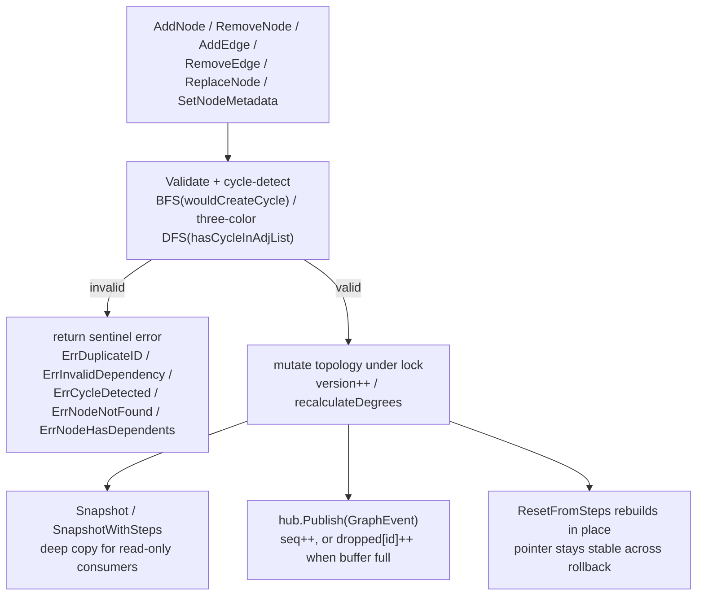
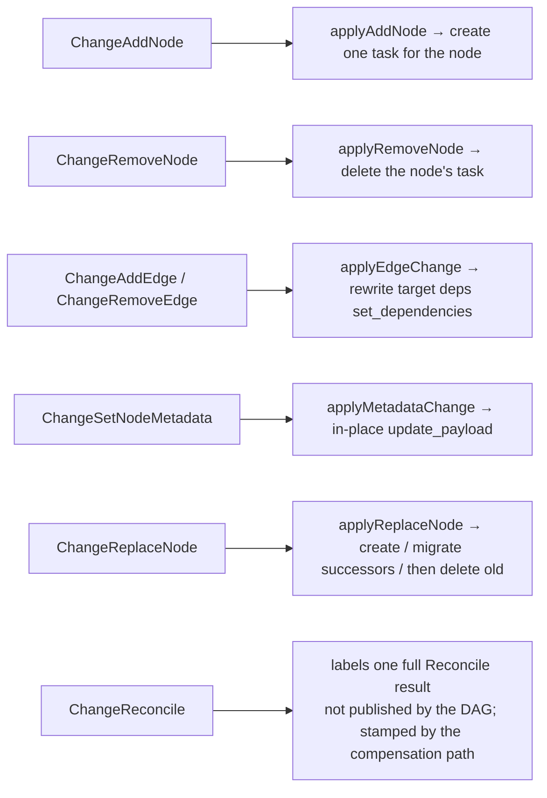

# ares Architecture Deep Dive (IV): Workflow Engine -- The DAG is the Source of Truth; Event-Driven Reactive Compilation (0.3.x)

> I used to hardcode workflows. If step 1 finishes, run step 2. If step 2 finishes, run step 3.
> Then requirements changed, and I arrived at a plain but important truth: **the graph is the source of truth, and execution is just a projection.**
> So in 0.3.x I shifted focus from "how to run a DAG" to "when the DAG mutates at runtime, how do I project that change onto the task set."
>
> This post reviews five source files: `workflow/engine/types.go`, `mutable_dag.go`, `graph_events.go`, `dag_patcher.go`, and `planprojection/coordinator.go`.
> I only cover symbols and logic I actually read in the code. What I didn't see, I don't claim.

## 0. Scope, Stated Up Front

Before writing this, I scoped myself hard to four modules:

1. **`types.go`** -- the `Step` / `Workflow` / `DAG` type definitions
2. **`mutable_dag.go`** -- the thread-safe mutable DAG (`MutableDAG`)
3. **`graph_events.go`** -- the change-event pub/sub (`GraphEventHub`) and the event sequence numbers
4. **`dag_patcher.go`** -- `DAGPatchExecutor`, which applies structural patches directly to the live topology
5. **`coordinator.go`** -- `CompileCoordinator`, which compiles the projection of the graph into taskfabric tasks

One sentence sums up the pipeline: **at runtime you mutate the MutableDAG → every mutation publishes one GraphEvent → the incremental compiler projects it into one task mutation → the task set converges with the graph.**

## 1. The Step: Smallest Unit of a Workflow

### 1.1 Step and Workflow

`Step` is defined in `internal/workflow/engine/types.go`. The fields I read:

```go
type Step struct {
    ID             string            `json:"id"`
    Name           string            `json:"name"`
    AgentType      string            `json:"agent_type"`
    Input          string            `json:"input"`
    DependsOn      []string          `json:"depends_on"`
    Timeout        time.Duration     `json:"timeout"`
    RetryPolicy    *RetryPolicy      `json:"retry_policy,omitempty"`
    RecoveryPolicy *RecoveryPolicy   `json:"recovery_policy,omitempty"`
    Interrupt      *InterruptConfig  `json:"interrupt,omitempty"`
    Status         StepStatus        `json:"status"`
    Output         string            `json:"output,omitempty"`
    Error          string            `json:"error,omitempty"`
    StartedAt      time.Time         `json:"started_at,omitempty"`
    FinishedAt     time.Time         `json:"finished_at,omitempty"`
    Metadata       map[string]string `json:"metadata,omitempty"`
}
```

A few details I confirmed from the code:

- **`Output` is "reserved"**. The source comment is blunt: nothing in production writes it today (L2 session graphs keep it empty); execution facts live in the fabric task envelope, and predecessor output is read by joining the envelope — **not from this field**. So don't assume `Step.Output` holds the execution result; the truth lives in the task.
- **Recovery policy is a first-class citizen.** `RecoveryPolicy` carries `Strategy` / `MaxAttempts` / `ReplacementAgent` / `Backoff`, and `RecoveryStrategy` has exactly three values: `retry`, `replace_node`, `fail_fast`. Note that `replace_node` is "replace the node" — this is how `ReplaceNode` gets attached to the recovery path.
- Status enums: `StepStatus` is `pending / running / completed / failed / skipped`; `WorkflowStatus` is `pending / running / completed / failed / cancelled`.

```go
type RecoveryStrategy string

const (
    RecoveryRetry       RecoveryStrategy = "retry"
    RecoveryReplaceNode RecoveryStrategy = "replace_node"
    RecoveryFailFast    RecoveryStrategy = "fail_fast"
)
```

### 1.2 DAG and NewDAG

`DAG` is a classic node + adjacency-list structure:

```go
type DAG struct {
    Nodes map[string]*DAGNode        // nodes, keyed by step ID
    Edges map[string][]string        // adjacency list: src -> targets
}

type DAGNode struct {
    StepID    string
    Metadata  map[string]string      // see 1.3
    InDegree  int
    OutDegree int
}
```

`NewDAG(steps []*Step) (*DAG, error)` runs this sequence of validations, which I checked line by line:

1. **ID normalization + dedupe**: `strings.TrimSpace(step.ID)`; an empty ID errors out; a duplicate ID returns `ErrDuplicateID` (labeled an "H4 fix" in the source, to prevent silent overwrites).
2. **Dependency validity + dedupe**: each `DependsOn` entry is trimmed and deduped; referencing a nonexistent node returns `ErrInvalidDependency`.
3. **Cycle detection**: `hasCycle()` runs a DFS with a recursion stack (`recStack`); a cycle returns `ErrCycleDetected`.
4. **Topological sort**: `GetExecutionOrder()` is the standard Kahn's algorithm (BFS in-degree removal); if the result length differs from the node count it returns `ErrCycleDetected`.

All sentinel errors live in `types.go`: `ErrInvalidDependency`, `ErrCycleDetected`, `ErrDuplicateID`, plus a batch of HITL-related `ErrInterrupt*` ones.

### 1.3 DAGNode.Metadata -- Making "metadata-only changes" visible

This is the detail I most wanted to write about after reading the code. `DAGNode` carries a `Metadata` map *in addition to* `StepID` and the degrees, and it is **snapshotted from the owning Step's map at build/patch time** (the source calls it plan C / C4).

Why a snapshot copy? The comment explains: previously `DAGNode` only carried degrees, so a parent→child mutation that only touched `Step.Metadata` produced **zero patches** — the evolution system saw "no topology change," so the "set metadata" operator could never be selected. Keeping a per-node copy makes the differ pure over the snapshot it is handed, so metadata changes become visible.

This detail is also exactly why `SetNodeMetadata` exists and mutates **both** the Step's map and the DAGNode snapshot (see 2.4).

## 2. MutableDAG: A Thread-Safe, Evolving Runtime Topology

`internal/workflow/engine/mutable_dag.go`. Core struct:

```go
type MutableDAG struct {
    mu            sync.RWMutex
    dag           *DAG
    steps         map[string]*Step
    version       uint64         // monotonic mutation counter
    hub           *GraphEventHub
    SchedulerType string         // active scheduler type, set by genome evolution patches
}
```

Its own sentinel errors: `ErrNodeNotFound`, `ErrNodeHasDependents`, `ErrDuplicateEdge`, `ErrEdgeNotFound`.

### 2.1 Mutation operations at a glance

| Method | Behavior | Validation / failure |
|--------|----------|----------------------|
| `AddNode(ctx, step)` | Add node + edges from `DependsOn` | dup ID→`ErrDuplicateID`; missing dep→`ErrInvalidDependency`; would cycle→`ErrCycleDetected`; **rolls back added edges then deletes the node on failure** |
| `RemoveNode(ctx, id)` | Delete node and its edges | missing→`ErrNodeNotFound`; still depended on→`ErrNodeHasDependents` |
| `AddEdge(ctx, from, to)` | Add a directed edge | missing nodes→`ErrNodeNotFound`; dup edge→`ErrDuplicateEdge`; cycle→`ErrCycleDetected` |
| `RemoveEdge(ctx, from, to)` | Delete an edge | missing nodes / missing edge→`ErrEdgeNotFound` |
| `ReplaceNode(ctx, oldID, newStep)` | Atomically replace a node and migrate edges | see 2.3 |
| `SetNodeMetadata(nodeID, md)` | Replace a node's metadata in place | see 2.4 |

Every legal mutation does `version++` and `hub.Publish`es the matching `GraphEvent`.

### 2.2 Cycle detection: BFS incremental + three-color DFS

`AddEdge` uses an incremental BFS check: `wouldCreateCycle(from, to)` starts BFS from `to` following outgoing edges; if it reaches `from`, adding the edge would create a cycle, so it's refused.

`ReplaceNode`, which touches multiple edges at once, uses a different approach: it runs a three-color DFS (`hasCycleInAdjList`, white/gray/black marking) over a **simulated adjacency list** *before* any real mutation. So the replace is atomic — **cycle detection precedes mutation, no rollback logic is needed** (the source says exactly that).

### 2.3 ReplaceNode: same-ID vs. different-ID

The real signature is `ReplaceNode(ctx context.Context, oldID string, newStep *Step) error`. Behavior depends on whether the ID changes:

- **Same ID (in-place update)**: updates the step reference directly, then does old-vs-new dependency reconciliation — edges contributed by the OLD step's `DependsOn` that are absent from the new step's must be removed, otherwise the node silently keeps stale deps (source note #31); it also refreshes the node's Metadata snapshot.
- **Different ID (edge migration)**: full migration — redirects the old node's incoming/outgoing edges to the new ID, rewrites downstream steps' `DependsOn`, then removes the old node. The simulated adjacency-list cycle check runs first.

After a successful replace, `recalculateDegrees()` rebuilds every node's in/out degree from the `Edges` map, `version++`, and it publishes a `ChangeReplaceNode` event carrying `OldNodeID`.

### 2.4 SetNodeMetadata: where the C4 metadata change lands

As noted in 1.3, metadata must change both the Step's map (so the patch survives snapshot/restore, which is driven by steps) and the DAGNode snapshot (so WorkflowDiffer sees it and emits a patch). `SetNodeMetadata` does exactly that:

```go
func (m *MutableDAG) SetNodeMetadata(nodeID string, md map[string]string) error {
    m.mu.Lock(); defer m.mu.Unlock()
    node, ok := m.dag.Nodes[nodeID]
    if !ok { return ErrNodeNotFound }
    node.Metadata = cloneMetadata(md)
    if step, ok := m.steps[nodeID]; ok { step.Metadata = cloneMetadata(md) }
    m.version++
    m.hub.Publish(GraphEvent{ /* ChangeSetNodeMetadata */ })
    return nil
}
```

### 2.5 Reads and copies: ReadDeps / Snapshot / ResetFromSteps

The encapsulation rule is uniform: **external goroutines must not touch `m.mu` / `step.DependsOn` directly**, so reads go through lock-guarded accessors:

- `ReadDeps(stepID)` -- returns a copy of the dependency list.
- `Snapshot()` / `SnapshotWithSteps()` -- deep-copy the topology; the `WithSteps` variant returns a deep topology copy plus a shallow step-reference copy under the **same read lock**.
- `Steps()` / `StepIndex()` -- copies of the current step set.
- `ResetFromSteps(steps)` -- **rebuilds the DAG in place**, preserving the `*MutableDAG` identity. This is what makes rollback safe: runtime manager, WorkflowGenome, and the patch executors all share the same pointer, so restoring a topology doesn't require swapping objects.
- `DroppedEvents(subID)` -- see the drop counter in Part 3.

Also, `GetExecutionOrder()` has its own override on `MutableDAG`: when `SchedulerType != "" && != "*graph.DefaultScheduler"`, it randomly shuffles the ready queue at each step (using `time.Now().UnixNano()`). This is the seam where genome-evolution changes to the scheduler config actually alter runtime behavior.

### 2.6 A flowchart of the graph engine



## 3. GraphEventHub: Events, Sequence Numbers, Drop Counters

`internal/workflow/engine/graph_events.go`. The core, straight from the source:

```go
type GraphChange struct {
    Type      ChangeType
    NodeID    string
    OldNodeID string // populated for ChangeReplaceNode
    FromID    string
    ToID      string
    Step      *Step
    Timestamp time.Time
}

type GraphEvent struct {
    Seq     uint64       // hub-wide monotonic sequence number
    Change  GraphChange
    Success bool
    Error   error
}
```

### 3.1 The full ChangeType set

`ChangeType` is an `int` enum starting at `iota`. The complete list and its meaning (which I cross-checked against the compiler's dispatch):



One important detail on `ChangeReconcile`: **the DAG never publishes it.** The DAG only emits the first six; `ChangeReconcile` tags the `ChangeResult` produced by a full reconciliation, so "created by reconcile" stays attributable.

### 3.2 Publish & subscribe: non-blocking + drop counting

```go
type GraphEventHub struct {
    mu          sync.RWMutex
    subscribers map[string]chan GraphEvent
    dropped     map[string]uint64   // per-subscriber count of missed events
    nextID      int
    seq         uint64
}
```

`graphEventBufferSize = 64` (each subscriber's channel buffers 64 events). Subscription IDs look like `sub-%d`; `Unsubscribe(id)` closes the channel and deletes the drop counter (IDs are never reused, so leaving it would be a dead map entry).

`Publish`'s key behavior, verified line by line: `h.seq++`, stamp the event, then for each subscriber do a **non-blocking** send — `select { case ch <- event: default: h.dropped[id]++ }`. If the buffer is full the event is dropped, but **never silently**: the count accumulates in `dropped[id]`, and the next delivered event leaves a hole in the sequence numbers.

Why do both the sequence number and the drop counter get this much care? The source comment is blunt: **"a skipped AddNode is a node that never becomes a task."** If you lose one AddNode, one node never becomes a task. So any sequence gap or any moved drop counter must trigger full compensation, never a shrug.

### 3.3 Terms in one place

| Concept | Meaning |
|---------|---------|
| `Seq` | hub-wide monotonic number; non-adjacent consecutive events = missed event |
| `dropped[id]` | cumulative events a subscriber missed because its buffer was full |
| `Dropped(id)` / `DroppedEvents(subID)` | read the counter (exposed by both the hub and MutableDAG) |
| `graphEventBufferSize` | 64, the per-subscriber channel buffer size |

## 4. DAGPatchExecutor: Applying Structural Patches Straight to the Live Topology

`internal/workflow/engine/dag_patcher.go`. This executor embodies a clear stance: **patches don't get "stored somewhere to be written elsewhere" — they mutate the live DAG directly.**

```go
type DAGPatchExecutor struct {
    dag *MutableDAG
}
```

Constructed via `NewDAGPatchExecutor(dag *MutableDAG)`, `Name()` returns `"workflow.dag"`, and `SetDAG(dag)` can rebind to a different live DAG. It is wired as the patch registry's fallback — per the source comment, so a workflow patch no longer dies on "no executor registered for target <nodeID>"; instead it mutates the real live DAG.

Four core methods implement the `patch.Restorable` contract:

- **`Snapshot(ctx)` → `(any, error)`**: a `DAGSnapshot{Steps []*Step}`; each live step is deep-copied via `cloneStepForSnapshot` (`DependsOn` / `RecoveryPolicy` / `RetryPolicy` / `Interrupt` / `Metadata`).
- **`Restore(ctx, snap)` → error**: reverts the live DAG to a captured snapshot — `ResetFromSteps(s.Steps)`, keeping the `*MutableDAG` pointer stable (see 2.5).
- **`CanApply(ctx, p)` → error**: declares which structural patch types it accepts. The set I confirmed: `PatchInsertNode`, `PatchRemoveNode`, `PatchReplaceNode`, `PatchAddEdge`, `PatchRemoveEdge`, `PatchSetNodeMetadata`.
- **`Apply(ctx, p)` → (inverse *patch.RuntimePatch, error)**: mutates the live DAG and **returns an inverse patch for rollback**. Insert's inverse is RemoveNode, AddEdge's inverse is RemoveEdge, and ReplaceNode puts a deep copy of the old step into the inverse patch's `Value`.

For `PatchSetNodeMetadata`, the `Value` may be a `map[string]string`, `*Step`, or `Step`; it extracts the metadata map and forwards to `SetNodeMetadata`.

## 5. CompileCoordinator: Compiling the Graph into a Task Set

Now the crux of 0.3.x: once the graph changes, how does the task set follow? All in `internal/planprojection/coordinator.go`.

### 5.1 Two compile paths: full vs. incremental

`CompileCoordinator` holds a reference to the task fabric, the event store, the evolution generation, the last full compile record (`lastCompile`), the last incremental result (`lastChange`), and the set of tracked task IDs (`planIDs`).

The package doc spells out the difference between the two paths:

- **`CompileDAG(ctx, dag)` -- the FULL path** (cold start, `ResetFromSteps`): it reclaims every task of the previous compile (best-effort `Delete`), then rebuilds the batch. The problem: **a task already acquired by a scheduler (running) cannot be deleted**; if it can't be deleted you can't do a full rebuild (you'd hit `ErrTaskExists` via CompilePlan's all-or-nothing rollback). So the full path is not for runtime growth.
- **`ApplyChange(ctx, dag, evt)` -- the INCREMENTAL path** (runtime graph growth): **one graph change moves one task.** It never deletes a task it was not asked to delete — so a RUNNING task is never torn down underneath its owner.

```go
// ApplyChange(ctx, dag, evt) dispatches on ChangeType, not recompiling.
// A full rebuild is exactly what the growth path cannot survive:
// Fabric.Delete refuses a RUNNING task → rebuild collides via ErrTaskExists →
// CompilePlan's all-or-nothing rollback discards the whole batch →
// the newly grown node never becomes a task.
```

I confirmed `ApplyChange`'s semantics from the source: `evt.Success == false` is a no-op (a failed mutation projects nothing), returning a `ChangeResult` with the DAGVersion stamped to now; refusals by task state (RUNNING/LEASED/SUSPENDED) land in `ChangeResult.Skipped` and never fail the whole change — only a structural failure returns an error.

### 5.2 Compensation: Reconcile and SubscribeGraphEvents

The event stream can lose events (buffer overflow), so there is a full-sync path:

- **`Reconcile(ctx, dag)`**: re-projects the DAG's **current** state onto the fabric rather than trusting the event stream. The DAG is the source of truth: every untracked node is created (in topological order), every tracked task is refreshed from the graph, and every tracked ID the graph no longer holds is deleted. Refusals (a RUNNING task can't move) land in `Skipped`. Its `ChangeResult.Change` is stamped `ChangeReconcile`.
- **`SubscribeGraphEvents(ctx, dag) func()`**: subscribes to the DAG's events and feeds each one to `ApplyChange`. **Missed events are compensated, not tolerated**: a `Seq` gap on the next delivered event triggers a full `Reconcile`; after each delivery it polls `DroppedEvents`, and once more ~250ms (`reconcilePollInterval`) after the last one — because a drop in the middle of a burst is only visible through the counter, not through a later sequence number. That tail check is a one-shot timer armed only by delivery, so an idle subscription does no work.

Returning to Chapter 4's claim, this is a good way to close it: **the DAGPatchExecutor closing the "two-graphs" gap** — a mutation on the live MutableDAG reaches the task set via events, so the next scheduler drain sees the updated topology.

### 5.3 Event → compile → convergence

```mermaid
sequenceDiagram
    participant M as MutableDAG (mutating side)
    participant H as GraphEventHub
    participant Sub as SubscribeGraphEvents goroutine
    participant C as CompileCoordinator
    participant F as Task Fabric

    M->>H: Publish(GraphEvent)  seq++
    H->>Sub: non-blocking delivery; dropped++ on full buffer (counted, never silent)
    Sub->>C: ApplyChange(dag, evt)  dispatch on ChangeType
    C->>F: CompileNode / Delete / SetDependencies / UpdatePayload
    Note over Sub,C: if evt.Seq != lastSeq+1 → full Reconcile
    Note over Sub,C: poll DroppedEvents after delivery; + 250ms tail one-shot timer
```

### 5.4 One incremental step, fully accounted

`ChangeResult` captures everything about one incremental compile: `Change`, `CompileID`, `DAGVersion`, `Created` / `Removed` / `Updated` (the touched task IDs, grouped by action), and `Skipped` (actions that could not be applied; `Complete()` is `len(Skipped)==0`). Each `SkippedOp` records `TaskID`, `Op`, and `Err`, with the `Op` vocabulary being four strings: `delete` / `set_dependencies` / `update_payload` / `create`.

Both paths (full via `CompileDAG`, incremental via `ApplyChange`) fold their outcome into `lastCompile` (`Generation` / `DAGVersion` / `CompileID` / `PlanIDs` / `StepCount`) and append a compile event to the event store for audit.

## 6. Design Trade-offs

- **The graph is the fact; the event is a notification; the task is a projection.** The incremental compiler treats the DAG as the source of truth, and the event only says "go reconcile." That's why even AddEdge/RemoveEdge converge to "the target's deps are whatever the graph now says."
- **One change moves one task.** That's the bedrock of runtime graph growth: prefer a slower increment over tearing down a RUNNING task with a full rebuild.
- **A drop counter and a sequence gap are must-reconcile signals.** A failed delivery isn't treated as coincidence, but as an account that must be settled.
- **Rollback without swapping the object.** `DAGPatchExecutor.Restore` goes through `ResetFromSteps`, so the `*MutableDAG` pointer stays stable, and the runtime manager / WorkflowGenome / patch executors sharing it all see the restored graph.

## 7. Honest Reflection

I tried to only write down things that are real in the code, but I agonized over a few points anyway.

The thing that surprised me most was `Step.Output`. If I hadn't read the source comment I would have assumed it held the execution result. The truth is that execution facts live in the taskfabric task envelope, and `Output` is a reserved field. It reminded me that **comments get you closer to the truth than field names do** — even I was almost misled before writing this.

The other thing that kept nagging me: incremental compilation puts "correctness" on top of **events not being lost**, yet events *can* be dropped by buffer overflow. The code defends against this with two signals (sequence gaps + drop counter + tail timer), and I agree with the design — but it means "once an event is lost, a full Reconcile is mandatory" is hard-wired into the subscription loop. In other words, **incremental is a performance optimization; full is the backing fact.** You only get to use incremental if you're willing to pay the cost of Reconcile. I accept that trade-off for now, but I'm not fully sure it's the best one.

If you're building a similar "live DAG → task projection" system, I'd genuinely like to hear how you handle the "events may be lost, but the projection must not" question.

---

## The Series

| # | Topic | What you'll learn |
|---|------|-------------|
| I | Architecture Overview | big picture + two isomorphic MutableDAGs + all-module breakdown |
| II | Agent Harmony Protocol | how agents communicate |
| III | Memory Distillation | how `ares_experience`/`ares_memory` remember and forget |
| IV | **This article** | `workflow/engine.MutableDAG`: how tasks flow and evolve in the DAG |
| V | Tool Layer | how `tools/toolsource` discovers, retrieves and binds tools |
| VI | Security & Observability | how `ares_events`/`introspect` show what happened |
| VII | Runtime & Lifecycle | how an Agent lives, dies, and is resurrected |
| VIII | Event System | how state is recorded and recovered |
| IX | Arena / Fault Injection | how `aresrecovery.Chaos` breaks things then verifies recovery |
| X | Retrieval | how relevant memory is found |
| XI | Autonomous Evolution | how `evolution` patches L1 and ships |
| XIII | Bootstrap & API | how `ares_bootstrap` wires without pain |
| XV | MCP Integration | how `ares_mcp` teaches an Agent to use tools |
| 19 | Storage layer | `storage/postgres` + `services/embedding` |
| 20 | LLM client layer | `llm` failover, multi-provider abstraction |
| 21 | Evaluation framework | `ares_eval` EvaluatorRegistry / LLMJudge |

Every article follows the same pattern: **Problem → Design Journey → Trade-offs → Honest Reflection.**

No marketing. No "10x faster than X." Just engineers talking engineering.