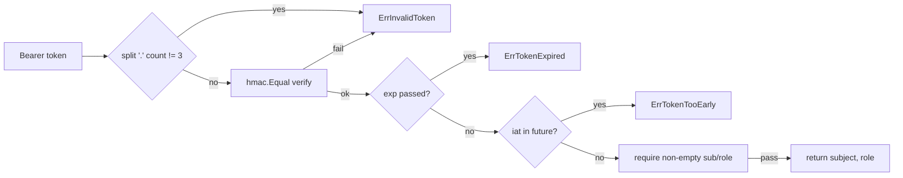
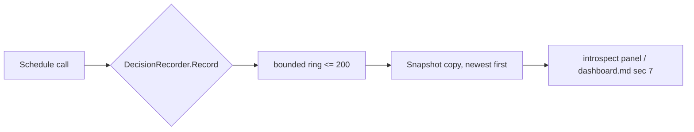

# ares Architecture Deep Dive (VI): Security and Observability — Auth, RBAC, Sanitization, and Scheduling Observability (0.3.x)

> 0.3.x note: This article is a complete rewrite grounded in the *current* `internal/ares_security/` and `internal/ares_observability/` implementations. Earlier versions of this article (a `SafeLogger`, a `LogTracer`, a rate-limiter factory, a four-phase graceful shut-down state machine) **no longer exist** in the codebase. This article only describes what is actually there now.

> The more dangerous a thing an Agent can do, the more you need to decide *before* it does it: who is using it, what it may touch, whether anything it emits leaks secrets — and, at runtime, whether every step it takes is actually visible.

---

## 1. What this article covers — and what "actually exists" means

First, a reality check so the title doesn't mislead. The security and observability story in the current codebase is not a grand "defense-in-depth whitepaper"; it is a set of **small, clear modules that genuinely guard each HTTP boundary**.

- Security: `internal/ares_security/` — **JWT auth + RBAC roles/permissions + request middleware + audit logging + sensitive-data sanitization** across 5 files.
- Observability: `internal/ares_observability/` — a **`Tracer` interface (OTel and Noop implementations) + Metrics (OTel and Prometheus backends) + per-session cost tracking**.
- Scheduling observability: **Scheduling Observatory** in `internal/kernelscheduler/decision_recorder.go`, plus the **runtime panel** in `internal/introspect/`.

Everything in the previous version of this article that does not exist in the current code has been dropped. Every symbol below is present in the named file.

Core file list (real paths):

| Module | File | Verified symbols |
|--------|------|------------------|
| JWT | `internal/ares_security/jwt.go` | `SignJWT`, `VerifyJWT`, `ErrInvalidToken`, `ErrTokenExpired`, `ErrTokenTooEarly` |
| RBAC | `internal/ares_security/rbac.go` | `Role`, `Permission`, `ParseRole`, `AllowRole`, `HasPermission` |
| Middleware | `internal/ares_security/middleware.go` | `AuthMiddleware`, `NewAuthMiddleware`, `WithAudit`, `Principal`, `FromContext`, `Verify` |
| Audit | `internal/ares_security/audit.go` | `AuditLogger`, `NewAuditLogger`, `Auth`, `Action` |
| Sanitizer | `internal/ares_security/sanitizer.go` | `Sanitizer`, `Sanitize`, `SanitizeJSON`, `SanitizeOptions`, `SensitivePattern` |
| Tracer iface | `internal/ares_observability/tracer.go` | `Tracer`, `LLMCall`, `ToolCall`, `AgentStep`, `AgentError` |
| Noop impl | `internal/ares_observability/noop.go` | `NoopTracer`, `NewNoopTracer` |
| OTel impl | `internal/ares_observability/otel_tracer.go` | `OTelTracer`, `NewOTelTracer`, `WithExporter`, `WithSampler`, `WithMetricReader` |
| Metrics | `internal/ares_observability/metrics.go` | `Metrics`, `NewMetrics`, `RecordLLMCall`, `RecordToolCall`, `RecordAgentStepDuration`, `RecordAgentError` |
| Prometheus | `internal/ares_observability/prometheus.go` | `PrometheusMetrics`, `NewPrometheusMetrics`, `MetricsHTTPHandler`, `RegisterMetricsRouter` |
| Sched observability | `internal/kernelscheduler/decision_recorder.go` | `DecisionRecorder`, `ScheduleDecision`, `CandidateScore` |
| Runtime panel | `internal/introspect/` | `Dashboard`, `Store`, `Collector`, `Handler`, `Sink` |
| LLM sanitizer wiring | `internal/llm/client.go` + `internal/ares_bootstrap/provide_llm.go` | `WithSanitizer` |

---

## 2. Security module: don't build a mechanism that "looks cool but nobody dares use"

Cold shower first. In the old version I wrote about a `SafeLogger`, a two-layer field-name + regex detector, and a package-level `SanitizeLog`. **None of those exist anymore.** Today `ares_security` is split into auth (JWT/RBAC/middleware/audit) and sanitization (`Sanitizer`).

### 2.1 JWT: hand-written HS256 that only trusts the signed form

`jwt.go` implements HS256 JWT from scratch, deliberately avoiding a third-party JWT library (constraint: prefer the stdlib).

```go
func SignJWT(secret []byte, subject, role string, ttl time.Duration, now time.Time) (string, error)
func VerifyJWT(secret []byte, token string, now time.Time) (subject, role string, err error)
```

Verified details:

1. **Constant-time comparison**: `decodeSigned` verifies with `hmac.Equal(sig, expected)` — not `==`.
2. **Verify the signature, then trust the payload**: a bad signature immediately returns `ErrInvalidToken`; no payload field is trusted.
3. **Three sentinel errors**: `ErrInvalidToken` (malformed/bad signature/missing claims), `ErrTokenExpired`, `ErrTokenTooEarly` (`iat` in the future). Callers distinguish expiry with `errors.Is(err, ErrTokenExpired)`.
4. **The token carries only a couple of claims**: `sub`, `role`, `exp` (Unix seconds), plus `iat`.



### 2.2 RBAC: a static role→permission matrix, deny by default

`rbac.go` defines three roles, three permissions, and a static `rolePermissions` matrix:

| Role (`Role`) | `PermRead` | `PermWrite` | `PermAdmin` |
|----------------|:---:|:---:|:---:|
| `RoleAdmin` ("admin") | ✅ | ✅ | ✅ |
| `RoleOperator` ("operator") | ✅ | ✅ | ❌ |
| `RoleAgent` ("agent") | ✅ | ❌ | ❌ |

- `ParseRole(s)` lowercases and trims before matching; unmatched returns `ErrUnknownRole` — an attacker can't mint a role the system doesn't know via the token.
- `AllowRole(role, perm)` / `HasPermission(role, perm)` share the same matrix, and **an empty role returns false (default deny)**.

### 2.3 Middleware: Bearer + signature + role check in one pass

`middleware.go`'s `AuthMiddleware` is "the single enforcement point for all protected routes":

```go
type AuthMiddleware struct {
    secret  []byte       // HS256 key; nil => deny all (401)
    require Permission    // minimum permission the route needs
    audit   *AuditLogger  // modular audit sink; nil disables
    now     func() time.Time
}
```

Flow (`authenticate`):
1. Extract the token from the `Authorization: Bearer ` header — **only the `Bearer ` scheme is accepted**, anything else is treated as missing to prevent smuggling.
2. `VerifyJWT` verifies signature and expiry.
3. `ParseRole` parses the role (unknown → 403).
4. `AllowRole(role, m.require)` permission gate (insufficient → 403).
5. On success, inject `Principal{Subject, Role}` into the request context; downstream reads it via `FromContext`.

Two engineering notes worth stressing:
- **nil secret = deny all**. The comment is explicit: a nil secret makes every request 401, so enabling JWT can never accidentally open a destructive endpoint.
- **Every decision is audited** (`m.auditAuth`), allow or deny.

### 2.4 Audit: never log the token, only log "who / did what / whether it worked"

`audit.go`'s `AuditLogger` is a thin wrapper over `*slog.Logger` with a fixed set of structured fields. Key design: **the token itself never enters the log**, only the decoded identity and the decision.

- `Auth(decision, subject, role, method, path, status)` — records auth allow/deny.
- `Action(action, subject, target, ok)` — records privileged/destructive actions (kill an agent, call an MCP tool, i.e. "who changed what").

### 2.5 Sanitizer: regex detection + targeted masks

`sanitizer.go`'s `Sanitizer` scans text with a set of `SensitivePattern` regexes; each `SensitiveFieldType` has a mask function. Verified constants:

```go
SensitiveFieldTypeAPIKey / Password / Token / Email / Phone / SSN / CreditCard / PersonalInfo
```

> ⚠️ **Honest caveat**: `SensitiveFieldTypePersonalInfo` exists as a constant, but `defaultSensitivePatterns()` registers **no regex for it** — a "constant exists but no default rule" gap. Don't assume it's out-of-the-box for that type. (待核实 / to be verified: whether some other caller supplies rules for this type.)

Two entry points:
- `Sanitize(input string)` — runs all patterns over a text and replaces matches with masks.
- `SanitizeJSON(jsonStr string)` — parses via a `json.Decoder` with `UseNumber()`, **recursively** sanitizes only string values, then re-serializes — avoiding regex passes that would corrupt quotes/braces across the whole JSON string. Numbers like `json.Number` are checked by `maybeMaskNumeric` (returned unchanged if no pattern hits, preserving numeric type).

Mask functions: `maskAPIKey`, `maskPassword`, `maskToken`, `maskEmail`, `maskPhone`, `maskCreditCard`, `maskSSN`, plus the low-level `maskString(s, preserveLength)` (keep first/last N chars, fill middle with `*`). `SanitizeOptions` tunes `MaskChar`, `KeepLength`, and `PreserveLengthFor`.

Where sanitization lands on the LLM call chain (`internal/llm/client.go`):

```go
func WithSanitizer(s *ares_security.Sanitizer) Option {
    return func(c *Client) { c.sanitizer = s }
}
```

Production wiring in `internal/ares_bootstrap/provide_llm.go`:

```go
client, err := llm.NewClient(llmCfg, llm.WithCallbacks(reg), llm.WithSanitizer(ares_security.NewSanitizer()))
```

So: **the live request to the provider goes out unchanged; only before it is recorded by the tracer/event store is it passed through `Sanitizer`** — keeping secrets out of logs and traces without altering the request.

---

## 3. Observability module: one `Tracer` interface, two backends

`tracer.go` defines the interface:

```go
type Tracer interface {
    RecordLLMCall(ctx, call *LLMCall)
    RecordToolCall(ctx, call *ToolCall)
    RecordAgentStep(ctx, step *AgentStep)
    RecordError(ctx, err *AgentError)
    GetTraceID(ctx) string
    WithTrace(ctx) context.Context
}
```

The structs `LLMCall` / `ToolCall` / `AgentStep` / `AgentError` all carry a `TraceID` so a trace can tie an execution together.

### 3.1 `NoopTracer`: keep the trace ID contract, record nothing

`noop.go`'s `NoopTracer` has four no-op `Record*` methods, but `WithTrace` still injects a self-incrementing `trace-N` ID into the context (via `atomic.AddUint64`), readable back with `GetTraceID`. So even with observability off, the trace-propagation contract doesn't break.

### 3.2 `OTelTracer`: a real OpenTelemetry backend

`otel_tracer.go`'s `OTelTracer` implements `Tracer`, opening a span at every observation point:

| Method | Span name | Key attributes |
|--------|-----------|----------------|
| `RecordLLMCall` | `llm.call` | `llm.model`, `llm.tokens_used`, `llm.duration_ms`, `llm.has_error` |
| `RecordToolCall` | `tool.call` | `tool.name`, `tool.duration_ms`, `tool.has_error` |
| `RecordAgentStep` | `agent.step` | `agent.id`, `agent.step_name`, `agent.duration_ms` |
| `RecordError` | `agent.error` | `agent.id`, `error.type`, `error.message` |

Options: `WithExporter` (default `stdouttrace.New()`), `WithSampler` (default `AlwaysSample`), `WithMetricReader` (default manual reader). Plus `Shutdown` (`errors.Join` over both providers), and accessors `Provider` / `MeterProvider` / `Metrics`. OTel also wires the OTel-side `Metrics` (next).

### 3.3 Metrics: OTel counters/histograms with the `ares_*` prefix

`metrics.go`'s `Metrics` defines a set of managed instruments:

| instrument | name | type |
|-----------|------|------|
| `llmCallsTotal` | `ares_llm_calls_total` | Int64Counter |
| `toolCallsTotal` | `ares_tool_calls_total` | Int64Counter |
| `agentErrorsTotal` | `ares_agent_errors_total` | Int64Counter |
| `llmCallDuration` | `ares_llm_call_duration_seconds` | Float64Histogram (buckets 0.1…60s) |
| `agentStepDuration` | `ares_agent_step_duration_seconds` | Float64Histogram |
| `toolCallDuration` | `ares_tool_call_duration_seconds` | Float64Histogram |

Recording methods `RecordLLMCall` / `RecordToolCall` / `RecordAgentStepDuration` / `RecordAgentError` attach labels (`model`/`tool_name`/`agent_id` etc.) and `has_error`.

### 3.4 Prometheus: a separate backend with the `ARES_*` prefix

`prometheus.go`'s `PrometheusMetrics` registers a set of `ARES_*` metrics via `prometheus/client_golang`. Highlights:

- Counters: `ARES_llm_calls_total{model,status}`, `ARES_tool_calls_total{tool,status}`, `ARES_agent_errors_total{agent,phase}`
- Histograms: `ARES_llm_call_duration_seconds{model}`, `ARES_agent_step_duration_seconds{phase}`
- Gauges: `ARES_active_agents`, `ARES_llm_tokens_total{model,direction}`
- Summary: `ARES_cost_usd_total{model}` (**labeled by model only, not session** — the comment is explicit that unbounded session IDs would blow up the registry; per-session detail lives in `CostTracker` in `cost.go`)
- Plus a full set of `ARES_evolution_*` (deploy/guardrail/shadow/promote/rollback/gate-reject/shadow_win_rate/generation/DAG version/compile count) — the evolution-loop observability surface.

Exposed via `MetricsHTTPHandler()` (`promhttp`) and registered with `RegisterMetricsRouter(mux)` at `GET /metrics`.

> **A handled pitfall**: duplicate Prometheus collector registration returns `AlreadyRegisteredError`. `NewPrometheusMetrics` caches the first successful instance in `cachedMetrics` and returns it on repeat calls, so recordings reach the registered vectors rather than a never-registered one.

### 3.5 Cost tracking `CostTracker`

`cost.go` provides a per-model + per-session `CostTracker`, covering the detail that the Prometheus side intentionally drops by labeling only by model. (Suggested: check `cost_test.go` for exact method names — this article only confirms the type exists.)

---

## 4. Scheduling observability: the Scheduling Observatory

Why does a scheduler need observability? Because assigning a task to an agent can be the joint product of several factors (capability overlap, load, experience confidence, priority). `decision_recorder.go` **records one decision on every `Schedule` call** into a **bounded ring buffer (`maxRecordedDecisions = 200`)**, which the panel renders as "why this agent won".

Verified structures:

- `ScheduleDecision`: `TaskID`, `Capability`, `Candidates` (ordered by score descending), `Winner`, `Epoch` (the fencing token from Acquire), `Time`, `Err` (on failure like `ErrNoCapableCandidate`, `Winner`/`Epoch` are zero; omitted on success).
- `CandidateScore`: `AgentID`, `Capabilities`, `Overlap`, `Load`, `Confidence`, `PriorityBoost`, `Score`.
- `DecisionRecorder`: `Record` (append + evict oldest), `Snapshot` (**a copy, newest first**, mutex-guarded), `scoreCandidates` (reuses `taskfabric.ScoreBreakdown` to compute score **and its decomposition** in one evaluation — so what the panel renders can never drift from what the scheduler actually ranked on).



---

## 5. The runtime panel: `internal/introspect/`

The `introspect` package is the read-model shell for a "single-process observable ARES runtime":

- `Dashboard`: `NewDashboard` assembles a complete real runtime (LLM adapter, failover client, tool registry, fabrics, scheduler, chaos observer, panel collector, HTTP handler); `Run` starts it, `Submit` dispatches tasks. Default listen `:5606`, routes `/introspect`, `/introspect/`, `/api/v1/introspect/`.
- `Store`: holds the **latest** `Snapshot` frame (`atomic.Pointer`); the activity timeline is a bounded ring (`maxTimelineEntries = 300`). The comment stresses O(1) memory is deliberate — **history lives in the event log/archive, not the panel**.
- `Collector` / `Sources`: every 2s pulls one `Snapshot` from `Sources` (Kernel / Fabric / Agents / Chaos / Collab / Tasks / Decisions). A nil source renders empty rather than panicking.
- `Handler`: serves an embedded SPA (`web/panel.html`, `//go:embed`) plus the JSON read API (`/api/v1/introspect/*`).

> 🔒 **Security boundary (actually written in the code comment)**: the `introspect` `Handler` performs **no auth or authorization**; `/api/v1/introspect/eventstream` returns raw events with their full payload (task inputs, checkpoints). It is for trusted operators only — **do not bind it to a public address**; keep it on localhost/internal networks, or put it behind a reverse proxy that enforces auth. The comment is explicit: "Callers wiring this into a mux own that boundary."

Also, `ProvideObservability` (`internal/ares_bootstrap/provide_observability.go`) wires the three real data surfaces — evolution trajectory (M3-1), human feedback (M3-2), and cross-Fabric spans (M4-1) — directly into `introspect.ControlServer`.

---

## 6. Architectural observations

- **Security = auth + authorization + audit + sanitization as four independent lines**: JWT/RBAC answers "who are you, what may you touch", `AuditLogger` answers "who changed what", `Sanitizer` keeps recorded data free of plaintext secrets. Each can be enabled/disabled independently.
- **Observability = interface + dual backends**: the business/LLM layer depends only on the `Tracer` interface; OTel and Noop are swappable. On the metrics side, OTel and Prometheus use different name prefixes (`ares_*` vs `ARES_*`) — two parallel export paths.
- **Sanitization happens "before recording", not "before sending"**: the request to the provider goes unmodified; only before it enters the trace/event store is it sanitized. That's the trade-off between "you can still debug" and "you don't leak secrets".
- **Observability components have their own boundaries too**: the introspect panel is explicitly "no auth, trusted operators only". Observable infrastructure is never *default-public*.

---

*Next in the series (XII): Security hardening — the tool-trust gate, unforgeable identity provenance, and how the sanitizer layer backstops the LLM call chain.*