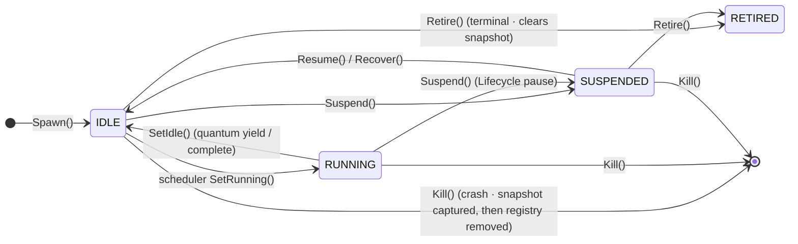

# ares Architecture Deep Dive (VII): Runtime & Lifecycle — Birth, Death, and Fresh Birth (0.3.x)

What happens when an Agent dies? Every framework has to answer this, but few do it well. This article walks through the design journey — from "how to prevent crashes" to "how to keep the task alive when the agent dies" and "how to resume interrupted work without wasting tokens." You'll see the disposable-agent state machine, the CognitionFactory injection path, the honest truth about the DAGExecution gate, and the real recovery semantics — including what is and isn't wired into production yet.

> Other Agent frameworks compete on features and flashiness. I have only one obsession: **Bugs I can accept. Crashes I absolutely cannot.**
> One day I started thinking — what if I just `kill -9` a running Agent right now? How do I save its work?
> Manually? First locate which process, dig through logs to find the cause, write a patch, then `go run main.go --args`… I'm already annoyed just thinking about it.
> What if there were a mechanism where an Agent could die, and its task could pick itself back up — with its cognition intact? I call this **the Agent dies, the Task does not**.
>
> 0.3.x update: The runtime has evolved into **Agent Fabric + Task Fabric + Recovery/Chaos**. The core philosophy is **"Agent death ≠ Task death"** — Agents are disposable, one-shot executors; the Task holds the checkpoint. When an Agent dies, it's not "resurrect the old Agent" but "spawn a new Agent + feed it the dead one's cognitive checkpoint." Agent lifecycle: `spawn → suspend → resume → retire → kill → recover`. Every execution is a single **quantum** (`ExecuteStep`); yielding at the quantum boundary guarantees the checkpoint is persisted.

## 1. The Rabbit Hole

Let me walk you through how I **agonized** over this design.

My first idea was simple: spawn a separate monitor task that checks every Agent's heartbeat. If one dies, report it — then restart it. Sounds solid, right? Then I asked myself: **what happens when the monitor itself dies?** Spawn another monitor to watch the monitor? It's turtles all the way down.

OK, different approach: spin up a backup Leader. Hot standby, disaster recovery, the whole deal. Then the next question hit me — **what about Sub Agents?** I can't give every Sub its own backup. So... a pool of rotating Subs? Cool, cool. Sounds great.

Then came the question that shut me up: **what about the interrupted task?**

The user asked the Agent to write a file. It got halfway through and the system crashed. System restarts, Agent auto-resurrects, and tells the user: **"Hey, the system just went down. I know you're frustrated — grab some tea, and we'll pick up where we left off!"**

Even if the user wants to curse the developer's ancestors, I'd say that's fair. More importantly — what about all those tokens that were already spent? Start over, spend them all again? That's real money.

So the design wasn't about "how to make an Agent never die." It was about three much more pragmatic questions:

1. **How does an Agent's task Continue after it dies?** (task survives)
2. **How does a new Agent pick up the old one's cognition?** (cognition hand-off)
3. **How does an interrupted task resume without wasting tokens?** (checkpoint resume)

Answer those three, and you can say "crashes don't happen."

---

## 2. The Agent State Machine: Fabric + AgentState

In 0.3.x, an Agent is just a disposable struct managed by the **Agent Fabric**. The Fabric doesn't schedule (that's Task Fabric's job), and it doesn't do IPC (that's IPC's job). It does exactly one thing — **life and death**.

```go
type Agent struct {
    // Identity is the stable agent identifier.
    Identity string
    // Capabilities are the declared capabilities (used by the capability-aware scheduler).
    Capabilities []string
    // State is the current lifecycle state.
    State AgentState
    // Load / Confidence / Priority are scheduling hints.
    Load       float64
    Confidence float64
    Priority   float64
    // Parent is "who spawned me" — provenance only, NOT a permission hierarchy.
    Parent string
    // SpawnedAt is when the agent was created.
    SpawnedAt time.Time

    // private: cognitive (cognitive state), cognition (execution body), governance (budget) …
}
```

Only four states, each dead simple:

```go
StateIdle      AgentState = "IDLE"      // alive, available for assignment
StateRunning   AgentState = "RUNNING"   // executing a task
StateSuspended AgentState = "SUSPENDED" // paused at Lifecycle level (not Task)
StateRetired   AgentState = "RETIRED"   // permanently decommissioned, not resumable
```



Note that `Kill` flows to `[*]` — it's not "another state," it's **deletion from the registry**. This is the key semantic: `RETIRED` still exists in the registry (just locked), while a killed Agent **no longer exists** and can only be replaced by a brand-new one through the recovery path.

---

## 3. Injecting Execution Capability: CognitionFactory (A1)

The Agent struct carries its execution slot in the `cognition` field, and it defaults to `nil`. So a freshly spawned Agent **has no execution capability by default** — it is "managed" (can be spawned/killed/recovered) but **cannot run a quantum**. Whether it can run is decided by `SpawnSpec.CognitionFactory`:

```go
type SpawnSpec struct {
    Identity     string        // requested id; "" means the Fabric assigns one
    Capabilities []string      // declared capabilities
    ParentID     string        // who spawned you (provenance, not hierarchy)
    TaskContext  map[string]any
    Resources    map[string]any
    Governance   Governance    // P3 cognitive-execution budget (token/tool/deadline)
    Priority     float64
    // CognitionFactory produces the execution body (Cognition) from the
    // declared capabilities. nil → the agent has no execution capability.
    CognitionFactory CognitionFactory
    // ExperiencePrior is the distilled prior experience (G1), seeded into
    // CognitiveState.Context at spawn time.
    ExperiencePrior any
}
```

```go
// Cognition is the execution contract for ONE quantum of cognitive work.
// Each ExecuteStep runs one quantum: complete the task (Done), yield
// progress for resumption (Checkpoint), or fail.
type Cognition interface {
    ExecuteStep(ctx context.Context, task *models.Task) (*StepOutcome, error)
}

// StepOutcome is the result of one execution quantum.
type StepOutcome struct {
    Done       bool              // true when the task is complete (Result set)
    Checkpoint any               // durable progress state (yield)
    Result     *models.TaskResult // final result, set only when Done
}

// CognitionFactory: Capabilities → Cognition.
type CognitionFactory func(capabilities []string) Cognition
```

The injection path is closed loop:

```mermaid
graph LR
    S[SpawnSpec] -->|Capabilities| F[CognitionFactory(capabilities)]
    F --> C[Cognition stored in Agent.cognition<br/>A1 injection]
    C -->|Agent.ExecuteStep runs one quantum| O{StepOutcome}
    O -->|Done| R[TaskResult]
    O -->|Checkpoint| Y[yield · checkpoint persisted]
    O -->|error| E[recoverable → encoded in StepOutcome<br/>unrecoverable → error]
```

Three boundary details worth remembering:

1. **A nil factory is legal**: the spawn produces a "shell" that can only be managed. `Executable()` checks for an injected body, and the scheduler uses it to **never offer a non-executable agent as a candidate**.
2. **A non-nil factory that returns nil is a programming error**: it would silently spawn a permanently non-executable agent (the code calls it "nil cognition was swallowed"), so the entire spawn is **rejected** (`ErrInvalidSpawnSpec`).
3. **Calling without capability gets an error**: calling `ExecuteStep` on an agent with no injected body returns `ErrAgentNotExecutable`.

And `ExperiencePrior` is the memory-distill hook (G1): the distilled prior becomes the new Agent's first `CognitiveState.Context`, so it isn't born a blank slate:

```go
if spec.ExperiencePrior != nil {
    a.cognitive = CognitiveState{
        SchemaVersion: CognitiveStateSchemaVersion,
        Context:       spec.ExperiencePrior,
    }
}
```

---

## 4. The Six Lifecycle Primitives

The Fabric exposes `spawn / suspend / resume / retire / kill / recover`. All are concurrency-safe (serialized under `Fabric.mu`), and each emits a lifecycle event through the optional EventSink (`agent.spawned / suspended / resumed / retired / killed / recovered`).

### Spawn: birth only, not scheduling

```go
func (f *Fabric) Spawn(ctx context.Context, spec SpawnSpec) (*Agent, error)
```

- A new Agent is always born in `StateIdle`.
- Validation: non-duplicate id (`ErrAgentExists`); no spaces in the id (`ErrInvalidSpawnSpec`); resource claim over quota → `ErrResourceQuotaExceeded` (**validate first, then mutate** — a failed spawn leaves the Fabric untouched).
- Injects the execution body, records `parent_id` provenance, and attaches the governance budget from birth.
- **Spawn does not schedule** — putting the Agent into the candidate pool is the Scheduler's job.

### Suspend / Resume: Lifecycle-level pause, not task pause

```go
func (f *Fabric) Suspend(ctx context.Context, agentID string) error // IDLE/RUNNING → SUSPENDED
func (f *Fabric) Resume(ctx context.Context, agentID string) error  // SUSPENDED → IDLE
```

- `Suspend` preserves the Agent's in-memory cognitive state; `Resume` relaunches **the same instance** (not a new spawn). Suspending an already-suspended agent is idempotent.
- RETIRED agents cannot be Suspend/Resume'd (`ErrAgentRetired`); Resuming a non-suspended state → `ErrAgentNotSuspended`.

### Retire: the graceful terminal state

```go
func (f *Fabric) Retire(ctx context.Context, agentID string) error
```

- **Requires the agent NOT be RUNNING** — to retire, suspend first, then retire (`ErrAgentRunning`).
- Releases the resource claim back to the P5 quota.
- **Must clear the death snapshot** — this is terminal: "the stale snapshot from an earlier kill/revive cycle must never resurrect later."
- Retiring a parent **does not** take children down (they are peer cognitive processes, not a permission tree).

### Kill: the crash path, non-graceful

```go
func (f *Fabric) Kill(ctx context.Context, agentID string) error
```

- Works on any state — this is crash semantics.
- **Order matters**: first capture the death evidence (`AgentSnapshot`: cognition + capabilities + parent id), **then** delete from the registry and release resources. Because after the delete the Agent is unreadable, the recovery subsystem depends on this snapshot to decide whether an in-place revival is possible.
- Children survive; the `Parent` field is NOT cleared — it stays as provenance. You're dead, but the trail remains.

### Recover: a new Agent picks up the old one's cognition

```go
func (f *Fabric) Recover(ctx context.Context, agentID string, cognitive CognitiveState) error
```

- The target Agent must be IDLE or SUSPENDED. The `cognitive` state is **fully replaced** into the agent.
- If it was SUSPENDED, it flips back to IDLE.
- This is the concrete action behind "a dead Agent's cognition is picked up by another/new Agent" (§13 invariant: **Agent disposable, Task durable**).

---

## 5. The Fabric Itself: Registry, Process Tree, Quota & Events

```mermaid
graph TB
    subgraph Fabric (Lifecycle pillar)
        REG[agents registry]
        TREE[children Process Tree<br/>parent→childIDs]
        QUOTA[resourceBudget / allocated<br/>P5 quota]
        SNAP[snapshots death-snapshot store<br/>last-per-identity]
        SINK[EventSink lifecycle events]
    end
    REG -->|Idle?| SCHED[Task Fabric scheduler<br/>only IDLE + executable are candidates]
    TREE -->|pure provenance · not authority| PROV
    QUOTA -->|checked on spawn / released on kill·retire| ALLOC
    SNAP -->|captured before Kill| SAVE
    SINK -->|best-effort| LOG[event log<br/>cross-restart rebuild]
```

Points to note:

- **Process Tree is Pure Provenance**: `children[parentID]` only answers "who spawned whom" — it never forms a permission hierarchy (§13 invariant #1: A ≡ B ≡ C, peer cognitive processes).
- **Resource quota (P5) is admission control**: claimed once at spawn, released at kill/retire. An empty/closed `resourceBudget` disables admission control.
- **Events are best-effort**: a failed `sink.Emit` **never breaks the state machine** — the in-memory registry is authoritative. Conversely, rebuilding state across process restarts requires the event log (Evidence-Driven).
- **Death-snapshot store**: one snapshot per identity, keeping the **most recent** death. `Retire` clears it (terminal); a successful in-place revival calls `ClearSnapshot` to consume it, so a long-running process doesn't accumulate stale snapshots. When several dead Agents share a capability, recovery picks the one with the **most recent `DiedAt`** — fresh cognition is the safest revival seed.

---

## 6. The L2 Execution Graph & the DAGExecution Gate: Honesty First

This section I want to state the ugly truth up front, because it is **not** a shipped capability.

The Agent Fabric contains an `L2Graph`: one `engine.MutableDAG` per session, nodes are actual tool instances, and a router cognition dispatches by the task's capability to `toolCognition / answerCognition / rootCognition / (optional) planCognition`. It all looks complete. But it sits behind a gate:

```go
// DAGExecution gates the L2 session-graph execution path. The zero value is
// the legacy ReAct behavior: the peer cognition factory returns the chat
// (tool-loop) cognition and the L2 graph machinery stays test-only.
type DAGExecution struct {
    Enabled bool
}

func (g DAGExecution) Select(chat, router Cognition) Cognition {
    if g.Enabled {
        return router // gate open → session-graph execution
    }
    return chat       // default: the old ReAct tool loop
}
```

**Being honest**: `Enabled` defaults to `false`. So **production peers run the default chat / ReAct tool-loop cognition**, and `L2Graph` + the router cognition are **not wired into the production serve path** — they are a test-only, forward-looking seed. The code comment says it plainly: *"it is not yet wired into the production serve path — until it is, peers keep their default ReAct chatCognition and this graph stays test-only."*

That doesn't mean it's useless — the router's dispatch key (`Task.AgentType` → candidate overlap → executor) is **exactly the key the scheduler already resolves**, so no new dispatch mechanism is introduced whenever the gate opens. `toolCognition` cleanly honors "state is the task" (strict-schema tools only receive `arg.`-namespaced keys; envelope plumbing never reaches the tool). And `answerCognition` carries a TODO: **no summarizer is wired** — it only emits the content its own node carries; with none, it plainly outputs "no answer content supplied" and logs a warning, rather than faking success.

**Honest reflection**: this is the restraint I most want to emphasize — I can make the L2 graph sound beautiful in docs, but as long as `Enabled=false`, it is not running. Writing about it as a "shipped capability" would be lying. Good things are allowed to not be enabled by default.

---

## 7. Death, Revival & Chaos Verification: Recovery + Chaos

What actually upholds "the Agent dies, the Task does not" is `internal/aresrecovery`. It welds the two Fabrics together — **Task Fabric (durable tasks + lease expiry + checkpoints) + Agent Fabric (disposable agents + cognitive state)** — to deliver "agent death → task requeue → checkpoint resume → replacement executor."

```mermaid
graph TB
    K[Agent dies<br/>Kill or lease expiry] --> S[Kill captures AgentSnapshot first<br/>cognition + capabilities + parent]
    S --> R2{Restart budget<br/>restarts[id] < MaxRestarts?}
    R2 -->|no| EX[ErrRecoveryExhausted<br/>no more restarts]
    R2 -->|yes| A2{LastSnapshot exists?}
    A2 -->|yes| IP[RestartAgent revives IN PLACE<br/>same identity · provenance continuous]
    A2 -->|no| FW[Fresh identity<br/>pure W1 replacement]
    IP --> REC[agents.Recover installs cognitive checkpoint]
    FW --> REC
    REC --> CLEAR[ClearSnapshot · snapshot consumed]
    CLEAR --> LE[lease expires → task READY<br/>new Agent resumes from checkpoint]
```

### Real details of restart

**The restart budget is "lifetime-cumulative," not "consecutive-failure cumulative."** This one deserves its own callout:

```go
// restarts is LIFETIME-CUMULATIVE per identity and is intentionally NEVER
// reset by a successful revival: the budget exists to stop a broken agent
// from cycling forever, so total deaths — not consecutive ones — consume it.
// (A2 review clarification 2026-08-22)
if attempts >= r.policy.MaxRestarts {
    return nil, ErrRecoveryExhausted
}
```

The default `DefaultRestartPolicy()` is `MaxRestarts=5`, initial backoff `1s`, capped at `30s`. An agent that keeps dying pays the budget even when a particular revival succeeds — **success does not clear it**. This is counter-intuitive, but correct: you don't want a sick agent to keep cycling forever just because it happens to get revived each time.

**In-place revival vs. full replacement (A2 arbitration).** If the dead identity's `LastSnapshot` still exists, `RestartAgent` revives **in place** — keeping the same `Identity`, so provenance and the audit trail stay continuous ("stateful cognitive revival"). Without a snapshot, it falls back to a **fresh identity, pure W1 replacement**:

```go
if _, ok := r.agents.LastSnapshot(deadAgentID); ok {
    spec.Identity = deadAgentID // snapshot exists → revive in place under same id
}
```

**Replacement spawns always take the recovery path.** Every replacement spawn goes through `SpawnForRecovery`, which **bypasses the population cap** (a self-healing spawn rejected by MaxConcurrent would strand the task forever) but **not the Enabled gate**. Meanwhile `WithCognitionFactory` injects the A1 execution-body factory, so the replacement is a **real, executable** cognitive process rather than an empty shell (no phantom).

### Two recovery paths that must be kept separate (an important honesty point)

| Entry point | Purpose | Note |
|-------------|---------|------|
| `RequeueExpiredLeases()` | lease expiry → task requeued to READY | the first recovery path: a dead agent's lease expires, the task becomes acquirable again |
| `RecoverTaskCheckpoint()` | replacement agent + acquire task + install checkpoint | **TEST/CHAOS-ONLY** |
| `RecoverFromAgentDeath()` | full chain: requeue → resume each checkpoint | **TEST/CHAOS-ONLY** |

The code is emphatic about the last two: they install checkpoints via `agents.SetCognitiveState` and acquire tasks themselves — a **separate mechanism from the production scheduler path** (`scheduler.executeWithCandidates → taskfabric.DecodeCheckpoint → ToModelTask`). **Production recovery runs `runKernelRecoveryLoop` in `cmd/ares`**; these three are only for chaos simulations, sandbox tests, and recovery tests, and the doc explicitly warns against wiring them into the production serve path.

### Chaos: break first, then verify

```go
// Chaos is the Failure Injection + Recovery Verification harness.
// Recovery proves the Runtime survives. Note: injection ≠ recovery —
// first assert "task stranded after injection," then VerifyRecovery asserts "task recovered."
func (c *Chaos) InjectFailure(ctx, agentID, failure) error     // "kill" or "suspend"
func (c *Chaos) VerifyRecovery(ctx) int                        // returns the number of tasks recovered
```

Two injectable failures: `FailureKill="kill"` (hard kill, removed immediately) and `FailureSuspend="suspend"` (soft pause, simulating a hang/stall rather than a crash). `InjectFailure` does **not** trigger recovery; `VerifyRecovery` does — splitting "task is stranded after injection" from "task is recovered after VerifyRecovery" keeps the test assertions clean.

---

## 8. Known Issues & Design Flaws

**1. Best-effort events, authoritative memory → cross-restart rebuild depends on the event log**

`Fabric.record` failing never breaks the state machine — the right trade-off — but it means "in-process" you read memory, "across restarts" you must replay the event log (Evidence-Driven). Two sources of truth coexist and need reconciliation when debugging.

**2. The lifetime-cumulative restart budget is counter-intuitive**

A success doesn't reset the sick agent's budget (see §7), which stops pathological cycling — but at the cost that an occasionally-crashed, otherwise-recoverable agent can still hit `ErrRecoveryExhausted` after a few "successful" revivals. There's currently no decay/decrement strategy — an open question.

**3. The in-place revival dependency chain is fragile**

`LastSnapshot` present → revive in place; but a snapshot is only captured in `Kill`. If an Agent vanishes without `Kill` ever running (the process is gone before it can save anything), there's no snapshot and it degrades to a W1 new-identity replacement. For unpredictable hard crashes this coverage is limited.

**4. DAGExecution defaults OFF**

The L2 execution graph is a beautiful vision, but `Enabled=false` means it is not running in production today. Treating it as a shipped capability will leave you on empty ground. It's a forward-looking seed, not the incumbent.

**5. RecoverTaskCheckpoint / RecoverFromAgentDeath are test/chaos-only**

Production recovery is `runKernelRecoveryLoop`. These two use `SetCognitiveState` + self-acquire, a mechanism independent of the real scheduler — do not wire them into production, or they'll fight the actual scheduling path.

**6. Recovery is "better to redo than to miss"**

`findByCapability` picks the freshest death snapshot and `RecoverFromAgentDeath` re-attaches each expired task. Against **non-idempotent tools** (place an order, send an email), re-running is catastrophic. The recovery system has no tool-level idempotency markers to distinguish "safe to retry" from "must skip."

---

## 9. Architecture Summary

| Pattern | Problem Solved | Gap |
|---------|---------------|-----|
| State machine IDLE/RUNNING/SUSPENDED/RETIRED | observable, arbitrable lifecycle | retire/suspend boundaries need care (Retire can't target RUNNING) |
| Kill captures snapshot before registry removal | death evidence preserved, in-place revival possible | unpredictable hard crashes skip Kill entirely |
| Retire clears snapshot (terminal) | stale snapshot can't resurrect later | — |
| Process Tree pure provenance (A ≡ B ≡ C) | peer hierarchy, parent death ≠ child death | tracing causation requires reading the tree |
| Spawn-bound execution injection (CognitionFactory) | discreteness = capability binding | nil factory yields a shell to be filtered by `Executable()` |
| ExperiencePrior distilled-prior injection | new Agent isn't a blank slate | prior quality shapes the outcome |
| Factory injection + Recover installs cognition | Agent dies, cognition survives | depends on Kill capturing the snapshot first |
| Recovery lifetime-cumulative budget | stops broken agents cycling forever | no reset on success, may waste an occasional mishap |
| In-place revival (LastSnapshot hit) | continuous provenance & audit | missing snapshot degenerates to W1 new-identity |
| Chaos inject/verify separation | prove stranded first, prove recovered second | only kill/suspend failure types |
| DAGExecution gate (default off) | forward-looking L2 graph doesn't disturb incumbent ReAct | not in production; misuse leaves you stuck |

The most satisfying test I ever ran: use Chaos `InjectFailure` to kill an in-flight analysis Agent, leaving its task stranded in READY; then `VerifyRecovery` hands the checkpoint to a replacement — the task keeps running, and not one token is wasted.

That moment I knew: **the money wasn't wasted.**

---

**Appendix: Key File Index**

| File | Core Responsibility |
|------|-------------------|
| `internal/agentfabric/agent.go` | `Agent` struct + `IDLE/RUNNING/SUSPENDED/RETIRED` + `CognitiveState` + `Executable()` |
| `internal/agentfabric/lifecycle.go` | `SpawnSpec` + `spawn/suspend/resume/retire/kill/recover` lifecycle primitives |
| `internal/agentfabric/fabric.go` | `Fabric` registry, Process Tree (provenance), resource quota, EventSink |
| `internal/agentfabric/executor.go` | `Cognition` / `StepOutcome` / `CognitionFactory` / `CognitionFunc` |
| `internal/agentfabric/l2graph.go` | `L2Graph` + router/tool/answer/root/plan cognitions + `DAGExecution` gate |
| `internal/agentfabric/snapshot.go` | `AgentSnapshot` + `snapshotStore` + `LastSnapshot/ClearSnapshot/FindRevivableSnapshot` |
| `internal/aresrecovery/recovery.go` | `Recovery` + `RestartPolicy` + recovery chain (incl. test/chaos-only entry points) |
| `internal/aresrecovery/chaos.go` | `Chaos` failure injection (kill/suspend) + `VerifyRecovery` |
| `internal/taskfabric/state.go` | Task states (`READY/RUNNING/SUSPENDED/FAILED`…) and transitions |
| `cmd/ares` | `runKernelRecoveryLoop` — the production recovery loop |

---

**In this series (Runtime part)**

| Chapter | Topic |
|---------|-------|
| [01 Architecture Overview](01-architecture-overview-deep-dive.md) | overall architecture & design principles |
| [02 Agent Harmony Protocol](02-agent-harmony-protocol.md) | inter-agent communication & collaboration |
| [07 Runtime & Lifecycle](07-runtime-lifecycle-deep-dive.md) | **this article**: Fabric birth/death/fresh birth |
| [08 Event System](08-event-system-deep-dive.md) | event sourcing & state rebuild |
| [09 Arena Fault Injection](09-arena-fault-injection-deep-dive.md) | the failure-injection arena |