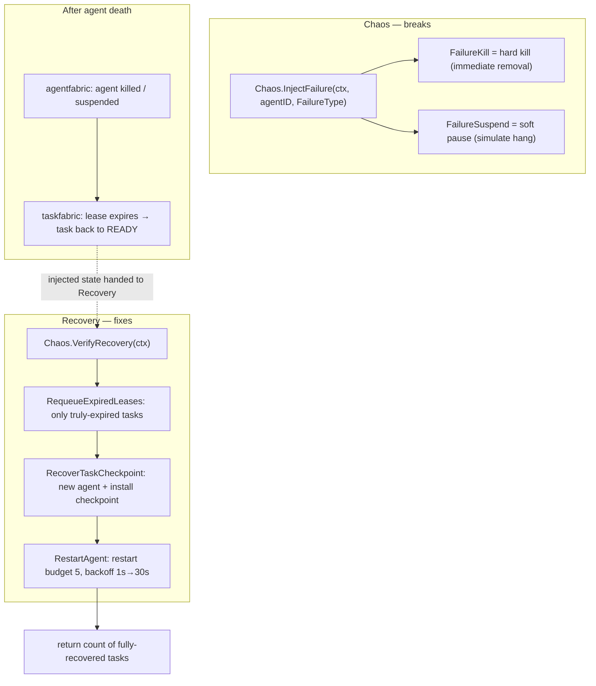
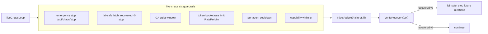
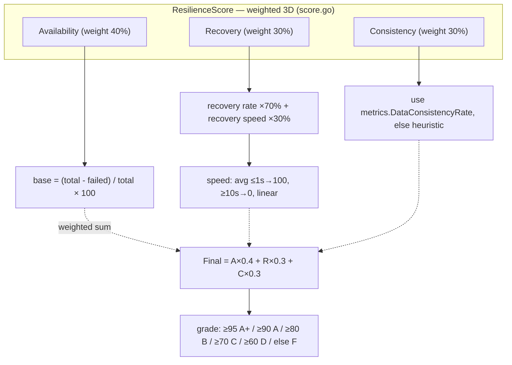
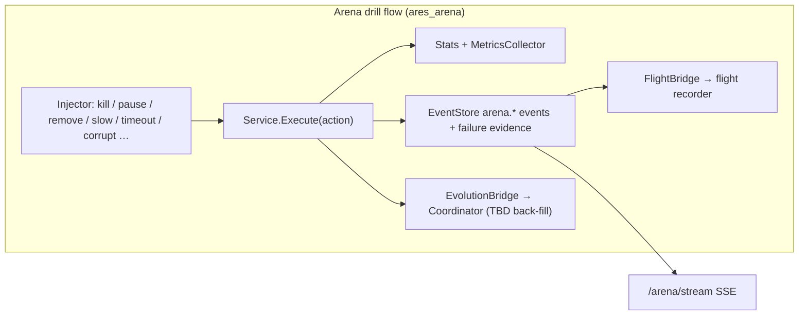

# ares Architecture Deep Dive (IX): Arena / Fault Injection — Deliberately Break It, Then Watch It Rise Again (0.3.x)

> Other agent frameworks show you how smart an agent is: fluent dialogue, strong reasoning, slick tool use.
> ares wants to show something else: **break it deliberately, and see whether it gets up on its own.**
> You click a button and kill a working agent to watch whether it recovers.
>
> 0.3.x update: fault injection and recovery verification are now split across **two independent surfaces**.
> - **`internal/aresrecovery`**: targets the new Kernel model (agentfabric + taskfabric). The source comment states it plainly: **"Chaos breaks, Recovery fixes."** This is the surface that is actually wired into the production serve path — with a fail-safe latch.
> - **`internal/ares_arena`**: targets the old "leader / sub-agent + DAG" model, running as a standalone `ares arena serve` chaos-drill process. Its `Injector` comment is equally plain: **"It does NOT implement recovery; the existing resurrection plugin and failover handle that automatically."**

> Boundary of this article: every symbol and flow below is something I actually read in this codebase. Where something is "configured but explicitly not done yet," or needs extra wiring to take effect, I mark it (待核实 / TBD) rather than dressing it up.

---

## 1. Why build a "break things" feature

Killing a running agent by hand and watching it come back and finish what it started is satisfying. But satisfaction alone proves nothing — **you'd only be guessing whether the system can actually take a beating**.

That's the point of chaos engineering: not one manual click, but **systematic, repeatable fault injection followed by recovery verification**. It is the laboratory for the lifecycle assertion from part 7 of this series — **"agent death ≠ task death."**

---

## 2. First, tell the two "chaos" surfaces apart

The easy trap when reading this code is that there are **two fully independent** fault-injection/recovery surfaces, and they must not be mixed up:

| Surface | Location | Target model | Production wiring | Recovery responsibility |
|---------|----------|--------------|-------------------|-------------------------|
| Kernel chaos | `internal/aresrecovery` | agentfabric + taskfabric (new) | `cmd/ares` `wireChaos` (live is heavily gated; default shadow) | `Recovery` implements the full recovery chain itself |
| Arena drill | `internal/ares_arena` | old leader/sub-agent + DAG | standalone process `ares arena serve` | `Injector` does **not** implement recovery — delegated to ares_runtime resurrection/failover |

Both are called "chaos," but one is **production-wired recovery verification with a fail-safe latch**; the other is a **drill process isolated from production**. The rest of this article covers each.

---

## 3. Kernel chaos: Chaos breaks, Recovery fixes

The comment at the top of `internal/aresrecovery/chaos.go` is the charter for this module:

> "Chaos is the Failure Injection + Recovery Verification harness… it deliberately kills agents to prove the Runtime (Recovery subsystem) can restore their tasks. **Chaos is SEPARATE from Recovery — Chaos breaks, Recovery fixes.**"

Broke into parts:

- `FailureType` has exactly two values:
  - `FailureKill` — a hard kill (crash): the agent is removed immediately.
  - `FailureSuspend` — a soft pause (simulates a hang/stall, not a crash).
- `Chaos.InjectFailure(ctx, agentID, failure)` — destroys only. The comment stresses: **recovery is NOT triggered here**; you must call `VerifyRecovery` explicitly. That lets a test assert "task is stranded after injection" before "task is recovered after VerifyRecovery." It records `injected[agentID] → FailureType`.
- `Chaos.VerifyRecovery(ctx) int` — forwards to `Recovery.RecoverFromAgentDeath`, returns the **number of tasks fully recovered**. This is the "Recovery Verification" half of Chaos.

`Recovery` (`recovery.go`) does the actual fixing. The recovery chain is:

1. `RequeueExpiredLeases()` → sweeps expired leases and requeues **only tasks whose lease genuinely expired** back to READY. The comment stresses you must never iterate all READY tasks — that would hijack brand-new tasks unrelated to the crash.
2. `RecoverTaskCheckpoint(taskID, replacementID)` → finds/spawns a replacement agent, acquires the task for it, and installs the preserved checkpoint as the new agent's cognitive state (resume from the break point).
3. `RestartAgent(deadAgentID, cognitive, capabilities)` → revives in place under the same id when a death snapshot exists (continuous provenance), otherwise spawns a fresh identity. The restart budget is **lifetime-cumulative**: default 5 attempts, backoff 1s→30s capped (`DefaultRestartPolicy`); exhausted returns `ErrRecoveryExhausted`, so a broken agent cannot cycle forever. A successful revival does **not** reset the counter — only total deaths consume it.
4. `RecoverFromAgentDeath(ctx) int` → chains 1–3: sweep expired leases → requeue → checkpoint-resume each requeued task, returning the number fully recovered.

> Two honest caveats:
> - The comments on `RecoverTaskCheckpoint` and `RecoverFromAgentDeath` are labelled **TEST / CHAOS-ONLY**: they install checkpoints via `agents.SetCognitiveState` and acquire tasks by hand — a separate mechanism from the production scheduler path (`runKernelRecoveryLoop` → `taskfabric.DecodeCheckpoint`). **They must not be wired into the production serve path.** Production recovery runs through `runKernelRecoveryLoop` in `cmd/ares`.
> - So the semantic weight of `Chaos`/`Recovery` here is **recovery verification**; the actual event-driven recovery loop in production is `runKernelRecoveryLoop` in `cmd/ares/kernel_loop.go`.



### Production wiring: wireChaos (shadow / live)

`cmd/ares/serve_chaos.go` `wireChaos` wires Chaos into the serve path. The default and safest posture is **shadow**:

- Default `mode=shadow` (or disabled, or live-with-unmet-guards) → only `shadowSandboxLoop` runs: it periodically replays a canonical failure scenario on **independent scratch fabrics** (spawn→create→acquire→kill→lease-expire→recover) — **never touching production agents** — and reports the outcome to the introspect panel.
- To switch to `mode=live`, **four guards must hold simultaneously**: `chaos.enabled=true`, `allow_live=true`, non-empty `eligible_capabilities` (target whitelist; an empty list refuses to arm), and non-empty `stop_token` (emergency-stop credential). Any missing guard falls back to shadow.
- The live loop `liveChaosLoop` enforces **six guardrails** (the source's own words): emergency stop `POST /api/chaos/stop`, a fail-safe latch, a GA quiet window, a token-bucket rate limit, per-agent cooldown, and the capability whitelist. Each injection is `InjectFailure(FailureKill)` → `runLiveChaosInjection` → `VerifyRecovery`; **if verification returns 0 recovered, the fail-safe latch trips and no further injections run until process restart.**



---

## 4. The arena drill process: `internal/ares_arena`

This is the old, production-isolated chaos-drill layer, launched by `ares arena serve`. It starts its own demo pool (`arena-worker-1..3`, type=coder) and a mutable DAG, specifically to demonstrate "inject a fault → watch the system react."

Core files (real paths, which differ from the earlier article):

| File | Purpose |
|------|---------|
| `internal/ares_arena/types.go` | ActionType (13 kinds), Action, Result, Stats |
| `internal/ares_arena/injector.go` | Injector — wraps `ares_runtime` + `MutableDAG`, **does not implement recovery** |
| `internal/ares_arena/service.go` | Service — Execute actions, record metrics, emit events/failure evidence |
| `internal/ares_arena/scenario.go` | Scenario orchestration: YAML → sequential actions → report |
| `internal/ares_arena/survival.go` | Survival mode: random injection on an interval |
| `internal/ares_arena/metrics.go` | MetricsCollector — per-action-type aggregation |
| `internal/ares_arena/score.go` | 3-dimensional resilience score |
| `internal/ares_arena/http.go` | REST + SSE + API-key auth |
| `internal/ares_arena/integration.go` | FlightBridge — arena actions → flight recorder |
| `internal/ares_arena/evolution_bridge.go` | EvolutionBridge → evolution Coordinator (TBD) |
| `cmd/ares/arena.go` | `ares arena` CLI: run / validate / list / serve / survival / inspect |
| `cmd/ares/serve_chaos.go` | production kernel chaos wiring (`wireChaos` above) |

> The earlier article's paths `internal/arena/…`, `internal/dashboard/static/app.js`, and `cmd/arena/main.go` **do not exist in this repository**. The real paths are above; arena ships no bundled static frontend — the front-end-observable surface is the REST/SSE endpoints.

### 4.1 The injector: a thin layer that does not recover

`Injector` depends on two **interface subsets**: `RuntimeProvider` (a subset of ares_runtime) and `DAGProvider` (a subset of mutable-DAG mutations). The interface-based design lets arena avoid importing concrete Runtime/DAG packages and makes mocking easy.

```go
// internal/ares_arena/injector.go
// Injector wraps existing ares_runtime/DAG APIs to inject chaos.
// It does NOT implement recovery; the existing resurrection plugin and
// failover handle that automatically.
type Injector struct {
	ares_runtime RuntimeProvider
	dag          DAGProvider
}

func (in *Injector) KillLeader(ctx context.Context) (string, error) {
	leaderID := ""
	for _, info := range in.ares_runtime.ListAgents() {
		if info.Type == "leader" { leaderID = info.ID; break }
	}
	if leaderID == "" { return "", ErrLeaderNotFound }
	if err := in.ares_runtime.StopAgent(ctx, leaderID); err != nil {
		return "", fmt.Errorf("arena: kill leader %s: %w", leaderID, err)
	}
	return leaderID, nil
}
```

It implements no recovery itself. Recovery is *delegated/expected* from ares_runtime's resurrection and failover. `KillLeader` just finds a `type=="leader"` agent and calls `StopAgent` — "a replacement leader is then elected by failover" is **not** implemented in this process.

`internal/ares_arena/e2e_chaos_recovery_test.go` is a real end-to-end check: it drives a genuine `ares_runtime.Manager`, registers a pool of workers with rebuild factories, calls `Manager.NotifyAgentDead(...)` to model a batch crash, then polls the factory call count to assert resurrection happens asynchronously and the Manager still tracks a live pool. It scales over 16/64/128.

### 4.2 Thirteen actions

`types.go` defines 13 `ActionType`s:

`kill_leader` `kill_agent` `remove_node` `remove_edge` `pause_agent` `resume_agent` `slow_agent` `kill_orchestrator` `network_partition` `tool_timeout` `memory_corrupt` `mcp_disconnect` `llm_failure`

`Service.Execute` dispatches each action to the matching `Injector` method via `switch action.Type`, then: updates `Stats`, calls `MetricsCollector.RecordActionResult`, emits an `arena.*` event to the EventStore, appends a `kind=failure` evidence record to the unified Evidence Store on failure, and calls any wired `FlightBridge` / `EvolutionBridge`.

### 4.3 Scenario orchestration

`scenario.go` defines action sequences in YAML. Real examples live in `examples/arena/` (`leader_assassination.yaml`, `cascading_storm.yaml`):

```yaml
name: leader-assassination-and-recovery
config:
  stop_on_error: false
  parallel_actions: false
  warmup: 1s
  cooldown: 1s
actions:
  - delay: 2s
    action: { type: kill_leader }
    label: kill-leader
  - delay: 1s
    action: { type: kill_agent, target_id: agent-1 }
    label: kill-agent-1
  - delay: 3s
    action: { type: network_partition, target_id: agent-2 }
    label: partition-agent-2
  - delay: 1s
    action: { type: slow_agent, target_id: agent-3, metadata: { delay: 10s } }
    label: slow-agent-3
```

`ValidateScenario` checks the name, at least one action, non-negative delays, per-action validity, and non-negative `max_concurrent`/`timeout`. `RunScenarioReport` supports warmup/cooldown, an overall timeout, and `stop_on_error`.

> Honest caveat: `ScenarioConfig.parallel_actions` and `max_concurrent`, plus per-action `depends_on`, are **explicitly "configured but not yet implemented"** — `RunScenarioReport` logs a warning and (TBD) always runs actions **sequentially**.

### 4.4 Survival mode

`survival.go` `Service.RunSurvival` picks a random action from the 13 and a random target (from listed agents or DAG nodes/edges) on each interval (default 30m / every 10s), recording a `Timeline`. `SurvivalReport` carries no hard-coded sample scores — the earlier article's running `Score: 100.0 (A+)` / `97.3` output lines are not something I found in this code, so they are not reproduced here.

---

## 5. The 3-dimensional resilience score

`score.go` `ResilienceScore` is a weighted 3-dimensional score; `gradeFromScore` maps fixed thresholds to letter grades.



An honest note on the Consistency dimension: `MetricsSnapshot.DataConsistencyRate` in `metrics.go` defaults to 0, because `RecordConsistency` is marked **Deprecated** (`RecordActionResult` is the current entry point) and no steady stream of real data feeds it. So `calcConsistency`:
- uses `metrics.DataConsistencyRate` when it is `> 0`;
- otherwise falls back to a **heuristic**: treats about half the failures as data-related (`dataRelated = max(1, failed/2)`) and deducts 5 points per unit.

In other words, the third dimension — unless someone wires real consistency metrics in — is a **documented estimate**, not a measured value. And the recovery-speed thresholds (≤1s → 100, ≥10s → 0) are this score's own rubric, not a measured SLA.

---

## 6. HTTP and authentication

`http.go` `Handler` registers roughly 27 routes: `/arena/leader/kill`; `/arena/agent/{id}/kill|pause|resume|slow|partition|tool-timeout|memory-corrupt|mcp-disconnect|llm-failure`; `/arena/node/{id}/remove`; `/arena/edge/remove`; `/arena/orchestrator/kill`; plus `stats/history/stream` (SSE) / `score/metrics`, the three survival endpoints, and flight timeline/diagnostics plus scenario run/validate.

Arena exposes only destructive endpoints (kill leader, remove nodes, corrupt memory), so authentication defaults to **deny**:
- If an API key is set (`--api-key` or `ARENA_API_KEY`), every request must carry the `X-API-Key` header (constant-time compare).
- With no key and no explicit `--allow-anonymous`, `APIKeyAuthMiddleware` returns 401 for every request — the earlier article's "open the dashboard and click" no-auth flow is, in the real code, rejected by default. `--allow-anonymous` is for local development only, and the comment warns it must never be enabled for a network-reachable deployment.

---

## 7. Flight recorder and evolution bridging

**FlightBridge** (`integration.go`) writes each arena action as a timeline event in the flight recorder and adds a diagnostic record for failures (calling `flight.SuggestFix`). This wiring is confirmed effective: `service.Execute` calls `s.bridge.OnActionExecuted` after every action.

**EvolutionBridge** (`evolution_bridge.go`) translates arena failures into `PatchProposal`s for the evolution Coordinator: `ActionRemoveNode → PatchInsertNode`, `ActionKillAgent/KillLeader → PatchReplaceNode`, `ActionSlowAgent/ToolTimeout → PatchChangeScheduler`, infrastructure faults → `PatchChangeRecoveryStrategy`, and grades them via `chaosPriority`: faults with **priority ≥ 9** (killing leader/orchestrator) go through `Coordinator.ApplyEmergency` for immediate self-healing; the rest go through `Coordinator.Submit` for evaluation.

> (TBD): `OnActionExecuted` does construct a proposal and submit/emergency-apply it on failure. But whether the Coordinator's evaluated proposal ultimately produces a real runtime/scheduling change depends on the Coordinator and its patch applicator. Inside `arena serve`, this operates on the process's own demo pool and mutable DAG; whether these patches flow back to the real production runtime is something I could not confirm in the code covered here, so I flag it as TBD.

Worth adding is the **execution feedback loop** in `cmd/ares/peer_mode.go` (from `aresrecovery`, targeting the Kernel model) that is confirmed live:
- `ExecutionAttribution.Record / RecordWithMetrics(agentID, capability, success, latency, retries, recovers)` collects per-(agent, capability) outcomes.
- `DeterministicScorer` is a **zero-LLM** deterministic scorer: weights `success 0.70 / latency 0.15 / retries 0.10 / recovers 0.05`, always in [0,1], with a neutral prior of 0.5 for no history. It is the deterministic fitness signal for the GA — no LLM, no randomness.
- `EvolutionFeedbackAdapter.Apply` pushes attribution snapshots back into `ConfidenceInjector.SetAgentConfidence / SetCapabilityConfidence`, so the next schedule sees the new confidence — failure-heavy agents are downweighted, success-heavy agents preferred.
- Change attribution `ChangeAttributor.Attribute` apportions the `BestScore` delta between two adjacent `GenerationSnapshot`s across each change: explicit Impacts win; the rest split the remaining delta equally.

Also from `chaos.go`, `EvolutionAdapter` (`AdaptPopulation(spawn, retire)`) is the runtime-adaptation surface: Evolution decides population changes; the Kernel enforces them through the existing spawn/retire primitives ("Agent decides; Kernel enforces"). Its `tasks` field comment says it is **intentionally unused for now** — scheduling-policy changes will plug into `taskfabric.Schedule` in a future iteration. So: population adaptation is implemented; scheduler-policy adaptation is declared but not yet wired.



---

## 8. CLI quick reference

| Command | Purpose |
|---------|---------|
| `ares arena run <scenario.yaml>` | Run a scenario against a server and print the report |
| `ares arena validate <scenario.yaml>` | Validate locally (or `--remote`) |
| `ares arena list [dir]` | List scenario files in a directory |
| `ares arena serve [--addr] [--api-key]` | Start the arena drill server (deny auth by default) |
| `ares arena survival [--addr] [--duration] [--interval]` | Run survival mode and poll status every second |
| `ares arena inspect [--addr] [--timeline] [--diagnostics]` | Read score/metrics/timeline/diagnostics reports |

---

## 9. Closing

After walking through all of this, I want you to remember not a score but the **two boundaries written into the comments**:

1. In `internal/aresrecovery`: **"Chaos breaks, Recovery fixes."** Breaking and fixing are two independent responsibilities, welded together by an explicit `VerifyRecovery()` call. In production, live chaos is locked behind six guardrails, and the default posture never touches production agents (shadow sandbox).
2. In `internal/ares_arena`: **"It does NOT implement recovery."** It only injects faults; recovery belongs to ares_runtime's existing mechanisms, and this is an isolated drill field.

I found no evidence in this repository for the earlier article's numbers such as "Score 100.0 (A+)", "revived in 1.4s", or "97.3% recovery rate", so none of them appear above. The Consistency dimension defaults to a heuristic, `parallel_actions` / `depends_on` are not yet implemented, and the EvolutionBridge back-fill effect is marked TBD.

> Making "deliberately break it, then watch it rise again" repeatable, verifiable, and — by default — isolated from production is the genuinely hard part of this.