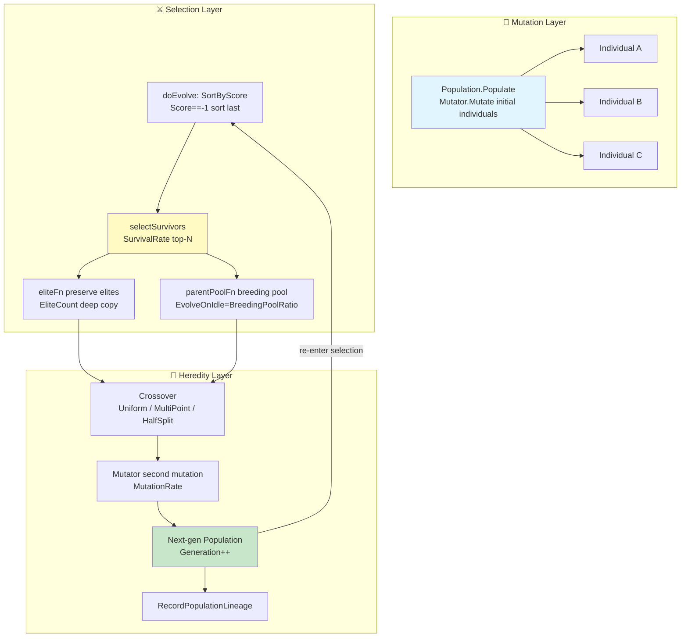
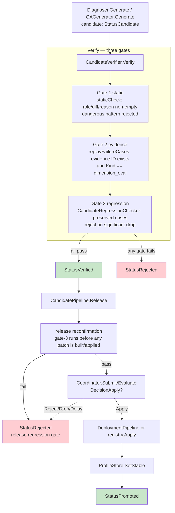
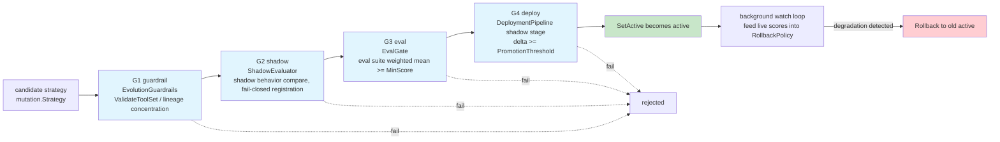

# ares Architecture Deep Dive (XI): Autonomous Evolution — When Agents Learn to Improve Themselves (0.3.x)

> The honest 0.3.x picture up front: **two evolution engines coexist, and their roles are opposite to intuition.**
> The one really wired into production bootstrap is **v1** — `internal/ares_evolution`'s **StrategyLifecycle** (G1 guardrail → G2 shadow → G3 eval → G4 deployment). Every promoted strategy crosses this gate.
> **v2** — `internal/evolution`'s **Candidate → Verify → Promote** release closed-loop — is the newer, oft-discussed pipeline. As a library with runnable examples (`examples/`) it's complete, but it **has no production caller today**; it is "code-complete, waiting to be wired."
> GA (population genetic algorithm) is demoted to an optional zero-token / parameter-tuning path, but its `Crossover` / `Fitness` have already been **removed from v2's core `Genome` interface** (zero production callers).

> Have you ever wondered why agents can't get smarter with use?
> They repeat the same mistake. Every solved problem starts from scratch next time.
> If humans can learn from mistakes, why can't agents?
> And more crucially — **"being able to generate a better strategy" and "being willing to ship that strategy" are two completely different things.**
> This article covers how far ares has actually gone on each, and which parts are still just code.

> Note: this article is based on real code (see `internal/evolution/` (v2 candidate/gates/GA lineage), `internal/ares_evolution/` (v1 lifecycle/fitness/guardrails/eval gate), `internal/evolution/genome/` and `internal/ares_evolution/genome/` (GA and DAG genomes), `internal/ares_bootstrap/provide_new_evolution.go` (L1 wiring), `internal/evolution/coordinator/` and `deployment/`, `internal/evolution/patch/`). Every symbol and path I describe I actually read in this code. Anything that is "only claimed in comments/docs, not provided by code," "example-only benchmark," or "configured but not wired," I mark （待核实）/ (unverified) or delete outright — I don't oversell it.

---

## 1. First, Acknowledge the Reality: v1 and v2 Coexist

The title says "autonomous evolution," but ares actually has **two** evolution systems, and pretending otherwise helps nobody:

| | **v1: `internal/ares_evolution`** | **v2: `internal/evolution`** |
|---|---|---|
| Main flow | `StrategyLifecycle`: Strategy → G1 guardrail → G2 shadow → G3 eval → G4 deploy | Candidate → Verify (Gate1/2/3) → Release → Promote |
| State machine | Strategy states: candidate / shadow / active / rollback | Candidate states: candidate → verified → rejected / promoted |
| Production wiring | ✅ Wired directly by `ares_bootstrap` (gates strung together) | ⚠️ **Reachable only via `examples/` and `_test.go`** — no production caller |
| Scoring | `RuntimeFitnessAggregator` (multi-source weighted) | Gate-3 `CandidateRegressionChecker` (preserved-case regression) |
| Dominant concept | "The strategy is a first-class living object with a production lifecycle" | "A change must first become a candidate, pass verification, only then touch the running system" |

v2 states its design principle in its own package comment, citing *AI Agents in Depth* Ch. 8:

> All modifications must first become candidates, pass verification, and only then can they change the running system. The verifier, test harness, and release gate must be outside the agent's own modification authority.

I'm establishing this up front because the next sections keep switching between the two systems — **the title "evolution" means these two combined (the one that reaches production being v1), plus the "not-yet-shipped" candidate pipeline that is v2.**

---

## 2. Core Insight: Evolution = Mutation + Selection + Inheritance (+ Release Gate)

Mapping concepts from biological evolution. Note that I deliberately refuse to over-fix the mapping, because ares's "mutation" and "selection" have two implementations on two paths:

| Biology | Agent Evolution | v1 `ares_evolution` | v2 `internal/evolution` |
|---|---|---|---|
| **Mutation** | Tune params / swap prompt / mutate DAG | `mutation.Mutator`; `genome.Population.EvolveOnIdle` | `GAGenerator.Generate` (mutating stable instructions) |
| **Selection** | New-vs-old, statistically significant | `RuntimeFitnessAggregator` weighted fitness | Gate-3 `CandidateRegressionChecker` (preserved-case win rate, Welch's t-test significance) |
| **Inheritance** | Record strategy lineage | `PopulationGenealogyRecorder.Record` | `CandidateStore` lifecycle + `Genealogy` |
| **Release gate** | Decide "can it ship" | `StrategyLifecycle` G2/G3/G4 + `RollbackPolicy` | `CandidatePipeline.Release` → canary deploy → `SetStable` → `Promote` |

The **GA population evolution loop** below is the skeleton of the v1 `genome` package (`internal/ares_evolution/genome/`) — pure in-memory, zero-token, the "tune parameters" path:



A few conservative decisions — all real defaults in the code:

- **`SurvivalRate` default 0.6**: keep top 60%, discard bottom 40%.
- **`MutationRate` default 0.2**: a crossover offspring has a 20% chance of being re-mutated.
- **`EliteCount` default 1**: keep 1 elite untouched by crossover so the best isn't washed out.
- **`BreedingPoolRatio` default 0.3**: `EvolveOnIdle` only lets the top 30% of survivors breed — stronger selection pressure, don't waste compute on mediocre parents.
- **`Score == -1` means unevaluated**: `SortByScore` forces these to the end, so "an individual that never ran Arena can't survive by luck."

What actually decides "can a new strategy ship" is the **lifecycle gate** (v1, §4) or the **candidate gate-3** (v2, §3). Evolution never ends at "a better strategy was generated" — it ends at "it passed the release gate."

---

## 3. v2 Candidate Pipeline: Candidate → Verify → Promote (Code-Complete, Awaiting Wiring)

This is what 0.3.x introduced. It solves the core pain points: **separating judgment from release**, making changes first-class "candidates," and requiring a final regression confirmation before shipping.

### 3.1 The candidate is a first-class object

`internal/evolution/candidate.go`:

```go
type CandidateKind int
const (
    CandidateInstruction CandidateKind = iota // Modifies AgentProfile.Instructions
    CandidateSkill                            // Adds/modifies a Skill
    CandidateTool                             // Adds a new tool definition
)

type CandidateStatus string
const (
    StatusCandidate CandidateStatus = "candidate" // Generated, awaiting verification
    StatusVerified  CandidateStatus = "verified"  // Passed all checks
    StatusRejected  CandidateStatus = "rejected"  // Failed verification
    StatusPromoted  CandidateStatus = "promoted"  // Deployed to stable profile
)

type Candidate struct {
    ID, Kind, TargetRole, Diff, Reason string
    EvidenceIDs []string        // failure evidence that triggered this candidate
    Status CandidateStatus
    RejectionReason string
    CreatedAt time.Time
    PromotedAt *time.Time
}
```

`NewCandidate` creates the initial state (`StatusCandidate`). `Verify()`, `Reject(reason)`, `Promote()` drive the state machine. A candidate **always carries evidence** — Gate 2 verifies the referenced failure evidence actually exists.

### 3.2 CandidateStore: concurrency-safe candidate pool

```go
type CandidateStore struct {
    mu         sync.RWMutex
    candidates []*Candidate
    nextID     int
}
```

`Submit` (assigns stable sequential IDs `cand-N`), `Get`, `ListByStatus`, `ListByRole` are all guarded by an `RWMutex` — the comment states it's explicitly for the "concurrent conflicting submissions" failure mode.

### 3.3 Three verification gates + release reconfirmation

`CandidateVerifier.Verify()` runs three gates; `CandidatePipeline.Release()` runs gate-3 once more before shipping:



The three gates in detail:

| Gate | Check function | Description |
|---|---|---|
| **Gate 1 static** | `staticCheck` | role/diff/reason non-empty; instruction candidates scanned for dangerous patterns (`containsDangerousPattern`: ignore all safety / bypass authentication / delete all data / don't verify, case-insensitive) |
| **Gate 2 evidence** | `replayFailureCases` | when an `evidence.Store` is injected, verifies each referenced `EvidenceID` exists and has `Kind == KindDimensionEval`; without a store it degrades to "assert non-empty" (the comment says this makes un-wired callers fail loudly on empty IDs) |
| **Gate 3 regression** | `CandidateRegressionChecker` | compares stable instructions vs candidate diff over a **preserved-case** suite; rejects when `Confident && NewAvg < OldAvg`. Default baseline/compare = 5 runs each, `minWinRate=0.55`, timeout 30s; **only applies to instruction candidates** (skill/tool are not regression-checked in v1); **an empty preserved suite skips the gate** |

### 3.4 Release pipeline: Release → manager → canary → SetStable → Promote

`CandidatePipeline.Release(ctx, candidateID)` (`internal/evolution/candidate_pipeline.go`):

1. Only accepts `StatusVerified` candidates (else `ErrCandidateNotFound` / `ErrCandidateNotVerified`).
2. **Release-time gate-3 recheck**: the `regressionCheck` injected via `WithReleaseRegressionCheck` runs **before any patch is built/applied**; on failure the candidate is `Reject("release regression gate: ...")` and neither runtime nor stable is touched.
3. `buildRuntimePatch` converts the candidate to a `patch.RuntimePatch` carrying a **rollback** (restore stable instructions) — rollback is baked into the candidate, not bolted on afterwards.
4. `coordinator.Submit` → `Evaluate`, read the decision.
5. `DecisionApply` → deployment pipeline (canary: staging → shadow eval → live) or direct `registry.Apply`, then `profileStore.SetStable` → `candidate.Promote()`.
6. `DecisionReject`/`DecisionDrop` → candidate rejected; `DecisionDelay` → no-op this round.

The key point: **rollback is a first-class candidate field**. And "who approves, what threshold" lives in `coordinator`/`deployment`, outside the candidate's control — the trusted-root isolation the package comment demands.

### 3.5 Where candidates come from: Diagnoser (human) and GAGenerator (GA mutation)

`Diagnoser` (`internal/evolution/diagnoser.go`) answers "which role repeatedly fails, and how." It queries `evidence.Store` for `Source="result_verifier"`, `Kind=KindDimensionEval` failure records, clustered by role:

```go
const MinFailureClusterSize = 2 // ≥2 same-role failures before a candidate — a one-off isn't a systemic gap
```

- `Generate(req)`: the candidate content (diff/reason) is provided by a **human**; the diagnoser only packages the failure evidence — v1 explicitly does **no automatic LLM candidate generation** (must stay within a bounded harness, Ch. 8).
- `GenerateGA(role, n)`: when `WithGAGenerator` is attached, generates candidates by GA-mutating the stable instructions.

`GAGenerator` (`internal/evolution/ga_generator.go`) treats the stable instructions as the parent and mutates with `mutation.Mutator`, keeping only children whose text genuinely differs:

```go
// Only keep children whose PromptTemplate genuinely differs from stable
// (a parameter-only mutation changes no text and is a no-op candidate)
if child.PromptTemplate == "" ||
    child.PromptTemplate == stable.Instructions ||
    seen[child.PromptTemplate] { continue }
```

GA candidates must carry evidence IDs (`ErrGAGeneratorNoEvidence`), and the generator needs a prompt pool or a custom mutator to have anything to mutate (`ErrGAGeneratorNoPool`). Default max 64 attempts to collect distinct candidates.

### 3.6 Gate-3's LLM scorer: LLMArenaScorer + gate3 assembly

Gate 3 needs a scorer for "instructions × case." 0.3.0 uses `LLMArenaScorer` (`internal/ares_evolution/service/llm_arena_scorer.go`, implementing `ares_arena.Scorer`) in two LLM steps: **execute** (instructions as behavior, case as task → output), then **grade** (LLM scores output quality 0–1, parsed and clamped).

`internal/evolution/gate3_orchestrator.go` provides the assembly entry points:

- **`BuildRegressionGate3(profileStore, client, testCases, opts...)`**: pure assembly `LLMClient → LLMArenaScorer → CandidateRegressionChecker`, returns `func(c *Candidate) error`, injectable into both `CandidateVerifier.WithRegressionCheck` and `CandidatePipeline.WithReleaseRegressionCheck`.
- **`LoadRegressionGate3(profileStore, configPath, testCases, opts...)`**: loads `llm.Client` from YAML (e.g. `configs/ares.local.yaml`) then assembles; when `llm.fallbacks` is non-empty it builds a `FailoverClient` (primary + fallback providers, auto-switch on rate-limit). Gate-3 uses a more lenient circuit breaker (8 failures / 15s) because the scorer already retries with exponential backoff.

Gate 3 uses `ares_arena`'s `BatchScorer` (`ScoreBatch`): collapse count executions + gradings into fewer LLM calls to dodge rate limits. I only verified the interface and the batching direction exist.

> Honestly: the example run numbers ("provider p=0.0297 significant", "one regression dropped 60→4 calls", "closed-loop ~8s") are results of one round of logs in `examples/` — **not statically verifiable repository properties**, so I won't repeat them (unverified). To reproduce, run `examples/15-llm-evolution-suite`, `examples/16-llm-regression-demo`, `examples/17-gate3-e2e-demo`, `examples/18-release-closed-loop` yourself.

### 3.7 The most important honesty point: this pipeline is NOT wired into production

`plan/0.3.1plan/REVIEW_PROGRESS.md` states plainly:

> `evolution` (old package): apart from `LLMAdapter` (used by the bootstrap 15-min ticker), the entire Candidate→Verify→Promote pipeline (`NewCandidatePipeline` / `NewGAGenerator` / `NewDiagnoser`, etc.) is reachable only via examples/tests; it has been superseded by `internal/ares_evolution`.

I grepped all of `internal/` for `NewCandidatePipeline` / `NewCandidateVerifier` / `BuildRegressionGate3` — every caller is in `_test.go` or `examples/`. **So the "newest" pipeline in this article is a fully-designed, well-tested, but not-yet-production candidate release system.** That's not a put-down — it's the truth about its "factory-gate status."

---

## 4. The v1 Production Path: StrategyLifecycle's Four Gates (the one actually running)

Since production uses v1, let's cover it properly. `StrategyLifecycle` in `internal/ares_evolution/lifecycle.go` is the **sole entry point** for promoting a strategy (B2/B3 fix: `deployBestStrategy` now calls `Submit`, not direct `Deploy` — no route around the G2 shadow gate once wired). The strategy state machine:

```
candidate → shadow → active ─(degradation)→ rollback pending → active(old)
               ↘ rejected
```

Before promotion it runs **four serial verify gates** (`VerifyGate` interface):



Key details:

- **G1 guardrail**: `EvolutionGuardrails` — in production the hand telling it to proceed is the tool-set whitelist check (`ValidateToolSet`, below) and lineage concentration.
- **G2 shadow**: `ShadowEvaluator` does shadow behavior comparison; registered **fail-closed** (once wired, `Submit` runs all registered gates — can't be skipped).
- **G3 eval**: `EvalGate` wraps `ares_eval`; `WithEvalGateBeforeRun` pushes the candidate's prompt template into the executor so the score actually discriminates candidates instead of measuring a fixed agent.
- **G4 deploy**: through `DeploymentPipeline`'s shadow stage, `delta = shadow - baseline >= PromotionThreshold`.

### 4.1 Fitness: RuntimeFitnessAggregator (weighted multi-source)

The v1 "scoring backend" is `RuntimeFitnessAggregator` (`internal/ares_evolution/fitness_aggregator.go`), merging multiple evidence sources into a single [0,1] fitness for both the lifecycle decision and the deployment gate.

```go
func DefaultFitnessWeights() FitnessWeights {
    return FitnessWeights{
        Outcome:       0.40, // task success/failure
        DimensionEval: 0.25,
        Workflow:      0.15,
        Scheduler:     0.15,
        Recovery:      0.05,
    }
}
```

```go
func DefaultAggregatorConfig() AggregatorConfig {
    return AggregatorConfig{
        WindowSize:            50,  // max evidence per source
        MinSamplesBeforeJudge: 10,  // below → ok=false (conservative cold-start)
        ColdStartScore:        0.5, // fallback when no evidence
        Weights:               DefaultFitnessWeights(),
    }
}
```

`Window(ctx, strategyID)` has honest trade-offs:

- **Per-strategy scoping**: the `strategy` source only counts records stamped with that ID's `strategy_id`; workflow/scheduler/recovery are runtime-global and ignore the ID — they measure "the system running the active strategy," not a candidate.
- **Rollback path** (non-empty `strategyID`): `Ok` only depends on the strategy's **own** sample count >= 10; global records can't substitute (principle: "rollback decisions must rest on the strategy's own evidence").
- **Advance signal is `LastAt`, not `Count`**: once a window saturates under steady-state churn, `Count` stops changing — the code gates on timestamp advance, otherwise `RecordScore` would stall forever.

> Honest: the **cost/latency penalty** term (the design doc's `penalty(cost, latency)`) is **not implemented** — the `TODO(tech-debt)` states task events carry no cost/latency data today, so no "dead config field" is introduced until a real source exists.

### 4.2 Guardrail: ValidateToolSet (tool-set whitelist check)

`EvolutionGuardrails.ValidateToolSet(generation, tools) *GuardrailResult` (`internal/ares_evolution/guardrails.go`) validates an evolved tool whitelist at selection time — three checks:

1. **Upper bound**: `len(tools) > MaxToolsEnabled` → `ShouldStop=true` (`tool_set_upper_bound`).
2. **At least one tool** (when `requireAnyTool`): empty set → rejected (`tool_set_empty`).
3. **Vocabulary alignment**: every named tool must be known/registered (`known` map) → else rejected (`tool_set_unknown_name`). Otherwise the runtime whitelist intersects to zero and the executors fall back to the **full** set, silently making the strategy the broadest possible one.

It **mutates no state** — it only reports whether the set may proceed. It complements (doesn't replace) the runtime zero-intersection fallback.

### 4.3 Eval gate: EvalGate (G3) — and the trap I flagged as a GAP

`EvalGate` (`internal/ares_evolution/gate_eval.go`) wraps `ares_eval.EvaluatorRegistry` against a fixed suite, default `MinScore=0.7`. `StrictMode` exists but defaults to `false`:

```go
func DefaultEvalGateConfig() EvalGateConfig {
    return EvalGateConfig{
        MinScore:   0.7,
        StrictMode: false, // preserves backward compatibility; prod sets true
    }
}
```

The problem (details in §8, E3): production assembly `buildEvalGate` (`internal/ares_bootstrap/eval_gate_wiring.go`) **only sets `MinScore`, never `StrictMode=true`**. When registry/runner/suite is missing, `Check` returns `true` (passes) and records a skipped count — a deliberate degradation contract, but **with no operational signal**, and **if `eval_suite` isn't configured, no G3 gate is built at all** (an honest absence, not a fake pass-through).

---

## 5. The GA Population Engine (v1 `ares_evolution/genome`): Zero-Token Parameter Evolution

If the v2 candidate pipeline and the v1 lifecycle both depend on LLMs (gate-3, G3), the `genome` package's population evolution is the one **pure in-memory, zero-LLM-call** path — it only sorts/scales/crosses/mutates based on existing `Score` data, costing memory-bandwidth order of magnitude (exact per-second throughput is marked unverified in §8; I won't publish fake numbers).

This package is where the §2 GA loop lands. The core struct, `Population` (`internal/ares_evolution/genome/population.go`):

```go
type Population struct {
    Agents     []*mutation.Strategy
    Size       int
    Generation int
    mu         sync.RWMutex  // read lock for Best/Stats, write lock for doEvolve
    cfg        PopulationConfig
    rng        *rand.Rand    // deterministic RNG; fixed seed = reproducible
}
```

`doEvolve` extracts the 90% common logic of `Evolve()` and `EvolveOnIdle()`, capturing the differences in an `evolveConfig` (survivalRate / parentPoolFn / eliteFn / logLabel):

- `Evolve()`: **all survivors can be parents**, elites per `EliteCount`.
- `EvolveOnIdle()`: **only top `BreedingPoolRatio` (default 0.3) can be parents**, keep only the #1 elite — the more aggressive zero-token evolution.

It also returns the sentinel error `ErrSelectionEmptyPopulation` on an empty population, and `generateOffspring` honors `ctx` cancellation (returns the partial offspring on interrupt).

### 5.1 Three crossover operators

`internal/ares_evolution/genome/crossover.go` (`CrossoverInterface.Crossover(ctx, a, b)`):

- **UniformCrossover (independent, equal-probability)**: each param 50% from A/B. Signature `uniformCrossParams(paramsA, paramsB) (map[string]any, string)` — the string is an inheritance description (`from_A=[...] from_B=[...]`) for lineage tracing.
- **MultiPointCrossover (k-point segment)**: switches parent at k cut points, preserving within-segment correlation. Cut points via Fisher-Yates partial shuffle (non-repeating, uniform); k=1 → one-point, k=len-1 → ~uniform.
- **HalfSplitPromptCrossover (half-sentence)**: `tmplA[:mid] + tmplB[mid:]`. **Known flaw: byte-length `len(string)` splitting breaks UTF-8 Chinese** (see §8; unfixed).

Crossover offspring are tagged `mutation.MutationCrossover`, distinct from mutation offspring.

### 5.2 Three selection operators

`internal/ares_evolution/genome/selection.go` (`Selection.Select(ctx, pop, n)`):

- **TruncationSelection**: `SortByScore` then top-N, fully deterministic.
- **TournamentSelection**: default k=3, pick 3 at random, return the best, repeat n times; larger k = stronger pressure.
- **RouletteWheelSelection**: proportional roulette, **critically filters out `Score == -1` unevaluated individuals first**; if all are unevaluated it degrades to uniform random (`selectUniform`). `spinWheel` does O(n) cumulative-probability selection.

### 5.3 SortByScore: unevaluated individuals always last

```go
func SortByScore(strategies []*mutation.Strategy) {
    sort.SliceStable(strategies, func(i, j int) bool {
        si, sj := strategies[i].Score, strategies[j].Score
        if si == -1 && sj == -1 { return false }
        if si == -1 { return false }  // i unevaluated → last
        if sj == -1 { return true }   // j unevaluated → i first
        return si > sj
    })
}
```

`sort.SliceStable` preserves original order among equal scores; `Score == -1` unconditionally last, so Truncation's top-N never grabs an unevaluated individual.

### 5.4 Multi-objective and steady-state (optional, at least the code exists)

- **NSGA-II** (`multi_objective.go`): four dimensions — success/quality Maximize, cost/latency Minimize; selection sorts by Pareto rank first, then crowding distance descending within a rank. Enable via the `"nsga2"` / `"nondominated"` selection strategy.
- **Steady-state GA** (`EvolveSteadyState`): replace only 10–50% per generation (`replaceRate` default 0.3), preserving exploration history for smoother online learning.
- **Canonical/selection score split** (`effectiveScore()`): `Score` is never temporarily modified; `SelectionScore` resets to 0 each generation and absorbs fitness-sharing adjustments — protecting canonical fitness from pollution.

> Honest: `internal/evolution/genome/genome.go` (the v2 interface) explicitly states `Crossover` and `Fitness` **were removed from the core `Genome` interface in 2026-07** ("zero production callers"), now optional via `CrossoverGenome` / `FitnessGenome` (type-asserted). So "GA has crossover" must be stated carefully: **the population package (v1) has crossover operators, but v2's `Genome` plugin interface no longer requires crossover.**

---

## 6. v2 Genome Registry and WorkflowGenome: Evolving DAG Topology

Beyond tuning strategy parameters, v2 `internal/evolution/genome/` provides genomes that evolve DAG structure. The `Genome` interface is minimal — `Name()` / `Mutate(n)` / `Snapshot()` (`Crossover` / `Fitness` are now optional extensions).

`WorkflowGenome` (`internal/evolution/genome/workflow_genome.go`) operates on an `engine.MutableDAG`; `Mutate` randomly picks one of 9 operators:

```
InsertNode / RemoveNode / ReplaceNode / Parallelize / Serialize
Swap / Split / Merge / SetMetadata
```

Each operator **touches the real `MutableDAG` directly** (`AddNode`+`AddEdge`, `RemoveNode`+`RemoveEdge`, `ReplaceNode`, …), with conservative constraints:

- `MaxNodes` cap (default 20) to prevent unbounded growth;
- `RemoveNode` keeps at least 1 node; `Serialize` collapses a parallel fan-out into a chain;
- `mutateParallelize` **rolls back a newly added node** if edge-adding fails — no "dead island";
- `mutateSwapNodes` uses `rollbackEdges` so a cycle-detection failure restores the original topology.

`Fitness` reads measured workflow success rate (`Value ∈ [0,1]`) from the evidence store; with no evidence it returns a neutral 0.5 so the GA keeps exploring.

> Honest: **the Scheduler genome is retired.** Both `provide_new_evolution.go`'s `TODO(tech-debt)` and `workflow_genome.go`'s constant comments state: sdk.Graph now runs fully-parallel ready batches, so ordering schedulers "have no execution decision left." `SchedulerGenomeName` is kept only as a historical identifier for legacy persisted patches. Hence **"six genomes" is outdated** — bootstrap actually registers **workflow / recovery / knowledge / memory (four)**. `prompt_genome.go` exists but I haven't verified its production registration state (unverified).

---

## 7. How Evolution Reaches the Running System: MutableDAG (the bootstrap wiring)

Evolution's "action surface" isn't a black box. `ProvideNewEvolution` in `internal/ares_bootstrap/provide_new_evolution.go` wires it all in one shot: Evidence Store → Genome Registry → Diff Registry → Patch Registry → Coordinator. It registers four genomes and four differs (workflow/knowledge/recovery/memory), and mounts corresponding executors in the patch registry.

But two problems can't be solved at init time — they need live objects injected later:

```mermaid
graph TD
    A[ProvideNewEvolution<br/>bootstrap: register 4 genomes/differs/executors<br/>mount Graph/Recovery/Knowledge/Memory executors into PatchRegistry]
    A --> C[NewEvolutionComponents]

    C --> D1[UpdateLiveDAG<br/>repoint WorkflowGenome at the live agent DAG]
    D1 --> D2[rebuild GraphPatchExecutor on live DAG]
    D1 --> D3[recoveryExec.SetDAG replaces fake DAG]
    D1 --> D4[NewDAGPatchExecutor set as PatchRegistry fallback<br/>structure patches target dynamic node IDs, no more 'no executor']

    C --> K[UpdateLiveKnowledgeRuntime<br/>repoint KnowledgePatchExecutor at live KnowledgeRuntime]

    C --> T[SetToolClassDAG<br/>inject L1 capability graph: toolName#argShape<br/>enabled/budget/prior metadata]

    D1 --> E[Coordinator.Evaluate<br/>accepted patches hit executors → reach the running system]
```



`UpdateLiveDAG(dag)` does three things, all via in-place swap rather than re-registration (because `patch.Registry.Register` **cannot overwrite an already-registered key** — a naive re-register always fails):

1. **Repoints `WorkflowGenome` at the live DAG** (`wf.SetDAG(dag)`) — otherwise the genome evolves a placeholder while patches apply to the live DAG, a cross-graph mismatch that silently no-ops;
2. **Rebuilds the graph executor on the live DAG** (`graphExec.SetGraph(g)`) and `recoveryExec.SetDAG(dag)`;
3. **Mounts a fallback**: `DAGPatchExecutor` as the patch registry's fallback (`SetFallback`), so `WorkflowDiffer`'s structure patches targeting a dynamic node ID no longer die on "no executor registered" — they reach the real runtime topology.

`SetToolClassDAG(dag)` injects a second graph — the **L1 capability graph**: one node per `toolName#argShape`, whose `enabled/budget/prior` metadata constrains L2 growth (planCognition reads it before growing a tool node). The comment is explicit: the L1 graph is **not compiled into taskfabric and is not an execution plan** — it's a capability catalog; evolution structure patches (`SetNodeMetadata`) mutate this catalog's metadata.

> Honest — the boundary here matters (`TOOL_DAG_MAINLINE_DESIGN.md` §10):
> - **"Evolution acts on peer-level agent topology" is fine to write; "acts on a single agent's internal workflow" is NOT** (M4 hasn't removed `chatStepState`; nothing closes that loop before M4).
> - **`UpdateLiveDAG` only gets the real DAG after the `serve` entry (`buildLiveAgentDAG`)**; at bootstrap, `ProvideNewEvolution` registers a placeholder, and a comment states "evolution verdicts are available but no live topology to act on."
> - **Evolution only modifies L1; L2 is a runtime artifact and accepts no patches** — a stated invariant.

---

## 8. Honest Accounting: What I Deleted, Flagged, and What's Missing

Before writing this I audited the old draft's "looks-good-but-unfounded" claims against `TOOL_DAG_MAINLINE_DESIGN.md` §10's **release-wording boundary** (the B-list).

### 8.1 Three confirmed debts (E1 / E2 / E3) — I verified them in the code, they're real

| # | Claimed | Code truth |
|---|---|---|
| **E1 time anchor** | `Evaluate` samples shadow and baseline at the same time anchor | ❌ **Not implemented.** The decision is `delta = shadow - baseline` (`deployment.go:236`), both sides from `agg.Window(ctx, candidateID)` and `agg.Window(ctx, activeID)` (`deployment_wiring.go:120/127`), but `evidence.Filter`'s `Since/Until` (`evidence.go:73-74`) are **never set** (`fitness_aggregator.go:346`) — windows are by-count, from two independent `store.Query` calls. Two comments (`deployment.go:109-112`, `deployment_wiring.go:88-91`) claim a property the code doesn't provide. |
| **E2 production rollback** | automatic post-promotion regression rollback | ❌ **Unreachable.** `MonitorAndRollback` (`deployment.go:294`) exists and reads `RollbackThreshold`, but has **zero production callers** — every call site is in `deployment_test.go`. `deploymentAdapter.Deploy` (`deployment_wiring.go:216`) returns right after `dp.Deploy`. The rollback pivot exists (`patch.go` Snapshot/Restore) but isn't connected. |
| **E3 StrictMode** | G3 eval gate is sound | ⚠️ **Passes when not configured, with no alert.** `StrictMode` (`gate_eval.go:36`) is never set true in production (`eval_gate_wiring.go:113` only sets `MinScore`); when registry/runner/suite is missing, `Check` returns `true` (`:135/:176`), differences are only string-concatenated, and the file doesn't even import a logger. |

Corresponding wording conclusions (quoting the design doc): **DO NOT write "has automatic rollback protection"** (E2 isn't wired), **DO NOT write "all four gates are effective"** (E3 passes when unconfigured).

### 8.2 The wider boundary (B-list)

| # | Claimed | Real state |
|---|---|---|
| B-1 | candidate-specific judgment | ✅ Landed but **default OFF** (`evolution.shadow_execution.enabled`). **Do NOT write "full A/B verification"** — limited by `sample_size` and traffic. |
| B-3 | collaboration/tool-channel real feedback | ✅ Metrics landed, independent evidence source, **default OFF**. |
| B-4 | evolution acts on tool selection | ✅ Whitelist wired, attribution into `EvidenceKey`, **needs `tool_weight > 0`** (default off). |
| B-5 | evolution acts on cross-agent collaboration | ❌ Not closed (the `ask_agent` actuator exists but L1 constraints aren't connected). **Do NOT write it.** |
| B-6 | post-promotion automatic rollback | ❌ Unreachable (=E2). **Do NOT write it.** |
| B-7 | all four gates effective | ⚠️ G3 passes when unconfigured, no alert (=E3). **Do NOT write it.** |

Config fact: `shadow_execution` and `channel_feedback` are defined in `internal/ares_config` but are **commented blocks** in `configs/ares.yaml`; "default off" is guaranteed by Go zero values — **operators must add the keys themselves to enable them.**

### 8.3 Deleted (no code provenance)

- **"Six genomes"**: the Scheduler genome is retired; bootstrap registers workflow/recovery/knowledge/memory (four).
- **All concrete benchmark numbers** ("100 gens 21.5ms", "EvolveOnIdle 40% faster", etc.): from my earlier draft — **no statically verifiable provenance in the source** (benchmarks exist, but median latency depends on hardware and RNG seed). I kept only the qualitative conclusion: **population evolution is pure in-memory, zero-LLM-call**; run `go test -bench=.` for exact microseconds, marked unverified.
- **Precise example-run numbers** ("p=0.0297", "8s closed loop", "60→4 calls"): same — one round of example logs, unverified.
- **Provider comparison "good avg 0.85 / bad avg 0.00"**: a single example-model run, not generalizable — deleted.

### 8.4 Explicitly flagged "unresolved / not wired"

- **v2 candidate pipeline has no production caller** (§3.7 — the biggest honesty point of this article).
- **Production deploy gate is off by default and refuses unreferenced patches**: bootstrap wires `DeploymentPipeline` into the coordinator only when `cfg.Evolution.Enabled && Deployment.Enabled` (default `false`); and `deploymentAdapter.Deploy` requires a `StrategyID` while `deployment_wiring.go` states "**today no patch producer sets StrategyID**" — so enabling the gate rejects nearly every patch as "unmeasurable." This is **deliberate** (an unjudgeable patch must not be promoted), but it means the deploy guard currently behaves like "the door is open but the guard stops everyone."
- **HalfSplitPromptCrossover's Unicode flaw**: byte-length `len(string)` splitting corrupts multi-byte Chinese; unfixed.
- **`getCurrentStrategy()`**: the old hardcoded placeholder has been replaced by the `StrategyStore` interface (`GetActive`/`SetActive`/`GetHistory`), with a DB-backed implementation (`PGStrategyStore`) on the v1 side. But I have **not traced the runtime path of every `getCurrentStrategy` / `shouldEvolve` wiring point in v1/v2 production** — I've only confirmed the interface and implementations exist. I mark this detail unverified rather than overselling a "complete closed loop."

---

## 9. Conclusion

Let's restate it plainly. ares's "autonomous evolution" has to be read in parts:

- **What runs in production is the v1 lifecycle**: a strategy must pass guardrail / shadow / eval / deploy gates, backed by a weighted multi-source fitness aggregator, a tool-set guardrail, and a rollback-capable strategy manager.
- **The v2 candidate pipeline (Candidate→Verify→Promote) is a fully-designed, well-tested, but unshipped** release system — the "next generation" shape: change first becomes a candidate, Gate 1 static + Gate 2 evidence + Gate 3 LLM regression, release-time reconfirmation, rollback baked into the candidate.
- **The GA population engine is a zero-token parameter/structure tuner**: pure in-memory, but its `Crossover`/`Fitness` have been stripped from the v2 `Genome` interface (no callers).
- **Evolution reaches the running system through MutableDAG**: either via `UpdateLiveDAG` acting on the live topology, or via `SetToolClassDAG` mutating the L1 capability catalog; and **evolution only modifies L1 — L2 accepts no patches.**

It's nowhere near "a perfect closed loop" — E1 (time anchor), E2 (production rollback), and E3 (strict mode) are debts I still owe; v2 isn't wired into production; the deploy gate is off by default and would reject every unattributed patch; and I refused to fabricate benchmark numbers. But the skeleton is real, every wire leads to code, and **the release gate is independent of the agent's own authority** — v1 achieves this today, and v2's design guarantees it too.

If you're adding self-evolution to your agent, my advice stands: **don't start with the Genome population.** First get the feedback loop running (every success and failure recorded), then add an eval gate that can quantify "which is better," then let the system mutate. The first step of evolution isn't making it smarter — it's **making every change's outcome count, and making bad changes stoppable.**

---

**Next Article Preview**: Security Hardening — I wrote the security module because I discovered agents were passing self-generated SQL directly to databases without any parameterization. RCE, Prompt Injection, SSRF... basically OWASP Top 10, it covers half of them. So I built a multi-layer defense: Input Sanitizer → Permission Guard → Audit Logger → Rate Limiter. Plus a Runtime Kill Switch — detect anomalous behavior and fuse within 100ms.