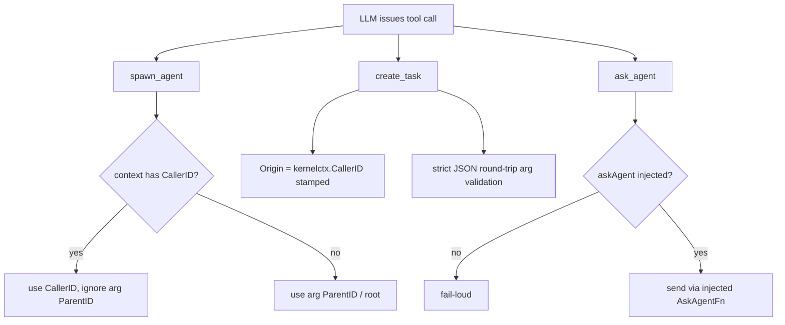

# ares Architecture Deep Dive (XII): Security Hardening — The Tool-Trust Gate and Identity Provenance (0.3.x)

> 0.3.x note: This article is a complete rewrite grounded in the current code. Old paths from earlier versions (`internal/ratelimit/`, `internal/storage/postgres/security.go`, `internal/security/sanitizer.go`) are no longer where hardening lives. This article describes only what actually exists today: the **tool-trust gate in `ares_skills`**, the **unforgeable identity provenance in `agentsyscall` (Kernel-enforced)**, and the **`Sanitizer` backstop on the LLM call chain**.

> An Agent's actual authority is not determined by how big you *think* it is — it is determined by **whether the tool it receives has passed a trust decision at the moment of binding**. And that decision starts from a four-tier trust level and one plain principle: source determines trust.

---

## 1. "Giving an agent capabilities" is itself a security decision

Let's be precise. Giving an agent a tool that can run arbitrary local commands is, in nature, no different from giving a process root in a cluster. The only difference is that tools are **declared by Skill manifests** — and every tool declaration line in a manifest is a decision point about whether to trust it.

In the current code, this decision point is deliberately isolated. It lives in `internal/ares_skills/`, and it follows a design principle written in the package comment of `types.go`:

> "Discovery, loading, execution and trust are four separate concerns."

Discovery is not permission. **Being able to see a skill ≠ being able to execute its tools.** That is the first principle of hardening here.

---

## 2. The trust gate: `TrustLevel` and `trustForSource`

### 2.1 Only three tiers

`resolver.go` defines a minimal trust tier. The comment is explicit: "the smallest possible trust gate — Discovered → Declared → Trusted? → Allowed?":

```go
type TrustLevel int

const (
    TrustUntrusted TrustLevel = iota // must not execute without explicit approval
    TrustAsk                          // requires confirmation before execution
    TrustAllowed                      // may execute freely
)
```

### 2.2 Source determines the default trust tier

`trustForSource(kind SourceKind)` maps a skill's source kind to a default trust tier:

| `SourceKind` | Meaning | Default tier |
|--------------|---------|--------------|
| `SourceProject` ("project") | project's `.ares/skills` | `TrustAllowed` (user opted into the repo) |
| `SourceUser` ("user") | user-global `~/.ares/skills` | `TrustAllowed` (user explicitly installed it) |
| `SourceRegistered` ("registered") | extra dirs declared in `config.toml` | `TrustAsk` (still needs a confirmation gate) |
| everything else (incl. `SourceExperience`) | learned / external | `TrustUntrusted` (**never auto-executed**) |

Pay special attention to `SourceExperience`: an "experience" skill can be indexed as a **relevance prior**, but `types.go` repeats emphatically: a learned skill is indexable but **NEVER auto-executed** — Discovery != Permission is strictest in the experience-learning case.

```go
func trustForSource(kind SourceKind) TrustLevel {
    switch kind {
    case SourceProject:
        return TrustAllowed
    case SourceUser:
        return TrustAllowed
    case SourceRegistered:
        return TrustAsk
    default:
        return TrustUntrusted
    }
}
```

### 2.3 Binding is where the gate is enforced: `Resolver.Resolve`

**Important**: `Resolver` only binds manifest declarations into runnable `ResolvedTool` values — it `never invokes` the tools themselves. The trust check happens at the *binding* layer, so a declared tool is blocked before it ever gets a chance to be called.

```go
func (r *Resolver) Resolve(decls []ToolDecl, kind SourceKind) ([]ResolvedTool, error)
```

`resolveOne` dispatches on `ToolKind`:

| `ToolKind` | Decision |
|-----------|----------|
| builtin | must exist in the known builtin set, else error |
| mcp | must declare a `Server`, else error |
| executable | **the trust gate lives here**: `TrustUntrusted` source → `ErrToolUntrusted`; if `allowLocalExecutables` is off → `ErrToolUntrusted`; the command must exist in PATH or as a path, else error |

`ErrToolUntrusted` is a sentinel:

```go
var ErrToolUntrusted = errors.New("ares_skills: tool untrusted")
```

```mermaid
flowchart LR
    D[manifest tool decl] --> K{trustForSource(kind)}
    K --> |untrusted| X["executable? => ErrToolUntrusted"]
    K --> |ask/allowed| E{executable kind?}
    E -- yes --> A{allow_local_executables?}
    A -- no --> X
    A -- yes --> B[cmd resolves in PATH / relative path]
    B -- no --> X
    B -- yes --> OK[ResolvedTool]
    E -- builtin/mcp --> C{valid declaration?}
    C -- no --> ERR[other error]
    C -- yes --> OK
```

> ⚠️ Honest boundary: as written, `trustForSource` only classifies `SourceRegistered` as `TrustAsk`, and the source currently shows **no implementation of an explicit "confirm before execution" interaction** — `TrustAsk` looks like a "not-yet-landed middle tier" (待核实 / to be verified: whether some caller implements the `TrustAsk` confirmation flow). The hard, real line is the `TrustUntrusted` + `ErrToolUntrusted` path: "untrusted source → not bound".

---

## 3. Unforgeable identity: Kernel-enforced provenance

Tool trust says "may this tool be called at all". The next question is: **who is calling, and on behalf of whom**. The `Kernel` in `internal/agentsyscall/` answers it with one principle: **identity provenance is enforced by the Kernel, not decided by LLM-supplied arguments.**

### 3.1 `spawn_agent`: parentage cannot be forged

`SpawnAgentArgs` has a `ParentID`, but the execution logic in `SpawnAgent` is:

```go
parentID := args.ParentID
if caller := kernelctx.CallerID(ctx); caller != "" {
    parentID = caller // the real caller in context wins; the LLM ParentID is ignored
}
```

So: **whenever the tool-call context carries a `kernelctx.CallerID`, that is the only trusted source**; a `parent_id` passed in the arguments is ignored — an agent cannot forge "who spawned me" in the parameters.

### 3.2 `create_task`: Origin is Kernel-stamped

`CreateTaskArgs` deliberately has **no creator argument** (the comment is explicit):

```go
// NOTE: there is deliberately no "creator" argument. The Kernel stamps
// Task.Origin from the tool context (kernelctx.CallerID) ...
```

`CreateTask` does:

```go
Origin: kernelctx.CallerID(ctx),
```

So the durable fact "who created this task" can only come from the calling context, never injected via params. On top of that, `create_plan` uses a strict JSON round-trip parse (type mismatches surface as errors rather than silently dropping fields).

### 3.3 Fail-loud: a missing collaboration primitive fails instead of faking it

Behind `Kernel.AskAgent` is an injected `AskAgentFn` (in production, IPC `ipc.Send`). If it isn't wired:

```go
if k.askAgent == nil {
    return nil, errors.New("agentsyscall: ask_agent not wired (no collaboration IPC) ...")
}
```

The same "no silent no-op" principle applies to the `create_plan` loop cap `maxPlanLoops` — `create_plan` is an LLM-callable syscall, so an unbounded loop count would be an unbounded goroutine count. Hence a "plan-loop quota" that is the dual of the spawn quota.

### 3.4 The meta-capability from kernel to tool boundary

Put together, the `agentsyscall` hardening model is:



---

## 4. The backstop: `Sanitizer` on the LLM call chain

Hardening is not just about entry; it's also about *output*. The previous article covered `ares_security.Sanitizer`; in this hardening context its role is to **cut plaintext leaks**: `WithSanitizer` in `internal/llm/client.go` lets the `Client` sanitize the prompt/response **before it is handed to the tracer / event store**. Production wiring is in `internal/ares_bootstrap/provide_llm.go`:

```go
llm.NewClient(llmCfg, llm.WithCallbacks(reg), llm.WithSanitizer(ares_security.NewSanitizer()))
```

Combined with the audit `AuditLogger` (`internal/ares_security/audit.go`), destructive actions (killing an agent, calling an MCP tool, etc.) also leave a structured "who / against what / succeeded" record. Trust gate + identity stamping + recording backstop together form the full hardening loop.

---

## 5. Boundaries of the current hardening mechanisms (honest checklist)

| Claim | Status |
|-------|--------|
| Tool-trust gate `TrustLevel` / `trustForSource` / `ErrToolUntrusted` | ✅ Real, `resolver.go` |
| `TrustUntrusted`-source tools rejected at binding | ✅ Real |
| The `TrustAsk` "confirm before execution" interaction | ⚠️ The tier exists, but **no confirm flow is implemented** (待核实 / to be verified) |
| `SourceExperience` never auto-executes | ✅ comment + code constraint |
| `spawn_agent` parent forced by `kernelctx.CallerID` | ✅ `agentsyscall/syscall.go` |
| `create_task` Origin Kernel-stamped, not injectable via params | ✅ same |
| `ask_agent` fail-loud when unconnected | ✅ same |
| LLM prompt/response sanitized before recording | ✅ `llm/client.go` + `provide_llm.go` |
| Destructive-action audit | ✅ `ares_security/audit.go` |

---

## 6. Conclusion

Security hardening in ares is not one thick middleware layer; it is **scattered at different layers, each guarding a single decision point**:

- `ares_skills` guards "may this tool be bound/called" (the trust gate).
- `agentsyscall` guards "who issued this call" (unforgeable identity).
- `ares_security.Sanitizer` + `AuditLogger` guard "no plaintext in records, and actions leave a trail".
- The `introspect` panel is the observability plane that makes those decisions traceable (but it has no auth — trusted operators only).

These lines do not intrude on one another: the trust gate doesn't count calls, identity stamping doesn't know about mask rules. Their only common trait is — **everything defaults to deny**.

---

*Verification note: every symbol above comes from the actual source; only items explicitly marked "待核实 / to be verified" (e.g. whether the `TrustAsk` interaction is implemented) are things I couldn't fully confirm from the current code.*

*Next in the series (XIV): the plugin system — an honest look at the actual `PluginBus` contract in `ares_runtime`, and why it is **not** the "hot-reload .so plugin system" you might be hoping for.*