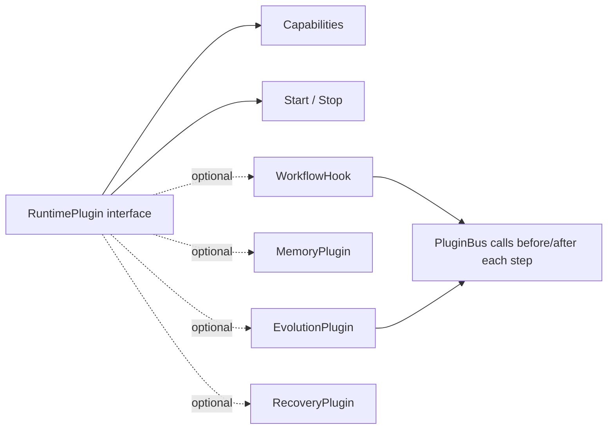
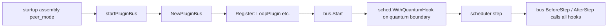
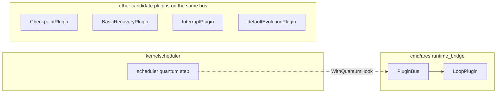

# ares Architecture Deep Dive (XIV): The Plugin System — Honestly, It's Not "Load a .so Without Code Changes" (0.3.x)

> 0.3.x note: This article is a complete rewrite grounded in the current code. The old narrative of an "executor god object being decomposed by plugins", and the claim of a "ToolExpander" that instantly resolves skill names into LLM tool definitions, must be kept separate from the plugin contract that actually exists. This article covers only what we really have: the `RuntimePlugin` **interface contract** and the `PluginBus` **lifecycle/hook manager** in `internal/ares_runtime/`.

> Let me be brutally honest first: **the "plugin system" in the current code is not dynamic loading.** No `go:plugin`, no `.so` hot-loading, no "inject external plugins without changing code". It is a **compiled-in Go interface + registry** — at startup assembly you `Register` structs that implement the interface into a `PluginBus`, which then owns lifecycles and calls the defined extension points.

---

## 1. What it actually is: a plugin contract + a bus

`internal/ares_runtime/`'s package comment says it plainly:

> "Package runtime defines the plugin contract for extending workflow execution. Plugins are registered on a PluginBus which manages their lifecycle and invokes them at defined extension points (BeforeStep, AfterStep)."

Three things: **define the contract (interface) → register on the bus → the bus manages lifecycle and calls the extension points.**

### 1.1 The plugin contract: `RuntimePlugin` is the foundation

```go
type RuntimePlugin interface {
    Name() string
    Capabilities() []Capability
    Start(ctx context.Context, bus EventBus) error
    Stop(ctx context.Context) error
}
```

- `Name()`: unique identifier.
- `Capabilities()`: declares which functional areas the plugin provides.
- `Start` / `Stop`: lifecycle. `Start` must be non-blocking; it receives the `EventBus` for emitting/subscribing events.

`Capability` is a set of functional-area constants:

```go
CapObserver / CapCheckpoint / CapRouter / CapLoop / CapMemory / CapEvolution / CapTool / CapRecovery / CapInterrupt
```

### 1.2 Three optional extension interfaces

On top of `RuntimePlugin`, a plugin may implement these optional interfaces so the bus hands specific scenarios to it:

| Interface | Purpose |
|-----------|---------|
| `WorkflowHook` | `BeforeStep` / `AfterStep` — called synchronously **before and after each step** |
| `MemoryPlugin` | `AdviseRoute(ctx, RouteState) → []RouteAdvice` — route suggestions based on similar prior executions |
| `EvolutionPlugin` | `Recommend(ctx, ExecutionState) → *RuntimeRecommendation` + `RecordOutcome(ctx, outcome)` — feed outcomes into evolutionary learning |
| `RecoveryPlugin` | `ShouldRecover(ctx, StepFailure, ExecutionState) bool` — decide whether to recover a failed step |

The data structures they depend on live in the same file (`plugin.go`): `RouteAdvice`, `RouteRecord`, `ExecutionState`, `RuntimeRecommendation`, `ExecutionOutcome`, `StepFailure`, `Step`, `StepResult`, etc.

`EvolutionPlugin` also has a dedicated default implementation in `evolution_plugin.go`: `NewEvolutionPlugin(name, provider, recorder, opts...)`, with a recommendation cache (default `CacheTTL = 30s`, tunable via `WithCacheTTL`). `provider`/`recorder` may be nil — "evolution not configured" is a valid disabled state, not an error.



### 1.3 The bus: `PluginBus`

`bus.go`'s `PluginBus` is the core manager:

```go
bus := ares_runtime.NewPluginBus()
```

- `Register(plugin)`: adds a plugin; **a duplicate name returns `ErrDuplicatePlugin`; `Register` after `Start` returns `ErrBusAlreadyStarted`**. A plugin implementing `WorkflowHook` is auto-registered as a hook.
- `Start(ctx)` / `Stop(ctx)`: starts all plugins (a failing one is logged and iteration continues); stop is in **reverse registration order**; failures are aggregated with `errors.Join`.
- `BeforeStep` / `AfterStep`: call all hooks **sequentially**, each with a timeout (`invokeWithTimeout`) and panic recovery. The contract is observational log-and-continue — **one failing hook doesn't stop the others**.
- `Emit` / `Subscribe`: the event system for plugins. `Emit` is **non-blocking**; a saturated subscriber buffer drops events (tracked as `droppedEvents`, readable via `Stats()`), consistent with "never block callers because of a slow consumer".
- `PluginsByCap(cap)`: fetch plugins by capability.



### 1.4 Production wiring: who actually plugs into the scheduler at startup

`cmd/ares/peer_mode.go`:

```go
kernel.pluginBus = startPluginBus(ctx, store, sched, kernelLoopCfg)
```

`startPluginBus` (`cmd/ares/runtime_bridge.go`) really registers:

```go
loop := ares_runtime.NewLoopPlugin("kernel-loop", ares_runtime.LoopConfig{
    MaxIterations: loopCfg.LoopMaxIterations,
})
if err := bus.Register(loop); err != nil { /* degrade to log + keep scheduling */ }
if err := bus.Start(ctx); err != nil { return nil }
sched.WithQuantumHook(newPluginBusHook(bus, loop, loopCfg))
```

So: **the plugin actually wired into the runtime in production is `LoopPlugin` (the kernel's round clock)**, attached to the scheduler's quantum boundary via `WithQuantumHook`, making the scheduling cadence (quanta/round, max_iterations) an observable, controllable object. That's also why a registration failure is deliberately downgraded to "log + keep scheduling" — **a metadata problem must never deadlock the kernel scheduler**.

Other built-in plugin implementations (verified to exist): `LoopPlugin` (`loop.go`), `BasicRecoveryPlugin` (`recovery.go`, an allowlist-based recovery), `InterruptPlugin` (`interrupt.go`, implements `RuntimePlugin` + `WorkflowHook`), `CheckpointPlugin` (`checkpoint.go`, implements `RuntimePlugin` + `WorkflowHook`), and a memory-routing plugin (`router_memory.go`).

---

## 2. The honest boundary: what it is not

This is arguably the most important part. Current "plugin system" real boundaries:

| Expectation | Reality |
|-------------|---------|
| Add a new plugin without changing code | ❌ **Not possible**. Plugins are Go structs compiled into the binary |
| `.so` / `go:plugin` hot-swap | ❌ Not present (`go:plugin` is not used in the current code) |
| Discover and register external plugins at runtime | ❌ Plugins are `Register`ed during startup assembly |
| Lifecycle/hook management for a shared bus in one process | ✅ Real, `PluginBus` |

**Why I stress this**: the old article's opening narrative about "splitting the executor's god object into plugins", and the claim that a "ToolExpander lets an Agent gain new skills without a restart", actually refer to *completely different mechanisms* — capability discovery in `internal/ares_skills/` (Discovery/Loader/Catalog/Resolver) and the event-callback registry in `internal/ares_callbacks/`. These do not go through `PluginBus`, and they are not "dynamic plugin loading". If what you want is "upload a plugin bundle to extend capabilities", **the current code does not have that**.

### 2.1 Don't confuse two systems: `ares_callbacks` ≠ plugins

`internal/ares_callbacks/` is an independent **event-callback registry** (`Registry`, `On(event, handler)` / `Emit(ctx)`) handling lifecycle events like `llm.start/end/error/token`, `agent.start/end/error`, and `tool.start/end/error`. It's consumed via the `Emitter` interface (e.g. `WithCallbacks` on the LLM client). It has the shape of callback registration/dispatch, but it is **not a `RuntimePlugin`** — it has no `Capabilities`/`Start`/`Stop` and does not hang off the `PluginBus`.

> Memory aid: `ares_callbacks` is "broadcast lifecycle events to subscribers"; the `PluginBus` in `ares_runtime` is "manage the lifecycle of compiled-in plugins and invoke step extension points". One is event dispatch; the other is a plugin bus.

### 2.2 The difference from skill capability discovery

`internal/ares_skills/`'s SkillCatalog / SkillLoader / Resolver handle "skill manifests + the tool-trust gate" (see the `TrustLevel` discussion in the Security Hardening article). Skill discovery does read SKILL.md / manifest files from disk at runtime, which *looks* dynamic — but that's the dynamism of **capability data**, not of **plugin code**. Declared tools still have to pass the `Resolver` trust gate to become runnable providers, and they are not brought under `PluginBus` lifecycle management.

---

## 3. The trade-off: why "compiled-in interface + registry" is actually reasonable

Pushing past the imagination the word "plugin" conjures, `RuntimePlugin` + `PluginBus` has clear value:

1. **Splits cross-cutting concerns off one execution path**: checkpoint, interrupt, recovery, loop, memory, and evolution all hang on the bus with a uniform interface, so the execution core doesn't have to know the details of each.
2. **Centralized lifecycle management**: `Start`/`Stop` (reverse order), timeouts, panic recovery, and event publishing are all provided by the bus — plugin authors don't reinvent them.
3. **Observe-only hooks that don't block**: the log-and-continue contract of `BeforeStep`/`AfterStep` means an observational plugin breaking won't take down scheduling.
4. **Decoupled from the kernel**: the note in `runtime_bridge.go` is key — "the adapter lives in runtime_bridge.go — the kernel stays free of any runtime import" (§0.3 dependency rule). The kernel doesn't import `runtime`; the plugin seam is opened at the assembly layer (`cmd/ares`).

The cost is equally direct: **an extension must be compiled in to take effect**, or it goes through the `ares_skills` capability-data path. If you're building a platform and want third parties to contribute capabilities without recompiling, that path is currently closed (待核实 / to be verified: whether a dynamic-loading evolution exists but isn't merged).



---

## 4. Conclusion

- **What really exists** as a plugin mechanism = the `RuntimePlugin` interface contract in `internal/ares_runtime/` + the `PluginBus` (registration / lifecycle / `BeforeStep`/`AfterStep` hooks / event system), assembled in production at `cmd/ares/peer_mode.go` → `startPluginBus`.
- **The plugin actually wired into the kernel today** is mainly `LoopPlugin` (the kernel round clock), attached at the scheduler quantum boundary via `WithQuantumHook`.
- It is **not** dynamic plugin loading: no `.so` / `go:plugin` / hot-loading. To extend capabilities without code changes, you take the `ares_skills` capability-data path — a completely different mechanism.
- Don't confuse `ares_callbacks` (event-callback registry) with `PluginBus` (plugin bus) — one broadcasts events, the other manages plugin lifecycle.

Said honestly, you might think "that doesn't count as a plugin system". But in the current code it *is*, in fact, a plugin system — just a compiled-in one. Seeing clearly what it is not is more valuable than overselling what it is.

---

*Next in the series: TBD. If something here makes you want a deeper dive on a specific module, tell me.*

*Verification note: all symbols above come from the actual source; "whether dynamic plugin loading is under development" is flagged to be verified, because I did not see it merged during this read.*