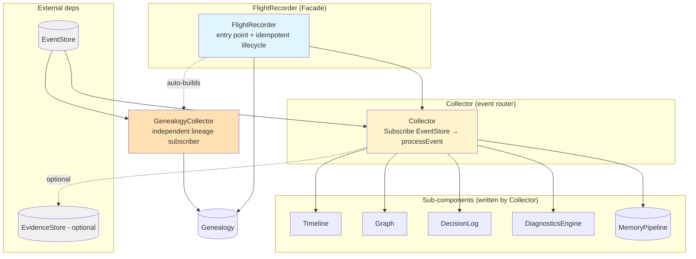
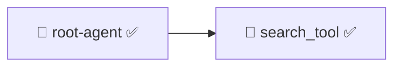
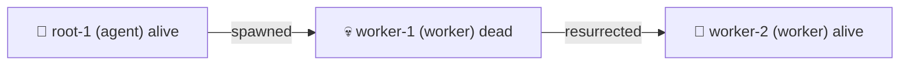

# ares Architecture Deep Dive (XVI): Flight Recorder — Agent Black Box and Execution Trace Replay (0.3.x)

> Ever had this happen…
> An Agent mysteriously froze in production. You check the logs — nothing. You check the metrics — normal. You stare at the screen and ask yourself: *"What the hell just happened in those few seconds?"*
> Airplanes have black boxes. Why don't Agents?

***

## 一、Why you need a black box

Let me start with the story that made me build the Flight Recorder.

Once, an Agent in production stopped dead. Not a crash, not an OOM — just… stopped. Like someone hit pause. The process was alive, the goroutines were alive, but nothing was getting done.

The logs said: all normal. The LLM said: normal result. The tools said: call succeeded.

It took two days to find the truth — the Agent failed to parse the LLM's JSON, retried several times, failed each time, and then quietly walked down a branch nobody had thought about: **no error, no retry, just silently skipped everything after that step.** The Agent was "alive, but dead."

That two days taught me three things:

1. **A log that says "everything's fine" usually means you logged the wrong place**
2. **The most dangerous failure isn't a crash — it's silently doing nothing**
3. **I need a black box — something that records every detail of an Agent run**

That's how the Flight Recorder was born. It doesn't live outside the Agent; it lives alongside the Runtime the Agent runs in, subscribing to the event bus and capturing every breath.

> Honesty note: the older draft described this module as a "facade" with a `memManager` field. The actual `FlightRecorder` in `recorder.go` **has no `memManager` field** — `FlightRecorderConfig` does declare `MemManager memory.MemoryManager`, but the constructor never stores it in the struct, so passing it is a no-op. What the black box actually manages is: `collector`, `eventStore`, `genealogy`, `genealogyCollector`, and a `sync.RWMutex` guarding the `started` flag.

***

## 二、Global architecture: what the black box looks like

The Flight Recorder is a **facade**. Underneath it: five sub-components plus an auto-built genealogy collector:



The `FlightRecorder` struct is small:

```go
type FlightRecorder struct {
    collector          *Collector
    eventStore         ares_events.EventStore
    genealogy          *Genealogy
    genealogyCollector *GenealogyCollector
    mu                 sync.RWMutex
    started            bool
}

type FlightRecorderConfig struct {
    EventStore    ares_events.EventStore
    EvidenceStore evidence.Store // optional: unified Evidence Store
    MemManager    memory.MemoryManager
    Genealogy     *Genealogy // optional: explicitly injected tree
}
```

### The most important design: genealogy "auto-build"

The old draft said "Genealogy is optional, injected by the caller." That is only *half* right. Look at the constructor:

```go
func NewFlightRecorder(cfg FlightRecorderConfig) *FlightRecorder {
    collector := NewCollector(CollectorConfig{ EventStore: cfg.EventStore, EvidenceStore: cfg.EvidenceStore })
    fr := &FlightRecorder{ collector: collector, eventStore: cfg.EventStore, genealogy: cfg.Genealogy }
    if cfg.Genealogy == nil && cfg.EventStore != nil {
        fr.genealogyCollector = NewGenealogyCollector(cfg.EventStore)
        fr.genealogy = fr.genealogyCollector.Genealogy()
    }
    return fr
}
```

**When `Genealogy` is nil and an `EventStore` is present, the recorder new's up its own `GenealogyCollector` and wires its tree in.** The comment is blunt about why: without this, production callers like bootstrap (which pass only `EventStore + EvidenceStore`) would never get a non-nil genealogy, and `/api/flight/genealogy` would print "No agents" forever — the lineage tree would be write-only dead code that nothing ever populates.

So it's not "optional, injected." It's **"you don't give one, I build my own."** Explicitly injected trees (e.g. in tests) are never silently overwritten.

### Start / Stop lifecycle

```go
func (fr *FlightRecorder) Start(ctx context.Context) error {
    fr.mu.Lock(); defer fr.mu.Unlock()
    if fr.started { return nil }                  // idempotent
    if err := fr.collector.Start(ctx); err != nil { return err }
    if fr.genealogyCollector != nil {
        if err := fr.genealogyCollector.Start(ctx); err != nil {
            log.Warn("flight recorder: genealogy collector start failed (lineage tree disabled)", "error", err)
        }
    }
    fr.started = true
    log.Info("flight recorder started")
    return nil
}

func (fr *FlightRecorder) Stop() {
    fr.mu.Lock(); defer fr.mu.Unlock()
    if !fr.started { return }                     // idempotent
    fr.collector.Stop()
    if fr.genealogyCollector != nil { fr.genealogyCollector.Stop() }
    fr.started = false
    log.Info("flight recorder stopped")
}
```

Idempotent, read/write lock separated. Note one subtlety: **a genealogy-collector start failure is demoted to a warn, not an error.** The priority is explicit: `timeline/graph/diagnostics` are the primary payload; the lineage tree is a nice-to-have.

Public surface: `Timeline()`, `Graph()`, `Decisions()`, `Diagnostics()`, `EventStoreRef()`, `Genealogy()`, `Pipeline(sessionID)`, `Replay(ctx, taskID)`.

***

## 三、Collector — the event router

The Collector is the engine. Its real structure is **much richer than the old draft implied** — there's an evidence pipeline the old draft never mentioned:

```go
type Collector struct {
    eventStore         ares_events.EventStore
    evidenceStore      evidence.Store
    evidenceCollector  *evidence.Collector // Source "flight"     : execution trace
    workflowCollector  *evidence.Collector // Source "workflow"   : workflow fitness
    recoveryCollector  *evidence.Collector // Source "recovery"   : recovery fitness
    schedulerCollector *evidence.Collector // Source "scheduler"  : scheduler fitness
    timeline           *Timeline
    graph              *Graph
    decisions          *DecisionLog
    diag               *DiagnosticsEngine
    pipelines          map[string]*MemoryPipeline
    agentStartIDs      map[string]string   // agentID → its latest start event ID
    cancel             context.CancelFunc
    eg                 errgroup.Group
    mu                 sync.RWMutex
}
const maxPipelines = 100 // ring cap for the pipelines map
```

**Evidence is a major 0.3.x addition.** When `EventStore` is present, the Collector not only subscribes to events but also declares four evidence collectors under different Sources, feeding execution traces and outcomes to the GA system (WorkflowGenome / RecoveryGenome / SchedulerGenome). This is how the Flight Recorder goes from "recorder" to "sensor of the evolution system."

### Start & the event loop

```go
func (c *Collector) Start(ctx context.Context) error {
    if c.eventStore == nil { return nil }         // nil-safe, silently skip
    ctx, c.cancel = context.WithCancel(ctx)
    ch, err := c.eventStore.Subscribe(ctx, ares_events.EventFilter{})
    if err != nil { return err }
    c.eg.Go(func() error { c.collectLoop(ctx, ch); return nil })
    return nil
}
```

`collectLoop` is a standard select-loop that calls `processEvent(ctx, evt)` per event. Note it uses an **`errgroup.Group`** (not a bare `WaitGroup`) — `Stop()` calls `eg.Wait()`, which also collects worker errors.

### processEvent — routing + evidence export

This is the heart:

```go
func (c *Collector) processEvent(ctx context.Context, evt *ares_events.Event) {
    if evt == nil { return }

    // 1) export execution-trace evidence first (Source "flight")
    if c.evidenceCollector != nil {
        _ = c.evidenceCollector.EmitWithMeta(ctx, evidence.KindExecutionTrace,
            map[string]any{"event_type": evt.Type, "stream_id": evt.StreamID, "version": evt.Version},
            "event_type", string(evt.Type))
    }

    // 2) route
    switch evt.Type {
    case ares_events.EventAgentStarted:       c.handleAgentStart(evt)
    case ares_events.EventAgentStopped:       c.handleAgentEnd(evt)
    case ares_events.EventTaskCreated, ares_events.EventTaskDispatched:
        c.handleTaskStart(evt)
    case ares_events.EventTaskCompleted, ares_events.EventTaskFailed:
        c.handleTaskEnd(evt)  // also exports workflow / scheduler fitness evidence
    case ares_events.EventFailoverTriggered, ares_events.EventFailoverCompleted:
        c.handleFailover(evt) // also exports recovery fitness evidence
    case ares_events.EventMemoryDistilled:    c.handleMemoryDistilled(evt)
    case ares_events.EventLLMCall:            c.handleLLMCall(evt)
    }

    if isToolEvent(evt)     { c.handleToolEvent(evt) }
    if isDecisionEvent(evt) { c.handleDecisionEvent(evt) }
}
```

Subtlety: **the switch and the ifs are not mutually exclusive.** An event can hit `EventLLMCall` and still satisfy `isToolEvent` — not a bug, a design. The same event can update Timeline and Graph at once.

The evidence export tags by Source:

- every event ships as `KindExecutionTrace` (Source `"flight"`)
- `EventTaskCompleted` → workflow + scheduler fitness `1.0`; `EventTaskFailed` → `0.0`
- `EventFailoverCompleted` → recovery fitness `1.0`; trigger-without-completion → `0.0`

Each GA genome filters on its own Source, so workflow / scheduler / recovery signals never pollute each other.

### What each handler does

| Handler | Timeline | Graph | Diagnostics | Pipeline |
|---------|----------|-------|-------------|----------|
| handleAgentStart | `EventAgentStart` | `NodeAgent` + `StatusRunning` (ID=agentID) | - | - |
| handleAgentEnd | `EventAgentEnd` (ParentID-paired) | `UpdateNodeStatus` → `completed` | - | - |
| handleTaskStart | `EventWaiting` | - | - | - |
| handleTaskEnd(ok) | `EventTaskEnd` | - | - | - |
| handleTaskEnd(fail) | `EventError` | - | auto-diagnose | - |
| handleFailover | `EventError` | - | - | - |
| handleMemoryDistilled | `EventMemoryOp` | - | - | AddStage |
| handleLLMCall | `EventLLMCall` | `NodeLLM` | - | - |
| handleToolEvent | `EventToolCall` | `NodeTool` | - | - |
| handleDecisionEvent | - | - | - | - |

One correction vs any naive reading: the failure auto-diagnosis reads the **event payload's `error` field**, not a function parameter:

```go
case ares_events.EventTaskFailed:
    evtType = EventError
    errMsg := ""
    if e, ok := evt.Payload["error"].(string); ok { errMsg = e }
    suggestions := SuggestFix(ClassifyError(errMsg))
    c.diag.Record(DiagnosticRecord{
        ID: evt.ID, AgentID: evt.StreamID,
        Category: ClassifyError(errMsg), RootCause: errMsg, Suggestion: suggestion, Timestamp: evt.Timestamp,
    })
```

**Every task failure auto-produces a "root cause + fix suggestion" diagnostic — no extra code, no manual logging.**

### Prefix matching & payload typing

```go
func isToolEvent(evt *ares_events.Event) bool  { ... s[:5] == "tool." }
func isDecisionEvent(evt *ares_events.Event) bool { ... s[:9] == "decision." }
func payloadInt(payload map[string]any, key string) int { /* int / int64 / float64 / string */}
```

`payloadInt` is more capable than the old draft's "float64 only" claim — it handles `int`, `int64`, `float64`, and even `string` (via `fmt.Sscanf`). It's the full patch for the "JSON numbers default to float64" problem.

The `agentStartIDs` map is another unmentioned highlight: `handleAgentStart` remembers each agent's latest start-event ID; `handleAgentEnd` uses it to do precise start→end pairing on the Timeline, **robust to out-of-order arrival and overlapping calls within one agent** (flagged B8 in code).

***

## 四、Timeline — every second recorded

The Timeline is the simplest component — a time-ordered event list. And one of the most visited.

### Event types

```go
const (
    EventAgentStart EventType = "agent.start"
    EventAgentEnd   EventType = "agent.end"
    EventTaskEnd    EventType = "task.end"
    EventToolCall   EventType = "tool.call"
    EventToolResult EventType = "tool.result"
    EventLLMCall    EventType = "llm.call"
    EventLLMResult  EventType = "llm.result"
    EventWaiting    EventType = "waiting"
    EventError      EventType = "error"
    EventMemoryOp   EventType = "memory.op"
    EventDecision   EventType = "decision"
)
```

(There is also `EventTaskEnd` — the old draft omitted it.)

```go
type TimelineEvent struct {
    ID string; ParentID string `json:"parent_id,omitempty"`
    AgentID string; Type EventType; Name string
    StartAt time.Time; EndAt time.Time `json:"end_at,omitempty"`; Duration time.Duration
    Metadata map[string]any `json:"metadata,omitempty"`
}
```

### Pairing: results fill up starts

`Timeline.Add` has a hardcoded pairing table:

```go
var pairStartOf = map[EventType]EventType{
    EventToolResult: EventToolCall,
    EventLLMResult:  EventLLMCall,
    EventAgentEnd:   EventAgentStart,
}
```

When a result-type event is added, it fills the matching start's `EndAt`/`Duration`, **preferring an explicit `ParentID` match and falling back to the most recent unpaired start of the same agent.** Combined with `agentStartIDs`, this is the heart of B8's out-of-order robustness.

Start-only events (`agent.start`, `waiting`) have nothing to pair — `Duration` stays 0 and doesn't affect stats.

### TimelineSummary — where the time went

```go
func (t *Timeline) Summary() TimelineSummary {
    // sum ToolDuration/LLMDuration/WaitDuration/ErrorDuration via typeDuration
    // Total = max(EndAt) - min(StartAt), which counts the "staring into space" gaps
    // ToolPercent/LLMPercent/WaitPercent normalized from TotalDuration
}
```

Total is `max(EndAt) - min(StartAt)`, **not** the sum of durations — so the gaps between events count. LLM 3s + tool 2s but 5s of idle in between: summing gives 5s, `maxEnd - minStart` gives 10s. That 5s gap may be exactly the wait/block time you're hunting.

### Defensive copies + ring caps

All readers return **copies**, so callers can mutate freely without touching internal state:

```go
func (t *Timeline) Events() []TimelineEvent {
    t.mu.RLock(); defer t.mu.RUnlock()
    result := make([]TimelineEvent, len(t.events))
    copy(result, t.events)
    return result
}
```

But the most production-critical truth the old draft missed: **the Timeline is a bounded ring buffer.**

```go
const maxTimelineEvents = 300
// inside Add:
if t.cap > 0 && len(t.events) > t.cap {
    t.events = t.events[len(t.events)-t.cap:]
}
```

It **keeps only the most recent 300 events.** The old draft spent pages worrying about "a 100k-event Timeline bottleneck," but the code kills that scenario at the source. This reshapes the whole philosophy: **not an everything-recording infinite log, but a bounded, rolling black box focused on "what just happened."** The `introspect` panel defaults align to 300 as well.

| Container | Ring cap |
|-----------|----------|
| Timeline events | 300 |
| Graph nodes | 300 |
| Decision records | 200 |
| Diagnostic records | 200 |
| Stages per MemoryPipeline | 50 |
| Sessions in Collector.pipelines | 100 |

***

## 五、Diagnostics — automatic fault diagnosis

The engine wants to tell you "where it broke" instead of making you read hundreds of lines.

```go
const (
    DiagToolTimeout      DiagnosticCategory = "tool_timeout"
    DiagLLMError         DiagnosticCategory = "llm_error"
    DiagParseError       DiagnosticCategory = "parse_error"
    DiagMemoryError      DiagnosticCategory = "memory_error"
    DiagNetworkError     DiagnosticCategory = "network_error"
    DiagConfigError      DiagnosticCategory = "config_error"
    DiagConcurrencyError DiagnosticCategory = "concurrency_error"
    DiagUnknown          DiagnosticCategory = "unknown"
)

type DiagnosticRecord struct {
    ID, AgentID, TaskID string
    Category            DiagnosticCategory
    RootCause           string
    Suggestion          string
    Timestamp           time.Time
    Duration            time.Duration
    Context             map[string]any   // not in the old draft
}
```

### ClassifyError — the elegant & crude glory of string matching

```go
func ClassifyError(errMsg string) DiagnosticCategory {
    switch {
    case contains(errMsg, "timeout") || contains(errMsg, "deadline exceeded"):
        return DiagToolTimeout
    case contains(errMsg, "llm") || contains(errMsg, "openai") || contains(errMsg, "ollama") || contains(errMsg, "generate"):
        return DiagLLMError
    case contains(errMsg, "parse") || contains(errMsg, "unmarshal") || contains(errMsg, "json"):
        return DiagParseError
    case contains(errMsg, "memory") || contains(errMsg, "session") || contains(errMsg, "distill"):
        return DiagMemoryError
    case contains(errMsg, "connection") || contains(errMsg, "network") || contains(errMsg, "dial"):
        return DiagNetworkError
    case contains(errMsg, "config") || contains(errMsg, "yaml") || contains(errMsg, "env"):
        return DiagConfigError
    default:
        return DiagUnknown
    }
}
```

Honestly it's a **glorified grep**. It knows nothing about error semantics; classification is decided by case order. `"json: timeout reading body"` contains both "json" and "timeout" — timeout comes first, so it's `DiagToolTimeout`.

I keep it for three reasons: it's too simple to be wrong; it covers most common errors; there's `DiagUnknown` + `SuggestFix` as the escape hatch. When your requirement is "classify it roughly", string matching is the pragmatic answer.

### SuggestFix & AutoDiagnose

`SuggestFix(cat)` returns 3–4 human-readable English suggestions per category. `AutoDiagnose(agentID, taskID, err, duration)` classifies → takes the first suggestion → assembles a `DiagnosticRecord` with ID `fmt.Sprintf("diag-%d", time.Now().UnixNano())`. Timestamp-prefixed, naturally ordered, collision basically never in practice.

The engine also has a ring cap (`maxDiagnosticRecords = 200`) and a `Distribution()` that outputs category percentages — exactly what the `/api/flight/diagnostics` endpoint renders.

***

## 六、DecisionLog — traceable choices

```go
const (
    DecisionToolSelect      DecisionType = "tool_selection"
    DecisionModelSelect     DecisionType = "model_selection"
    DecisionMemoryRetrieval DecisionType = "memory_retrieval"
    DecisionRetry           DecisionType = "retry"
    DecisionRouting         DecisionType = "routing"
)

type Decision struct {
    ID, AgentID string
    Type        DecisionType
    Candidates  []string
    Selected    string
    Reason      string
    Confidence  float64
    Timestamp   time.Time
    Metadata    map[string]any
}
```

`Candidates + Selected + Reason + Confidence` answers one priceless question in debugging: **why did the Agent pick that?**

`handleDecisionEvent` best-effort-extracts `reason`/`selected`/`confidence` and **hardcodes `Type: DecisionToolSelect`** — the `decision.xxx` event type only says "this is a decision," not which sub-kind. So DecisionLog quality depends entirely on the publisher. If a publisher emits an empty payload, you know a decision happened but not what/when/why — "I know someone called, but not who, what, or how long." The ring cap (200) at least keeps it bounded.

***

## 七、Replay — back to the crime scene

If the Timeline is watching a recording, Replay is **frame-by-frame playback.**

```go
type ReplaySession struct {
    taskID      string
    ares_events []*ares_events.Event
    currentIdx  int
}

func NewReplaySession(ctx context.Context, eventStore ares_events.EventStore, taskID string) (*ReplaySession, error) {
    if eventStore == nil { return nil, errors.New("event store is nil") }
    evts, err := eventStore.Read(ctx, taskID, ares_events.ReadOptions{
        Direction: ares_events.ReadAscending, Limit: 10000,
    })
    if err != nil { return nil, fmt.Errorf("read ares_events for task %s: %w", taskID, err) }
    if len(evts) == 0 { return nil, fmt.Errorf("no ares_events found for task %s", taskID) }
    return &ReplaySession{taskID: taskID, ares_events: evts, currentIdx: -1}, nil
}
```

`currentIdx` starts at **-1**; `Step()` increments then reads:

```go
func (s *ReplaySession) Step() (*ReplayStep, error) {
    if s.currentIdx >= len(s.ares_events)-1 { return nil, errors.New("no more steps") }
    s.currentIdx++
    return s.currentStep(), nil
}
```

The -1 means `Current()` right after creation returns nil — you must `Step()` first. Like file reading or a DB cursor.

The navigation surface is larger than the old draft showed:

```go
func (s *ReplaySession) StepTo(n int) (*ReplayStep, error) // bounded jump
func (s *ReplaySession) Current() *ReplayStep              // look without advancing
func (s *ReplaySession) Summary() ReplaySummary            // steps/duration/agents/event types
func (s *ReplaySession) IsFinished() bool
func (s *ReplaySession) Reset()                            // back to -1
```

`Summary()` aggregates `TotalSteps`, `Duration` (first↔last timestamp), `Agents`, `EventTypes`, `FirstEvent`, `LastEvent` — the "cover page" of a replay.

### The Replay limit

`Limit: 10000`. A single replay reads at most 10k events. `Read()` doesn't error — it returns the first 10k and silently truncates the rest. Be careful: you may be replaying the first 10k of a task, not the whole task. Past that, either the task should be split, or someone wrote an infinite loop.

***

## 八、Graph — the call tree (a tree, not a graph)

Timeline is time-dimension; Graph is structure-dimension.

```go
type Graph struct {
    root            *GraphNode
    nodes           map[string]*GraphNode
    pendingChildren map[string][]*GraphNode // out-of-order buffer
    mu              sync.RWMutex
    cap             int                       // 300 ring cap
}

type GraphNode struct {
    ID, ParentID string
    Type         NodeType      // agent / tool / llm
    Name         string
    Status       NodeStatus    // running / completed / failed
    StartAt, EndAt time.Time
    Duration     time.Duration
    Children     []*GraphNode
    Metadata     map[string]any
}
```

`Children []*GraphNode` means one parent per node — **it's called Graph, but it's a tree.** Fine, because Agent execution is naturally nested parent-child.

Worth calling out:

1. **`pendingChildren` out-of-order buffer** (B7): child arrives before parent → parked here, re-attached when the parent lands.
2. **Self-parenting guard** (M12): `ParentID == ID` returns early, preventing a node from becoming its own child and blowing the stack in recursive traversals.
3. **`UpdateNodeStatus` computes Duration under the write lock** (P0-2), avoiding grab-read-then-mutate-outside races.
4. **All recursive traversals carry a visited-set** — `Depth()`, `ExportMermaid`, `ExportDOT` are cycle-immune.
5. **Ring cap 300**: evicts the oldest node from the `nodes` map only (lookup lost, tree shape intact).

Three real export formats:

```go
func (g *Graph) ExportMermaid() string        // graph LR, 🤖agent/🔧tool/🧠llm + status emoji
func (g *Graph) ExportDOT() string            // digraph, status-colored nodes
func (g *Graph) ExportJSON() ([]byte, error)
```

Mermaid shape:



***

## 九、Genealogy — the family tree (the real implementation differs a lot)

This is where the old draft was wrong most. There is **no** `GenealogyStatus` enum, no `edges []GenealogyEdge`, no `GenealogyEdge{Parent,Child,Relation}`. The real implementation is:

```go
type AgentRelation string
const (
    RelationSpawned     AgentRelation = "spawned"
    RelationResurrected AgentRelation = "resurrected"
    RelationPromoted    AgentRelation = "promoted"
)

type LineageNode struct {
    ID string; Type string; ParentID string
    Relation  AgentRelation
    SpawnedAt time.Time; DiedAt time.Time `json:"died_at,omitempty"`
    IsAlive   bool
    Children  []*LineageNode
    Metadata  map[string]any
}

type Genealogy struct {
    roots []*LineageNode
    nodes map[string]*LineageNode
    mu    sync.RWMutex
}
```

Key difference: **relationships live on each node's `Relation` field, not in an edge table; life/death is expressed by `IsAlive` + `DiedAt`, not a status enum.**

Core methods: `RecordSpawn`, `RecordRoot`, `RecordResurrection`, `RecordDeath`, `RecordPromotion`, `Roots`, `Descendants`, `Ancestors`, `IsAlive`, `ExportMermaid`, `ExportJSON`.

### RecordSpawn — two shapes of parenthood

```go
func (g *Genealogy) RecordSpawn(parentID, childID, agentType string, metadata map[string]any) {
    child := &LineageNode{ID: childID, Type: agentType, Relation: RelationSpawned,
        SpawnedAt: time.Now(), IsAlive: true, Metadata: metadata}
    if parentID != "" {
        child.ParentID = parentID
        parent, ok := g.nodes[parentID]
        if !ok {
            parent = &LineageNode{ID: parentID, SpawnedAt: time.Now(), IsAlive: true}
            g.nodes[parentID] = parent
            g.roots = append(g.roots, parent)   // placeholder root created on the fly
        }
        parent.Children = append(parent.Children, child)
    } else {
        g.roots = append(g.roots, child)        // no parent → a root
    }
    g.nodes[childID] = child
}
```

Note the "create a placeholder root if the parent hasn't shown up yet" detail — **under out-of-order events, the family tree never breaks.**

### RecordRecurrection — back from the dead

```go
func (g *Genealogy) RecordResurrection(oldID, newID string) {
    oldNode, hasOld := g.nodes[oldID]
    if hasOld { oldNode.IsAlive = false; oldNode.DiedAt = time.Now() }
    newNode := &LineageNode{ID: newID, Relation: RelationResurrected, SpawnedAt: time.Now(), IsAlive: true}
    if hasOld {
        newNode.Type = oldNode.Type
        newNode.ParentID = oldNode.ParentID
        // re-parent under the old node's parent
        if oldNode.ParentID != "" { if parent, ok := g.nodes[oldNode.ParentID]; ok { parent.Children = append(parent.Children, newNode) } }
        else { /* replace the root slot */ }
        newNode.Children = oldNode.Children   // adopt the old node's children
        oldNode.Children = nil
    } else {
        g.roots = append(g.roots, newNode)
    }
    g.nodes[newID] = newNode
}
```

Semantics are **inherit, not new**: the new node inherits `Type`, `ParentID`, and even adopts the old node's children; the old node is marked dead. So when an Agent crashes and is restarted, it stays in place on the family tree — lineage stays continuous.

### ExportMermaid — a family tree with life and death

Status iconography: dead → 💀 (`IsAlive` false), promoted → 👑 (`Relation == promoted`), else alive → 🤖, plus status text:



And here I'll correct the old draft's rendered example: it drew `worker-1 -->|resurrected| worker-2`, which **is** consistent with the real `RecordResurrection` semantics — after a resurrection the parent-child edge runs from the old node to the new one (the new node is re-parented under the old node's parent, and Mermaid prints each child edge with the child's `Relation`).

***

## 十、GenealogyCollector — a separate spectator

The old draft's claim that "the main Collector and GenealogyCollector are two independent subscribers" — **that part is right**, and there's a dedicated file `genealogy_collector.go`. But the details deserve a correction:

```go
type GenealogyCollector struct {
    genealogy  *Genealogy
    eventStore ares_events.EventStore
    cancel     context.CancelFunc
    eg         errgroup.Group
}
```

It subscribes to the same EventStore but routes differently:

```go
case ares_events.EventAgentStarted:       c.handleAgentStarted(evt)
case ares_events.EventAgentStopped:       c.handleAgentStopped(evt)
case ares_events.EventFailoverTriggered:  c.handleFailoverTriggered(evt)
case ares_events.EventFailoverCompleted:  c.handleFailoverCompleted(evt)
```

- `handleAgentStarted`: reads `type` and `parent_id` from payload — `parent_id` present → `RecordSpawn`, else `RecordRoot`
- `handleAgentStopped`: `RecordDeath`
- `handleFailoverTriggered`: marks dead via payload `agent_id`, falling back to `StreamID`
- `handleFailoverCompleted` (the crux, unlike the fabricated version in the old draft):

```go
func (c *GenealogyCollector) handleFailoverCompleted(evt *ares_events.Event) {
    oldID, _ := evt.Payload["old_agent_id"].(string)
    newID, _ := evt.Payload["new_agent_id"].(string)
    if oldID != "" && newID != "" {
        c.genealogy.RecordResurrection(oldID, newID) // old→new: resurrection
    } else if newID != "" {
        c.genealogy.RecordPromotion(newID)           // new ID only: promotion
    }
}
```

The real code does **not** read a `promoted` boolean — it branches on whether `old_agent_id` *and* `new_agent_id` are both present: both → resurrection; only the new ID → promotion. It's grounded in the event's own semantics, not a possibly-absent flag.

Why separate? As discussed, the main Collector owns "execution-time" data (Timeline/Graph/Diagnostics); Genealogy owns "long-lived" data (must survive an Agent's death). Clearing the Timeline must not erase lineage, and losing lineage breaks evolution history. **Different responsibility boundaries, so two subscribers.** (The cost: the same event is processed twice — see "Honesty".)

***

## 十一、The consumption paths — three ways flight data leaves

Recorded data that's never consumed is just "a bigger, prettier log." There are three real consumption paths plus a control-plane panel — and, honestly, I must correct the old draft: **the `internal/dashboard` package it cited has been deleted.**

### 11.1 The control plane: `/api/flight/*` (replacing the deleted dashboard)

The old draft said the 6 endpoints lived in `internal/dashboard/api.go` on `mux.HandleFunc("/flight/...")`. **That package no longer exists.** The header of `internal/introspect/flight.go` is explicit:

> After the old `internal/dashboard` package was deleted (monitoring.md Phase 4), the `/flight/*` read endpoints were dropped with it even though the flight data … is still recorded …

So `dashboard` was deleted, the old `/flight/*` endpoints briefly vanished, then they were migrated — **strictly read-only** — to `internal/introspect` under the `/api/flight/` prefix:

```go
case r.Method == http.MethodGet && strings.HasPrefix(path, "/api/flight/"):
    s.serveFlight(w, r)

// serveFlight by suffix:
case "/api/flight/timeline":
case "/api/flight/summary":
case "/api/flight/graph":        // {mermaid: "..."}
case "/api/flight/decisions":
case "/api/flight/diagnostics":  // {records:[...], distribution:{...}}
case "/api/flight/genealogy":    // {mermaid: "..."}
```

Six endpoints, strictly read-only (nothing here mutates the recorder). They sit behind a `FlightProvider` interface, adapted by `flightRecorderAdapter` (`NewFlightRecorderAdapter`); a nil recorder yields a nil provider and the endpoints 503/empty without crashing.

### 11.2 FlightBridge — Arena's probe

Real code is in `internal/ares_arena/integration.go`; the signature differs from the old draft (takes `Action, Result`, not pointers):

```go
type FlightBridge struct { recorder *flight.FlightRecorder }

func (b *FlightBridge) OnActionExecuted(action Action, result Result) {
    if b.recorder == nil { return }
    b.recordTimelineEvent(action, result)
    if !result.Success { b.recordDiagnostic(action, result) }
}
```

`recordTimelineEvent` writes the Arena action into the Timeline:

```go
te := flight.TimelineEvent{
    ID: action.ID, AgentID: action.TargetID, Type: flight.EventToolCall,
    Name: "arena:" + string(action.Type), StartAt: action.CreatedAt,
    EndAt: action.CreatedAt.Add(result.Duration), Duration: result.Duration,
    Metadata: map[string]any{
        "source": "arena", "action_type": string(action.Type),
        "source_id": action.SourceID, "success": result.Success, "target_id": action.TargetID,
    },
}
```

Failed actions also produce a diagnostic. The `source="arena"`, `action_type`, `success` fields are exactly the "escape hatch in Metadata" example from earlier.

The **real `arenaActionToCategory` mapping** (again, unlike the fabricated table in the old draft):

| Arena ActionType | DiagnosticCategory |
|------------------|-------------------|
| KillLeader / KillAgent / KillOrchestrator | concurrency_error |
| NetworkPartition | network_error |
| RemoveNode / RemoveEdge | config_error |
| PauseAgent / ResumeAgent | concurrency_error |
| SlowAgent / ToolTimeout | tool_timeout |
| MemoryCorrupt | memory_error |
| MCPDisconnect | network_error |
| LLMFailure | llm_error |
| default | unknown |

(The old draft classified `KillLeader` etc. as `tool_timeout`; the real mapping is `concurrency_error`.)

### 11.3 FlightToExperienceAdapter — failure is the best teacher

Real code in `internal/ares_evolution/adapter.go`; the old draft's high-level story (learn only from final failures) holds:

```go
ch, err := subscriber.Subscribe(ctx, ares_events.EventFilter{
    Types: []ares_events.EventType{
        ares_events.EventTaskFailed, ares_events.EventStepFailed, ares_events.EventStepRecoveryFailed,
    },
})
```

Flow: `processEvent` → `flight.Diagnostics().Get(agentID)` (via bootstrap's `diagnosticsAccessorWrapper`, mapped to `evolution.DiagnosticsReport`) → per-record TaskID match → `buildExperience`. In-run retry-mostly-succeeds noise is ignored.

`buildExperience`'s filters:

1. **`record.Severity < 3` → dropped** (low-grade alerts don't deserve to bloat the experience library)
2. empty `RootCause` and `Category` → dropped
3. `score = severityToScore(severity)`, more severe → lower score

```go
func severityToScore(severity int) float64 {
    if severity <= 0 { return 1.0 }
    if severity >= 10 { return 0.1 }
    return float64(11-severity) / 10.0
}
```

severity 10 → 0.1 ("never do this again"), severity 1 → 1.0 ("occasionally tolerable"). Produced Experience: `Type: TypeFailure, Source: "flight_recorder"`, `Solution` from `record.Suggestion`, persisted to the experience repo.

### 11.4 The bootstrap wrappers

`internal/ares_bootstrap/provide_wiring.go` wraps `*flight.FlightRecorder` for evolution:

- `flightRecorderWrapper`: implements `Diagnostics()` and `EventStore()`
- `diagnosticsAccessorWrapper.Get(agentID)`: maps `DiagnosticsEngine.FilterByAgent` → `evolution.DiagnosticsReport`, tagging each record's severity via `categorizeSeverity`
- `eventStoreSubscriberWrapper.Subscribe`: forwards `EventStoreRef()`

`categorizeSeverity`'s real mapping:

| DiagnosticCategory | Severity |
|--------------------|----------|
| ConcurrencyError | 8 |
| LLMError | 7 |
| MemoryError | 6 |
| NetworkError | 6 |
| ToolTimeout | 5 |
| ParseError | 4 |
| ConfigError | 3 |
| Unknown (default) | **5** |

One correction to the old draft: it said `Unknown → 3`. The actual `default` case is **5**. ConcurrencyError tops the list (8) — hardest to reproduce, hardest to localize; LLMError (7) follows — the Agent does nothing without the LLM; ConfigError is last (3) — usually affects one agent and fixes fastest.

`severity` is set by `diagnosticsAccessorWrapper`, and `FlightToExperienceAdapter.buildExperience` consumes it for the `< 3` filter and `severityToScore`. The three chains close the loop here.

***

## 十二、Honesty

### 12.1 The ring caps are the real story

The old draft spent effort on "what about a 100k-event Timeline." Let me close it realistically: **the code kills that scenario at the source.** Every container has a hard cap (see the table in section 四); overflow silently evicts the oldest. This is the correct boundary for a black box — a bounded, rolling view of "what just happened" is more useful and more honest than an infinitely-growing everything-bucket.

### 12.2 String matching is not fault classification

`ClassifyError` is order-dependent. `"parse error: json: timeout waiting for connection"` contains json/timeout/connection — currently `DiagToolTimeout` (timeout is the first case), but the root cause is really a network timeout. Order decides everything. True accuracy would take an LLM-as-Classifier, at the cost of extra latency and money. **The Flight Recorder chose "cheap but imperfect" over "perfect but expensive."** I agree with that.

### 12.3 The cost of defensive copies

All readers return deep copies — thread-safe, but O(n) alloc + copy per read. With a 300 ring cap, that cost is naturally contained (hundreds of entries, not tens of thousands), so it's **not the bottleneck today.** If it ever is, adding `EventsSince(t)` to return deltas is trivial.

### 12.4 The two-collector awkwardness

The main Collector and GenealogyCollector are two independent subscribers — **the same event is processed twice.** The waste is minor; the real hazard is ordering: two goroutines may process at different speeds, so the main Collector might not have finished `EventAgentStopped` when the GenealogyCollector has already done `EventFailoverCompleted`. Why keep them separate? Different responsibility boundaries — execution data can be cleared anytime; lineage data must survive. For now, we **accept eventual consistency across components.**

### 12.5 Genealogy auto-build

The old draft framed Genealogy as "optional injection." The real semantics: **you don't supply one, I build my own.** This auto-build is what keeps production (bootstrap passes only EventStore) on a living family tree — without it, the genealogy endpoints would print "No agents" forever. It's a real 0.3.x improvement: turning "writeable but unread" dead code into a live feature.

### 12.6 What to record, what not

It records: each LLM call's start/end, tool calls, decisions, memory-distillation in/out ratios, failure diagnostics, genealogy life/death. It does **not** record — full LLM response text, full tool output, every state-transition detail. And because of the ring caps, even what's "remembered" only spans the recent window. Criterion: can you get debuggable signal from it? Raw data is too big and too noisy; extracted, classified, attributed metadata belongs in the box.

***

## 十三、Appendix

### Key file index

| File | Responsibility | Core symbols |
|------|----------------|--------------|
| `internal/ares_flight/recorder.go` | Facade | idempotent lifecycle, genealogy auto-build, `Replay` |
| `internal/ares_flight/collector.go` | Router + evidence export | `processEvent`, 4 evidence Sources, `payloadInt` |
| `internal/ares_flight/timeline.go` | Timeline | 11 EventTypes, `pairStartOf`, ring cap 300 |
| `internal/ares_flight/diagnostics.go` | Diagnostics | 8 categories, `ClassifyError`, `SuggestFix`, `AutoDiagnose` |
| `internal/ares_flight/decision.go` | DecisionLog | 5 DecisionTypes, ring cap 200 |
| `internal/ares_flight/pipeline.go` | Memory pipeline | `PipelineStage`, `CompressionRatio`, ring cap 50 |
| `internal/ares_flight/replay.go` | Replay | `currentIdx=-1`, `Step/StepTo/Current/Summary/Reset` |
| `internal/ares_flight/graph.go` | Call tree | `pendingChildren`, cycle guard, Mermaid/DOT/JSON |
| `internal/ares_flight/genealogy.go` | Family tree | `LineageNode` + `Relation`, record-* methods |
| `internal/ares_flight/genealogy_collector.go` | Lineage subscriber | failover branch (resurrection vs promotion) |
| `internal/ares_flight/log.go` | Logging | `var log = logger.Module("flight")` |
| `internal/ares_arena/integration.go` | FlightBridge | real `arenaActionToCategory` |
| `internal/ares_evolution/adapter.go` | FlightToExperience | severity≥3 filter + `severityToScore` |
| `internal/ares_bootstrap/provide_wiring.go` | Wrappers | `categorizeSeverity` (default=5) |
| `internal/introspect/flight.go` | `/api/flight/*` read-only | `FlightProvider` + `flightRecorderAdapter` |

### Links to the rest of the series

- **Event system (十一/十二)**: the Recorder's `EventStore` *is* the event system; the Collector subscribes via `ares_events.EventFilter{}`.
- **Evolution / GA (twenty-something series)**: the Collector's three fitness evidence Sources + `FlightToExperienceAdapter` are the evolution system's sensors. Without the Flight Recorder, evolution loses its source of learning from execution failures and scheduling outcomes.
- **Arena (九)**: `FlightBridge` writes fault-injection outcomes into the black box, so chaos results are replayable.

***

### Next tease

Runtime Lifecycle — an Agent's life from birth to death.

Start, call LLM, call tools, finish or fail — behind that simple story sits a whole machine of state machines, timeouts, graceful shutdown, OOM protection, and leader election. We lift the hood next.

After all — who would write a Flight Recorder without shipping a bug now and then?