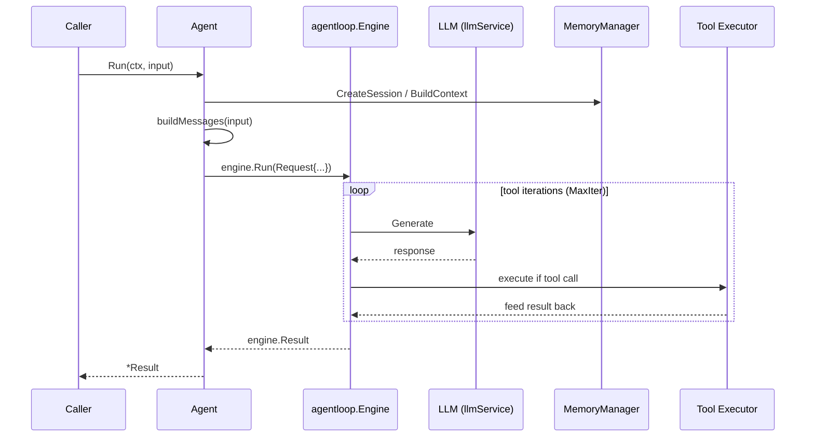
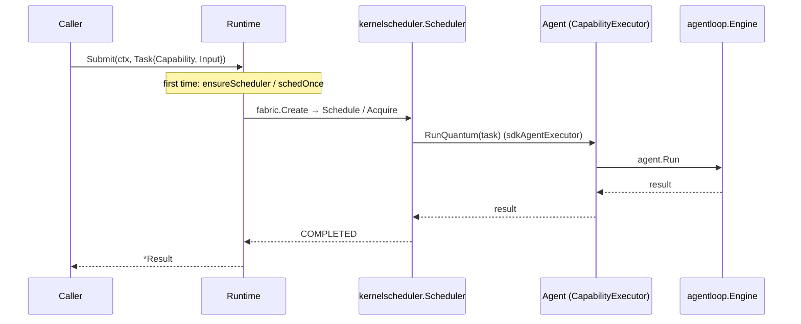
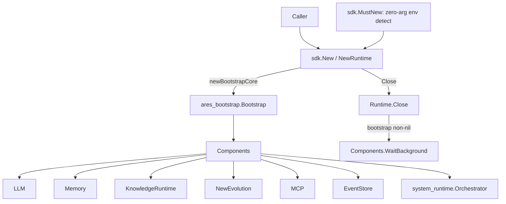

# ares Architecture Deep Dive (XVII): The SDK Layer — a Package That Wraps the Internals

Every framework has the same last-mile problem. The internals are beautiful — clean interfaces, pluggable providers, composable pipelines. Then the user shows up and asks: "How do I make it go?"

The SDK package (`sdk/`) is that last mile: one import, a handful of functional options, and the LLM, tools, memory, knowledge, evolution, and MCP are all wired up.

Let's be direct up front: this is not "one line of code to start an agent" magic. It's a package that collapses the internal wiring into a set of calls. The wiring is still invisible — but this time it's contained, not left sitting in a bootstrap file nobody dares to touch.

---

## The Entry Points: Three Constructors, Two Are Yours

In the real code (`sdk/sdk.go`) there are two construction paths, plus a zero-arg quick-start entry:

```go
// sdk/sdk.go
func New(opts ...Option) (*Runtime, error) // returns error, for production
func NewRuntime(opts ...Option) *Runtime   // panics on error, for quickstart

// sdk/quickstart.go
func MustNew() *Runtime // zero-arg: auto-detects the environment, panics on failure
```

Watch out — `MustNew` is misleading. It's **not** `MustNew(opts...)`. It takes **no arguments**: it probes the local environment (Ollama on localhost:11434, or reads `OPENAI_API_KEY` / `ANTHROPIC_API_KEY`), applies the matching provider options, keeps memory enabled by default (falling back to compression-only when no embedding service is available), and panics on failure (a `regexp.MustCompile`-style fail-fast). The intent, per the doc comment, is that zero config should still work.

The real "with options" entry points are `NewRuntime` / `New`:

```go
import "github.com/Timwood0x10/ares/sdk"

rt := sdk.NewRuntime(sdk.WithOpenAI("gpt-4o-mini"))
defer rt.Close()
agent := rt.NewAgent("assistant", sdk.WithInstruction("You are helpful."))
result, err := agent.Run(ctx, "hello")
```

`Runtime` is the top-level container. Its actual fields (the `Runtime` struct in `sdk/sdk.go`) include:
- `llmSvc` — LLM client (OpenAI, Ollama, Anthropic, OpenRouter, or custom)
- `toolReg` — tool registry (built-in, custom, MCP-discovered, AKF tools)
- `memMgr` — memory & distillation engine
- `knowledgeRT` / `knowledgeStore` — AKG/AKF knowledge graph compile + retrieval
- `evolutionStore` / `evoComponents` — strategy evolution
- `mcpClients` — MCP connections
- `eventStore` — event backend (distillation subscribes to it)

The constructors sniff the config: `providerKeyHint` logs a `slog.Warn` early when a hosted provider is missing a key (construction stays non-fatal — key-less gateways are legitimate), instead of waiting for a provider-side 401 on the first `Run`. Likewise, `New` returns an error wrapped by `agentloop.FriendlyErr` when the LLM fails to initialize. (Note: the exact warning wording is unverified against code — only the construction-time sniffing mechanism is real.)

### Runtime read accessors

Besides construction and teardown, `Runtime` exposes a few read-only entry points (`sdk/sdk.go`):

| Method | Returns | Purpose |
|--------|---------|---------|
| `(*Runtime).ToolRegistry()` | `*tools.Registry` | Register custom tools |
| `(*Runtime).GetModel()` | `string` | Current model name |
| `(*Runtime).GetProvider()` | `string` | Current provider name |
| `(*Runtime).KnowledgeStore()` | `knowledge.KnowledgeStore` | Knowledge store (nil when disabled) |
| `(*Runtime).Snapshot()` | `system_runtime.Snapshot` | System-level snapshot from the Bootstrap core |

---

## The Option Surface: Functional Options, Zero-Value Means Default

`Option` is `func(*config) error` — all configuration funnels through this functional-option path. The full runtime option surface (`sdk/options.go`):

| Option | Signature | What it does |
|--------|-----------|--------------|
| `WithConfig` | `(path string)` | Load config from a YAML file |
| `WithConfigFromEnv` | `()` | Read `./ares.yaml`, `$ARES_YAML` overrides the path |
| `WithOpenAI` | `(model string)` | Configure OpenAI provider |
| `WithOllama` | `(model string)` | Configure Ollama provider |
| `WithAnthropic` | `(model string)` | Configure Anthropic provider |
| `WithOpenRouter` | `(model string)` | Configure OpenRouter provider |
| `WithBaseURL` | `(url string)` | Override API base URL |
| `WithAPIKey` | `(key string)` | Set API key explicitly |
| `WithLLMConfig` | `(cfg *core.LLMConfig)` | Apply a whole LLM config |
| `WithFallbackLLM` | `(cfg *core.LLMConfig)` | Add a failover provider; callable multiple times |
| `WithDefaultMemory` | `()` | Now a no-op (memory on by default); kept for compat |
| `WithoutMemory` | `()` | Explicitly disable memory |
| `WithMemoryConfig` | `(maxHistory, maxSessions int)` | Tune memory sizing |
| `WithDistillation` | `(threshold int)` | Enable distillation; threshold=0 uses component default |
| `WithRAG` | `(topK int, minScore float64)` | Enable RAG retrieval injection |
| `WithEmbeddingService` | `(url, model string)` | Inject an external embedding service |
| `WithPostgres` | `(cfg DatabaseFileConfig)` | Enable PostgreSQL-backed storage |
| `WithKnowledgeConfig` | `(cfg KnowledgeFileConfig)` | Tune retrieval chunking and similarity |
| `WithEvolution` | `()` | Enable strategy evolution |
| `WithKnowledge` | `()` | Enable the AKF Knowledge Fabric pipeline |
| `WithAKGQualityGate` | `(q knowledge.QualityGateConfig)` | Configure the AKG fact quality gate |
| `WithAKGEmbedding` | `(model, baseURL string)` | Configure AKG distillation/retrieval embedding |
| `WithKnowledgeProvider` | `(p provider.GraphProvider)` | Register an extra GraphProvider; callable multiple times |
| `WithSQLiteKnowledgeStore` | `(dbPath string)` | File-backed SQLite store instead of in-memory |
| `WithMCP` | `(conn MCPConn)` | Connect to an MCP server; callable multiple times |
| `WithTrace` | `(enabled bool)` | Toggle per-step trace logging |

Implementation details worth noting:

- **`WithDefaultMemory` is defunct in name.** `defaultConfig()` sets `memCfg.Enabled` to `true` by default, so `WithDefaultMemory` merely sets it again — the doc comment calls it "a no-op kept for backward compatibility." Opt out with `WithoutMemory()`.
- **`WithRAG` has a threshold**: `topK < 1` or `minScore` outside `[0,1]` returns `ErrInvalidRange`. Here zero is not "default", it's invalid.
- **Errors are part of the options**: since `Option` returns error, `WithPostgres` (empty host → `ErrMissingValue`; out-of-range port → `ErrInvalidRange`), `WithEmbeddingService`, and `WithSQLiteKnowledgeStore` all propagate their errors back through `New`.

Agent options are a separate set (`func(*agentConfig)`):

| Option | Signature | What it does |
|--------|-----------|--------------|
| `WithInstruction` | `(string)` | System instruction, prepended to the conversation |
| `WithTools` | `(...tools.Tool)` | Attach tools |
| `WithHumanInput` | `(fn HumanInputFunc)` | Human-in-the-loop approval callback before tool calls |
| `WithMaxIterations` | `(n int)` | Cap the ReAct iteration count |
| `WithMaxTokens` | `(n int)` | Cumulative token budget for one run |
| `WithTimeout` | `(d time.Duration)` | Wall-clock budget for one run |
| `WithToolDiscovery` | `()` | Runtime tool discovery (exposes a discover_tools meta-tool) |
| `WithToolSource` | `(s toolsource.ToolSource)` | Set discovery source; implies discovery on |
| `WithToolSelector` | `(s toolsource.ToolSelector)` | Set tool-pool filter; implies discovery on |

**Honest reflection**: The option surface is large, and it's large because every row maps to a real field on the internal `config` struct. The problem that functional options solve over a config struct is composition — "give me the production config but with memory disabled" is awkward with a plain struct. Options stack, and they let us add new ones without breaking existing callers.

---

## The Agent: `Run` Does Not Inline the Loop

Once you have a `Runtime`, creating an agent is trivial:

```go
agent := rt.NewAgent("assistant",
    sdk.WithInstruction("You are a helpful assistant."),
    sdk.WithTools(searchTool, calcTool),
    sdk.WithHumanInput(approveFunc),
    sdk.WithMaxIterations(10),
)

result, err := agent.Run(ctx, "What's 2+2?")
```

Note that `Agent.Run` (`sdk/agent.go`) **does not inline the ReAct loop**. It does three things:
1. Create a memory session (when memory is enabled);
2. Build the message list (system instruction + memory context + AKF knowledge context + user input);
3. **Delegate the ReAct loop** (LLM call → tool execution → feed back) **to `agentloop.Engine`**, then map the engine result back into the SDK `Result`.

The execution path in one diagram:



The `Result` struct gives you everything (`sdk/agent.go`, json tags match the fields):

```go
type Result struct {
    Output     string        `json:"output"`
    ToolCalls  int           `json:"tool_calls"`
    MemoryUsed bool          `json:"memory_used"`
    TokenUsage TokenUsage    `json:"token_usage"`
    Duration   time.Duration `json:"duration"`
}

type TokenUsage struct {
    Input  int `json:"input"`
    Output int `json:"output"`
    Total  int `json:"total"`
}
```

### Streaming: don't be fooled

`Stream` returns a channel:

```go
ch, err := agent.Stream(ctx, "hello")
if err != nil { return err }
for chunk := range ch {
    if chunk.Err != nil { return chunk.Err }
    fmt.Print(chunk.Content)
    if chunk.Done { break }
}
```

**Honest reflection**: this is **simulated streaming**. `agent.Stream` runs the full `agent.Run` inside a goroutine, then sends `result.Output` into the channel in 10-rune chunks (`chunkSize := 10`), ending with a `Done=true` chunk that also carries the `Result`. Real token-level streaming requires deeper changes to the LLM client — a known limitation. The channel is buffered (`make(chan StreamChunk, 32)`). `StreamChunk` fields: `Content`, `Done`, `Err`, `Result`.

---

## Multi-Agent: Peer Capabilities + a Shared Scheduler

The legacy leader-sub orchestration is not in the SDK. The model now: register each specialist on the Runtime by capability, submit tasks by capability, and let the **shared `kernelscheduler.Scheduler`** do the matching and dispatch (`sdk/task.go`):

```go
// Register: capability is the key; the agent is named after it
rt.RegisterAgent("researcher", sdk.WithInstruction("You research LLM frameworks."))
rt.RegisterAgent("writer", sdk.WithInstruction("You write clear summaries."))

// Submit: goes through the same scheduling path as the kernel
result, err := rt.Submit(ctx, sdk.Task{Capability: "researcher", Input: "Research the top 3 LLM frameworks"})
```

Real details:

- `Task` is deliberately field-light: `ID` (optional; the runtime assigns one when empty), `Capability` (exact match on the registered capability; empty lets any registered agent handle it), `Input`, `Timeout`.
- `RegisterAgent`: the first registration for a capability wins; a later one does not replace it. An empty capability defaults to `"agent"`. It returns a `*Agent` that can also be run directly via `Run` — `Submit` is the uniform entry point, **not the only one**.
- `Submit` goes through `submitThroughScheduler`: **fabric.Create → kernelscheduler (Schedule → Acquire → RunQuantum) → COMPLETED → result** — the same path the kernel uses, with no bypassing direct-run path.
- Lazy init: the scheduler and its fabrics are only started on the **first `Submit`**, guarded by `sync.Once` (`schedOnce`).
- When a capability has no pre-registered agent, `Submit` creates one on demand — "a runtime never refuses a well-formed task just because it was not pre-registered."



An agent that needs help decomposes tasks itself: the SDK registers the `spawn_agent` / `create_task` kernel syscalls into the tool registry and appends them to every agent's tool list (`sdk/syscall.go`; `wireSyscalls` runs on the first `Submit`; `syscallTools`/`syscallKernel` are nil before the first `Submit`). Splitting is the agent's decision — not a framework-defined team roster. See the `examples/27-peer-spawn-demo` example (it exists).

---

## Config-Driven Setup: YAML → Option

For production, YAML config is cleaner than stacking a pile of options. `config.go` provides:

```go
cfg, err := sdk.LoadConfigFile("ares.yaml") // read + parse + validate
opts, err := cfg.ToOptions()                // convert to []Option
rt := sdk.NewRuntime(opts...)               // or New to receive the error
```

`LoadConfigFile` returns a `*ConfigFile`, which exposes `Validate()` and `ToOptions()`. The section structure (yaml tags match the source):

| Section | Type | Fields |
|---------|------|--------|
| `llm` | `LLMFileConfig` | provider / model / api_key / base_url / temperature / max_tokens / max_prompt_length |
| `database` | `DatabaseFileConfig` | host / port / user / password / database / ssl_mode |
| `embedding` | `EmbeddingFileConfig` | service_url / model |
| `memory` | `MemoryFileConfig` | enabled / max_history / max_sessions / enable_distillation / distillation_threshold / enable_rag / rag_top_k / rag_min_score |
| `knowledge` | `KnowledgeFileConfig` | chunk_size / chunk_overlap / top_k / min_score / quality / embedding |
| `tools` | — | builtin / mcp |
| `reflection` | — | enabled |
| `evolution` | — | enabled |

**Zero-value means default** is the running principle: an omitted section falls back to the component default. But a few exceptions to watch:

- `memory.enable_distillation` is tri-state (`*bool`): `nil` defaults to true (`DistillationEnabled()` decides), keeping SDK YAML and serve YAML consistent.
- `memory.rag_top_k=0` is invalid when `EnableRAG` is true (must be `>=1`) — the opposite of "zero = default"; it only validates when RAG is on.
- `memory.distillation_threshold=0` means "ungated" (fire on every event). The code passes it through rather than substituting a default, so users can express ungated behavior explicitly via YAML.
- `knowledge.quality.min_final_score` is the quality-gate trigger field: the whole gate struct is only applied when it's `>0`, else the package default is used.
- Validation is centralized in `Validate()` (`validateLLM`/`validateMemory`/`validateKnowledge`); range errors are wrapped in sentinel errors: `ErrNilConfig`, `ErrInvalidRange`, `ErrMissingValue`, `ErrNilProvider`.

One fix worth noting in `LLMFileConfig`: `max_prompt_length` used to exist in `core.LLMConfig` but was never wired, so its YAML value was silently dropped and long runs died at the provider default of 8192. `ToOptions()` now bridges it into `cfg.llmCfg.MaxPromptLength` via a closure option.

---

## Binding Bootstrap: the SDK Shares One Core with serve/start

The key architectural fact: **the SDK does not build a parallel runtime graph**. In `New`, it calls `newBootstrapCore` (`sdk/bootstrap_runtime.go`), which maps the SDK config onto `ares_config.Config` and calls the unified assembly kernel **`ares_bootstrap.Bootstrap(ctx, cfg, deps)`** (`internal/ares_bootstrap/bootstrap.go`), getting back a `*ares_bootstrap.Components` — the same one `serve`/`start` use. So the SDK reuses the same EventStore / NewEvolution / Memory / KnowledgeRuntime instances instead of standing up a second copy.



Two constraints:

- **Fallback**: `newBootstrapCore` returns nil when the config is **not Bootstrap-capable** (`sqliteStorePath != ""` or `len(extraProviders) > 0`, per `bootstrapCapable`) or when assembly fails; the SDK then falls back to its own wiring (the wireMemory / wireMCP / wireKnowledge / wireEventBackend path in `sdk.go`). So a Bootstrap regression never breaks SDK construction — it just loses one unification path.
- **Ownership transfer**: on the success path, the Bootstrap lifecycle context's ownership moves to `Runtime`. `Close()` cancels it first, then calls `bootstrap.WaitBackground()` to drain the background goroutines (distillation subscriber, GA ticker, LLM suggestion ticker) so none outlives `Close`. On the error path, a deferred cancel prevents a context leak.

`Components` also exposes three read-only ops methods (`internal/ares_bootstrap/bootstrap.go`): `Snapshot() system_runtime.Snapshot`, `ComponentStatus(name) (ComponentStatus, bool)`, `IsSystemReady() bool`. The SDK's `Runtime.Snapshot()` is a passthrough to `r.bootstrap.Snapshot()` (returns an empty snapshot when bootstrap is nil, so callers don't need nil guards).

---

## Evolution: Not "Automatic", an Explicit `Evolve`

Don't misread `WithEvolution()` as "auto-tunes your prompt." At the SDK level, evolution is an **explicit call** — `(*Runtime).Evolve(ctx, agent, task) (string, error)` (`sdk/evolve.go`): you supply an agent and a task, it runs a GA cycle and returns the evolved instruction.

The mechanics (all in code): build a base strategy (with two evolvable dimensions), create a mutator and crossover, initialize a GA population, run **3 generations**, scoring each with **actual execution** (`executeAndScore`: success + latency + token efficiency, no LLM involved), pick the best strategy, apply its params back onto the agent, and return a string that appends the strategy params to the original instruction (`buildEvolvedInstruction`) so you can rebuild the agent with `WithInstruction`.

```go
newInstruction, err := rt.Evolve(ctx, agent, "Summarize this doc")
if err != nil { return err }
rebuilt := rt.NewAgent("optimized", sdk.WithInstruction(newInstruction))
```

Two evolvable dimensions (`paramToolSelector`, `paramSearchDepth`) exist only where there's an agent-level backing field:
- `tool_selector` → filters `agent.tools` (auto / manual / priority)
- `search_depth` → sets `agent.maxIter` (deeper search = more ReAct iterations)

The former `scheduler_strategy`, `memory_threshold`, and `recovery_strategy` dimensions were removed — they are kernel/runtime concepts with no agent-level backing field. The code says it plainly: "evolving dimensions that cannot be applied would be dishonest: the GA would search a space that has no effect on execution."

Don't package this as a demo one-liner. `Evolve` is a heavyweight operation: it actually schedules the agent multiple times to score (population 10, elite 2, mutation rate 0.3, survival 0.5), so a 3-generation pass is dozens of `Run` calls. It's an eval/offline tool, not a per-request path. `WithEvolution()` only makes you eligible to call it (`Evolve` returns an error "evolution not enabled (use WithEvolution())" when `!r.evoEnabled`).

---

## Run Budgets: Bounded Autonomy

`WithMaxTokens` and `WithTimeout` flow through `agentloop.Request` into the execution engine, capping resource consumption per run (the `sdk/options.go` doc comments, mapping to the "bounded autonomous execution" primitive):

```go
// WithMaxTokens caps the cumulative prompt+completion tokens across all LLM
// calls in one agent run. When the budget is exceeded the run stops early and
// returns "max tokens reached" instead of burning more iterations.
// Values <= 0 mean unbounded (default).
func WithMaxTokens(n int) AgentOption

// WithTimeout caps the total wall-clock duration of one agent run. When the
// deadline passes between LLM calls the run stops and returns "timeout
// reached". Values <= 0 mean no time budget (default).
func WithTimeout(d time.Duration) AgentOption
```

- **Token budget**: cumulative (prompt + completion); on overshoot the run stops immediately — returning `max tokens reached`, not burning more iterations
- **Wall-clock budget**: the deadline is checked between LLM calls; on timeout the run returns `timeout reached`
- **Unbounded by default**: `<= 0` means no cap (identical to legacy behavior); only explicit settings take effect — `WithMaxTokens`/`WithTimeout` write the field only when `n > 0` / `d > 0`
- **Passthrough**: both are fields on the agent and `Run` fills them into `agentloop.Request`

---

## Lessons

The SDK layer isn't glamorous. You can't demo `NewRuntime` to investors and say "look, a few lines!" — it's still wiring, just contained in a package and a set of options.

But what this layer does is real, and each claim is checkable against the code: unified entry points (three constructors, pick one), validated configs (range errors fail early, not at runtime), errors surfaced early (the construction-time key sniff), a single execution path (`Run` delegates to `agentloop.Engine`; `Submit` goes through the shared scheduler — no bypass), and shared components (the SDK and serve/start reuse the same Bootstrap core).

**The best SDK is the one you don't notice.** You call `NewRuntime`, get a working agent, and focus on your logic. The wiring is invisible — but this time it's contained, not left sitting in a bootstrap file nobody dares to touch.