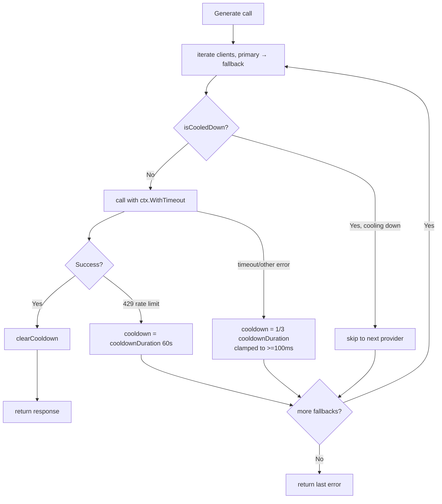
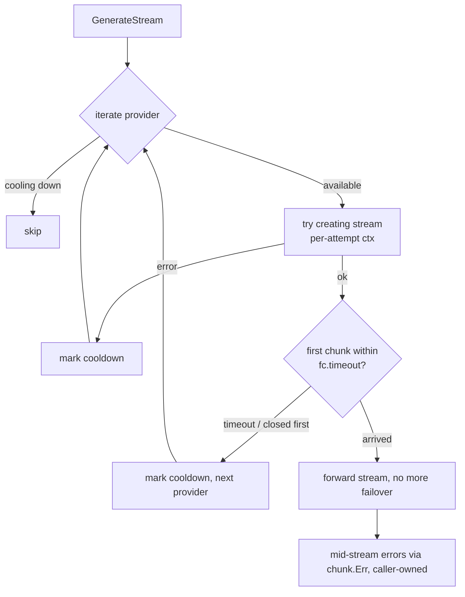
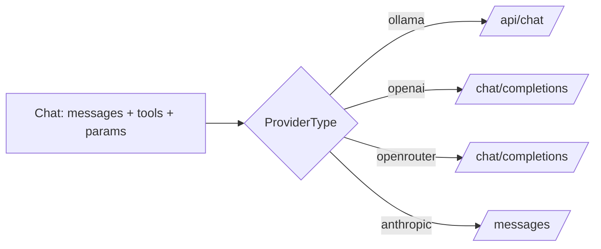

# ares Architecture Deep Dive (XX): LLM Client Layer — Client, Failover, and Multi-Provider Abstraction (0.3.x)

Article V (Tool System) showed how tools get called. But *who* calls the LLM? That's the `internal/llm/` layer — actually **two packages**: `internal/llm` (`Client`, `FailoverClient`, ~5.4k lines including tests) and `internal/llm/output` (per-provider adapters and response parsing, ~5.8k lines). Together they let ares talk to OpenAI, Ollama, OpenRouter, and Anthropic without caring which one is answering.

> Honesty correction: the old article claimed "5,799 lines across two packages." Actual `wc -l` (including `_test.go`) is ~5,400 for `internal/llm` and ~5,791 for `internal/llm/output` — about 11k lines combined.

---

## The Problem: One Provider, Three Failure Modes

A single `*llm.Client` wired to one provider works — until it doesn't:

| Failure | Symptom | Impact |
|---------|---------|--------|
| Timeout | Hangs until timeout, then errors | Agent appears frozen |
| Rate limit (429) | Immediate rejection | Burst traffic kills the agent |
| Provider outage | Connection refused | Total downtime |

**Honest reflection**: We didn't pick a load balancer — round-robin across providers. Providers aren't interchangeable; an OpenAI answer differs from a Claude one, and round-robin silently changes agent behavior. Failover is explicit: primary first, fallback only on failure.

---

## The Design: `Client` and `FailoverClient`

### The underlying `Client` (internal/llm/client.go)

Each provider is a `llm.Config` (`Provider`/`APIKey`/`BaseURL`/`Model`/`Timeout`/`MaxTokens`/`MaxPromptLength`/`Extra`). `NewClient` builds a struct with an `http.Client`, optional callbacks, rate limiter, retry policy, circuit breaker, and sanitizer:

```go
// internal/llm/client.go
const (
    defaultTimeoutSeconds = 60
    maxPromptLength       = 8192
    defaultMaxTokens      = 4096
)

type Client struct {
    config         *Config
    httpClient     *http.Client      // with Timeout — plain requests
    streamClient   *http.Client      // no Timeout — stream timeout is entirely context-driven
    tracer         ares_observability.Tracer
    ares_callbacks ares_callbacks.Emitter
    limiter        ares_ratelimit.Limiter
    sanitizer      *ares_security.Sanitizer
    retryPolicy    RetryPolicy       // default: 3 attempts, exponential backoff
    circuit        *CircuitBreaker   // default: enabled
    closeOnce      sync.Once
}

func NewClient(config *Config, opts ...Option) (*Client, error)
```

`Client` carries its own defenses: 429/5xx/transport errors retry under `retryPolicy`, and the breaker fails fast while a provider is degraded. `IsEnabled()` requires a non-empty `APIKey` for openai/openrouter/anthropic and always returns true for ollama.

### The high-level `FailoverClient` (internal/llm/failover.go)

```go
type FailoverClient struct {
    clients          []*Client              // primary + fallbacks, tried in order
    timeout          time.Duration          // per-call timeout
    cooldownDuration time.Duration          // default 60s
    mu               sync.RWMutex
    cooldowns        map[string]time.Time   // provider+model → cooldown expiry
}

func NewFailoverClient(configs []*Config, timeout time.Duration,
    rate float64, burst int, opts ...FailoverOption) (*FailoverClient, error)
```

`configs[0]` is the primary, `configs[1:]` are fallbacks. Construction disables the underlying clients' own retry and circuit breaking (`RetryPolicy{MaxAttempts:1}` + `WithCircuitBreaker(nil)`) — **the failover layer owns switching and doesn't want lower retries masking a failure**. A token bucket rate limiter is applied only to the primary (`i == 0`).



**Cooldown is tiered, not uniformly 60s.** `cooldownForError` gives a rate limit the full `cooldownDuration`, but a transient error only a third (clamped between 100ms and the full duration) — a bumped provider gets retried sooner, but never hammered on every call:

```go
func (fc *FailoverClient) cooldownForError(err error) time.Duration {
    if isRateLimitError(err) {
        return fc.cooldownDuration
    }
    short := fc.cooldownDuration / 3
    if short < 100*time.Millisecond {
        short = 100 * time.Millisecond
    }
    if short > fc.cooldownDuration {
        short = fc.cooldownDuration
    }
    return short
}
```

This prevents the "retry storm": a cooling-down provider is skipped entirely rather than hammered.

**Honest reflection**: There's no "preferred provider" concept. If Anthropic succeeds as a fallback, you still use OpenAI next time. You're not load-balancing — you only fall back when the primary fails. That's the intent.

---

## Streaming: Failover Covers the Handshake Only

`GenerateStream` has an easily missed semantic: failover covers **creating the stream** (the HTTP handshake) only. `fc.timeout` is only used to wait for the **first chunk** — a fixed request timeout would cut long streaming output mid-flight (the H8 comment). Each attempt gets its own `context.WithCancel`; a silent provider fails over; once the first chunk arrives the stream runs to completion, and mid-stream drops surface as `StreamChunk.Err`, not handled by the failover layer (N6):



```go
// each attempt gets its own context so a silent provider is cancelled
// without tearing down the caller's context
attemptCtx, attemptCancel := context.WithCancel(ctx)
ch, err := client.GenerateStream(attemptCtx, prompt)
```

---

## The DeepSeek `ReasoningContent`

DeepSeek thinking-mode responses carry a `reasoning_content` field separate from `content`. Early ares parsing dropped it.

> Location correction: the old article placed this on `Message`/`AssistantMsg` in `internal/core/models/message.go`. **Inaccurate** — the field lives in the `internal/llm/output` package: `output/openai.go`'s `Message` (with a `reasoning_content` JSON tag) is parsed and threaded into `AssistantMsg.ReasoningContent` in `output/toolcall.go` via `parseToolCallsFromResponse`, and `AssistantMsg.toMap()` writes it back (so the thinking trace round-trips through multi-turn tool calls):

```go
// internal/llm/output/toolcall.go
type AssistantMsg struct {
    Role             string              `json:"role"`
    Content          string              `json:"content,omitempty"`
    ReasoningContent string              `json:"reasoning_content,omitempty"` // DeepSeek thinking trace
    ToolCalls        []AssistantToolCall `json:"tool_calls,omitempty"`
}

func (m *AssistantMsg) toMap() map[string]interface{} {
    msg := map[string]interface{}{keyRole: m.Role, keyContent: m.Content}
    if m.ReasoningContent != "" {
        msg["reasoning_content"] = m.ReasoningContent
    }
    // ...
    return msg
}
```

**Honest reflection**: This is a provider-specific quirk leaking into core structures. You might ask "shouldn't a clean design use `ProviderMetadata map[string]any`?" A typed `ReasoningContent` field is easier to use and document. We chose pragmatism over purity.

---

## The Output Adapter: a Factory, Not a Switch

Production code has no `NewAdapter(provider) + switch`. It's a **registration-based `Factory`** (`output/factory.go`). Adapters register into `Factory.adapters` by provider name; `Create`/`CreateAdapter` looks them up; an unknown provider returns `ErrUnsupportedProvider`. `RegisterProvider` lets you mount a custom adapter externally:

```go
// internal/llm/output/factory.go
type Factory struct{ adapters map[string]func(*Config) LLMAdapter }

func NewFactory() *Factory { /* registers openai / ollama / openrouter */ }

func (f *Factory) Create(provider string, config *Config) (LLMAdapter, error)
func CreateAdapter(provider string, config *Config) (LLMAdapter, error)
func RegisterProvider(provider string, factory func(*Config) LLMAdapter)
```

Three built-in adapters — `NewOpenAIAdapter`, `NewOllamaAdapter`, `NewOpenRouterAdapter` — all implement `LLMAdapter` (`Generate` / `GenerateWithParams` / `GenerateStructured` / `GenerateStream` / `GetModel`). `OpenRouterAdapter` reuses most OpenAI logic; **there is no standalone Anthropic adapter** (Anthropic `Chat`/streaming are handled directly by `internal/llm`'s `chatAnthropic`/`streamAnthropic`).

Provider response shapes differ, then normalize to unified types; `parser.go` folds LLM text into structured results (`ParseRecommendResult`/`ParseJSON`/`ParseArray`…, with markdown-fence stripping, brace balancing, and `fixJSONString` repairs). Ollama's `Generate` reads `/api/generate`'s `response` field; OpenAI reads `choices[].message.content` from `/chat/completions`.

**Honest reflection**: Anthropic uses a different message/tool format than OpenAI. At some point someone tried to normalize everything to OpenAI's shape at the adapter layer; it worked for simple cases but broke on tool calls. The final design: each adapter owns its protocol, `parser.go` does the final normalization. One line to remember: **the adapter owns protocol differences; the parser owns output differences.**

---

## Chat Routing and Tool Calling

`Chat(ctx, messages []*core.LLMMessage, tools []core.Tool, params map[string]any)` is the tool-calling path (`params` carries evolution-strategy overrides for temperature/tokens/top_k). It dispatches by provider:



Ollama tool calling goes through **`/api/chat`** (its `tools` field), confirmed:

```go
// internal/llm/chat.go chatOllama
baseURL := c.config.BaseURL
if baseURL == "" {
    baseURL = DefaultOllamaBaseURL // http://localhost:11434
}
req, _ := http.NewRequestWithContext(ctx, "POST", baseURL+"/api/chat", bytes.NewBuffer(jsonBody))
```

The response's `message.tool_calls` normalizes into `core.ToolCall`. `internal/llm/output/toolcall.go` defines the tool-calling output types: `ToolCall`, `ToolResult`, `ToolChoice` (`auto`/`none`/`required`), `ToolCallResponse`, and the `ToolCapable` interface (`GenerateWithTools` / `SendToolResult`).

---

## The Service Layer and Bootstrap Wiring

`internal/llmservice/service.go`'s `LLMClient` is satisfied by both `*llm.Client` and `*llm.FailoverClient`; `Service` wraps it:

```go
// internal/llmservice/service.go
type LLMClient interface {
    Generate(ctx context.Context, prompt string) (string, error)
    GenerateStream(ctx context.Context, prompt string) (<-chan llm.StreamChunk, error)
    Chat(ctx context.Context, messages []*core.LLMMessage, tools []core.Tool, params map[string]any) (*core.GenerateResponse, error)
    IsEnabled() bool
    GetProvider() string
    GetModel() string
    Close()
}

type Service struct {
    client          LLMClient
    repo            core.LLMRepository
    config          *core.BaseConfig
    llmConfig       *core.LLMConfig
    embeddingClient any
}
```

`NewService` builds a `FailoverClient` when `config.Fallbacks` is non-empty, else a single `Client`; `Service.Generate` routes to Chat whenever tools are present or `hasToolMessages` is true.

On the bootstrap side (`internal/ares_bootstrap/provide_llm.go`'s `ProvideLLM`), the `ares_config.LLMConfig` is folded into a `llm.Config` and a **single** `llm.NewClient` is built with a callback registry, a `Sanitizer`, and the W1 `MetricsTracer` + `CostDashboard`, returned as `LLMComponents{Client, CallbackReg, CostDashboard}`; compat-layer `ollama.New` / `openai.New` is registered by provider name.

> Verified note: `ProvideLLM` currently builds only a single client — it does **not** assemble a `FailoverClient` there. The declarative failover entry points are `llm.LLMConfig.Fallbacks` → `llmservice.NewService`, or `sdk.WithFallbackLLM(&core.LLMConfig{...})` on the SDK side (`sdk/options.go`, callable multiple times to append fallbacks). Also, `llm.NewClientFromEnv` was removed in D13 (zero production callers).

---

## Lessons

The LLM client layer is invisible when it works. You don't notice the failover until the log shows "cooling down, skipping"; you don't notice tiered cooldown until you realize a low-grade error came back fast while a 429 was genuinely parked for 60s.

**The best client layer is the one that makes failure boring.** A provider outage should be a log line, not a page at 3 AM. Failover + tiered cooldown + per-call/per-attempt timeouts turn catastrophic failures into minor inconveniences — as long as you remember: **streaming is protected only until the first chunk; after the handshake, `chunk.Err` is the caller's problem.**