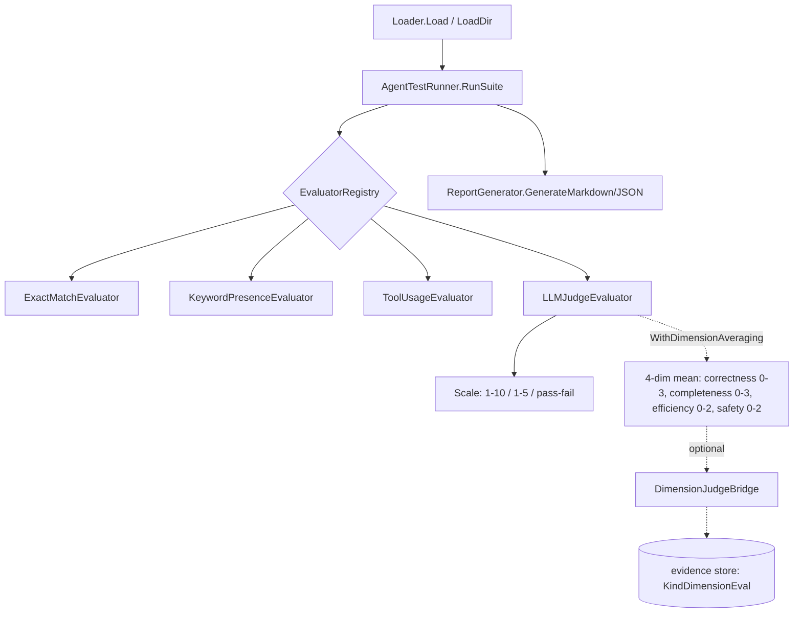
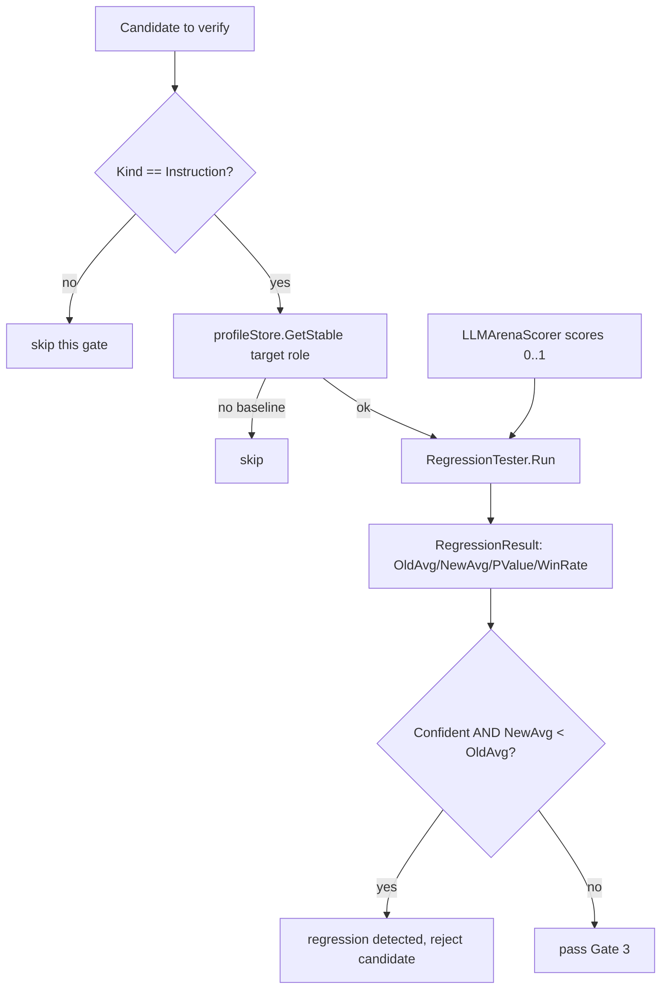

# ares Architecture Deep Dive (XXI): Evaluation Framework — How We Know If an Agent Is Actually Good (0.3.x)

"How do you know your agent improved?" This question keeps haunting us. The evolution engine generates new strategies and the candidate verification pipeline runs preserved-case regressions — but we need an objective way to say "strategy A is X% better than strategy B."

The evaluation framework (`internal/ares_eval/`, ~3,000 lines) is part of the answer. It turns "looks better to me" into reproducible scores. **A disclaimer up front: it is far from a general-purpose "evaluate anything" platform.** More precisely it's a small library of "score this agent output" evaluators, plus a regression gate that actually compares strategies. This article covers only what really exists in the code.

---

## The Problem: Vibes-Based Evaluation

Early ares evaluation was mostly manual and gut-driven, and all of it was broken:

| Path | Method | Problem |
|------|--------|---------|
| Manual | "Read the output, does it look right?" | Not scalable, heavily biased |
| Exact match | Output must equal expected text | Fragile, LLM verbosity varies |
| Token counting | "More tokens = more thorough" | Length ≠ quality (inferred from code comments; no measurement to cite, mark 待核实) |

Before describing anything, we did the honest thing: we inventoried **what the code actually contains** instead of dressing it up as a grand three-layer design.

---

## The Real Structure: Three Components

The actual `internal/ares_eval/` is a plain pipeline — **no "Comparison layer", no "concurrent Runner layer"** as often drawn in docs:



### Component 1: Loader (`loader.go`)

`Loader` loads suites from YAML via `Load(path)` and `LoadDir(dir)`. It includes `validateSuitePath`, which rejects suite paths that traverse into system directories (etc/proc/sys/dev/boot/root). Test-case fields live in `types.go` — note they are **not** the `Expected/Category/Difficulty` shape from older blog posts:

```go
// internal/ares_eval/types.go
type TestCase struct {
    ID             string
    Name           string
    Input          string
    ExpectedOutput string   // optional reference answer
    ExpectedTools  []string // tools the agent is expected to use
    Timeout        Duration // supports "30s" / "1m30s", default 30s
    Metadata       map[string]interface{}
    Tags           []string // selective execution
}

type TestResult struct {
    TestCaseID   string
    ActualOutput string
    ToolsUsed    []string
    Duration     time.Duration
    TokensUsed   int
    Error        string
    Metrics      map[string]float64
    Timestamp    time.Time
}

type EvalScore struct {
    Metric  string  // "exact_match", "keyword_presence", "tool_usage", "llm_judge"
    Score   float64 // always normalized to [0,1]
    Details string
}
```

Example suite:

```yaml
name: basic
description: smoke tests
test_cases:
  - id: reasoning_01
    input: "If A > B and B > C, what's the relationship between A and C?"
    expected_output: "A > C"
  - id: tool_call_01
    input: "please build this project for me"
    expected_tools: ["shell"]
    timeout: "60s"
```

### Component 2: Runner (`runner.go`, `agent_runner.go`)

`runner.go` only defines interfaces — **there is no `Runner` struct and no `RunAll`/`RunScenario`** as claimed in older posts:

```go
// internal/ares_eval/runner.go
type TestRunner interface {
    RunSuite(ctx context.Context, suite TestSuite) ([]TestResult, error)
    RunSingle(ctx context.Context, testCase TestCase) (TestResult, error)
}

type AgentExecutor interface {
    Execute(ctx context.Context, input string) (output string, toolsUsed []string, tokensUsed int, err error)
}
```

`AgentTestRunner` (`agent_runner.go`) drives an `AgentExecutor`, runs each case under a per-case timeout context, and records `Duration/TokensUsed/ToolsUsed`. It holds an optional `EvaluatorRegistry`; `RunAndEvaluate(ctx, suite, evaluatorName)` resolves an evaluator by name and scores every result. **This path is currently serial — there is no concurrent runner here.** Concurrency appears instead as batched scoring inside the evolution regression gate (below).

### Component 3: Evaluators (`evaluator.go`, `llm_judge.go`, `dimension_judge.go`)

The core interface promises exactly one thing (`Name()` is an extra method on implementations, not part of the interface):

```go
// internal/ares_eval/evaluator.go
type Evaluator interface {
    Evaluate(ctx context.Context, testCase TestCase, result TestResult) ([]EvalScore, error)
}
```

Built-in evaluators:

- `ExactMatchEvaluator`: `actual == expected` → 1.0, else 0.0. Gives 1.0 when `ExpectedOutput` is empty.
- `KeywordPresenceEvaluator`: score = fraction of keywords present.
- `ToolUsageEvaluator`: score = fraction of expected tools actually used.
- `LLMJudgeEvaluator`: LLM-as-judge (below).

`EvaluatorRegistry` (`NewEvaluatorRegistry` / `Register(name, eval)` / `Get` / `Names`) provides thread-safe named registration.

#### LLMJudgeEvaluator

Three scales are supported:

```go
// internal/ares_eval/llm_judge.go
const (
    ScaleOneToTen  ScaleType = iota + 1 // 1-10
    ScaleOneToFive                       // 1-5
    ScalePassFail                        // binary pass/fail
)
```

By default it uses the Chinese scoring prompt `DefaultJudgePromptCN` (`prompts.go`), grading four dimensions for a total of 0–10, and expects JSON `{"score": N, "reason": "..."}`. `Evaluate` normalizes to `[0,1]` (`score / maxScore`) and uses `extractJudgeJSON` for robust parsing of markdown-fenced or raw JSON.

**Honest reflection**: LLM-as-judge bias toward verbose, fluent output is real, but the code carries **no length-penalty prompt and no calibration against human scores**. Those are genuine TODOs, not shipped features. There is also no cache layer; cost control lives elsewhere (see the regression gate).

#### Dimension averaging (`dimension_judge.go`)

Note: **there is no standalone `DimensionJudgeEvaluator` type.** Dimension scoring is a path on `LLMJudgeEvaluator` enabled via `WithDimensionAveraging()` — the LLM scores four independent dimensions and we average them to lower variance:

| Dimension | Max |
|------|------|
| correctness | 3 |
| completeness | 3 |
| efficiency | 2 |
| safety | 2 |

It returns JSON `{"correctness":0-3,"completeness":0-3,"efficiency":0-2,"safety":0-2,"reason":"..."}`, normalized-averaged into metric `llm_judge_dimension_avg`.

The diagnosis can be persisted into the universal evidence store (`KindDimensionEval`) via the optional `DimensionJudgeBridge.Emit` in `evidence_bridge.go`, so the evolution `Diagnoser` consumes real failure evidence instead of a single scalar (a continuation of the Ch.8 verification theme).

### Reporting (`report.go`)

`ReportGenerator.GenerateMarkdown/GenerateJSON` produce suite-level stats (total/passed/failed/duration/tokens) plus per-metric average/min/max. `RunEvaluation` is a convenience that chains Load → Run → Evaluate.

---

## The Two Real Integration Points with Evolution

### Integration A: bootstrap registers the evaluator (`ares_bootstrap/provide_evolution.go`)

There is **no** `SetupEvaluators` with `WithMaxRetries` or a multi-evaluator register as in older posts. The real thing:

```go
// internal/ares_bootstrap/provide_evolution.go (simplified)
func setupEvaluators(llmClient ares_eval.LLMClient) (*ares_eval.EvaluatorRegistry, error) {
    judge, err := ares_eval.NewLLMJudgeEvaluator(llmClient,
        ares_eval.WithChinesePrompt(),
        ares_eval.WithScale(ares_eval.ScaleOneToTen),
    )
    if err != nil {
        return nil, err
    }
    registry := ares_eval.NewEvaluatorRegistry()
    if err := registry.Register("llm_judge", judge); err != nil {
        return nil, err
    }
    return registry, nil
}
```

This registry is exposed as `EvolutionComponents.EvaluatorRegistry` for downstream use.

### Integration B: Gate-3 preserved-case regression (`evolution/candidate_regression.go`, `gate3_orchestrator.go`)

This is where "does strategy A beat strategy B?" actually lands — **not in `ares_eval`**, but in the third gate of candidate verification. `CandidateRegressionChecker` compares the stable old instructions against the candidate's diff over the same preserved-case suite, scoring each with an `ares_arena.Scorer`, then runs a significance test. Defaults are hard-coded:

| Item | Default |
|------|------|
| `baselineRuns` / `compareRuns` | 5 |
| `minWinRate` | 0.55 |
| `timeout` | 30s |
| Significance | p < 0.05 (Welch's t-test, `Confident`) |



The scoring model is `LLMArenaScorer` in `ares_evolution/service/llm_arena_scorer.go`: two LLM calls — first have the model execute the instructions on a preserved case, then grade the output on `[0,1]`. It also implements `ScoreBatch`, collapsing a whole regression run into two batched calls (batch execute + batch grade), which drastically cuts request counts for rate-limited providers — a real, verifiable cost optimization. `gate3_orchestrator.go` provides `BuildRegressionGate3`/`LoadRegressionGate3` to wire it up; the latter builds a `FailoverClient` (primary provider + fallbacks) when `llm.fallbacks` is configured, so one provider's quota exhaustion doesn't take down the whole gate, and uses a more lenient circuit breaker (8 failures / 15s) to accommodate the scorer's exponential-backoff retries.

**Honest reflection**: the older claim of "1000 LLM calls per generation, plus caching and a random-10 fast mode" **matches no code or constant** — I dropped it. The real cost controls are batch scoring and failover coordination. (That claim is marked unverified; no corresponding implementation exists.)

---

## An Honest Wrap-up

`internal/ares_eval/` is not an ambitious "agent evaluation platform". It's a small scoring library: Loader + Runner + evaluators + report, plus a `DimensionJudgeBridge` that streams dimension diagnoses into the evidence store. "Comparison" is genuinely answered by the Gate-3 preserved-case regression with its statistical significance test — not by a `Comparison` struct. The `concurrent_runner.go`, `comparison.go`, and the HTTP service layer (`/eval/run` endpoints) from older posts **do not exist in the code**, and this article drops them.

**The best evaluation framework is the one that makes "is it better?" a question with a numerical answer.** Vibes don't scale. Reproducible scores do — but only when those scores come from code you can actually point to.