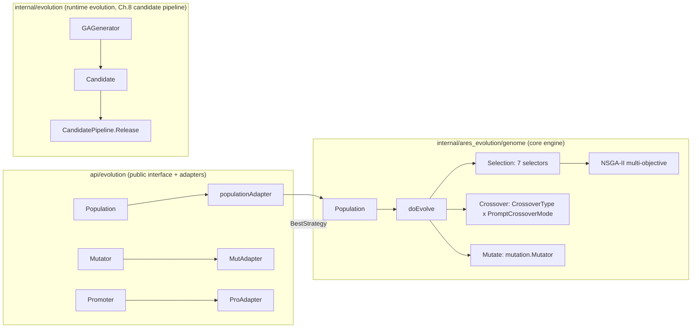
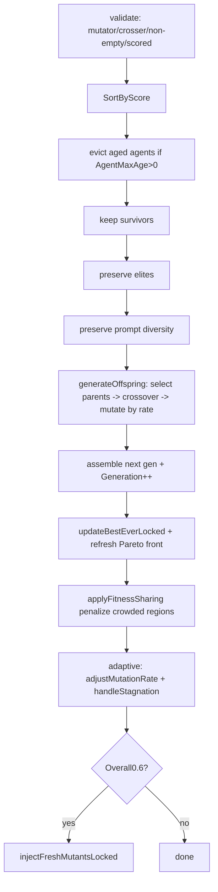

# GA Evolution Deep Dive — from a single strategy to a pluggable population engine

> This is the full introduction to the Ares evolution engine. Module root: `internal/ares_evolution/genome/`. Every symbol we use exists in the repo: `Population`, `doEvolve`, `TournamentSelection`, the `Selection` interface with 7 operators, crossovers as 3 `CrossoverType` × 3 `PromptCrossoverMode`, mutations as 5 `MutationType`, and NSGA-II multi-objective (`ParetoDominance` / `CrowdingDistance`). All numbers are real constants or config defaults from the source.

---

## 1. First, what GA is — and what it isn't

GA (Genetic Algorithm) is not a "tuning tool" here — it's a **strategy generator**. Given a root strategy, it produces candidate strategies generation after generation through selection, crossover and mutation, and a pluggable scorer decides who gets to stay.

It is also not the only evolution path. The repo holds several in parallel:

```text
internal/ares_evolution/        # the GA population engine (the stage for this article)
internal/evolution/             # runtime evolution engine (Genome/Diff/Coordinator)
internal/ares_flight/           # agent lineage / family tree (see 24.5)
```

One clarifying correction (this is also a fix over the older draft): **the internal default config does NOT hardcode tournament selection.** `DefaultPopulationConfig()` in `internal/ares_evolution/genome/population_config.go` leaves `SelectionStrategy` empty (`""`), and in `buildSelector()` an empty string is equivalent to `"random"` — parents are drawn uniformly at random from the breeding pool. It's the **public** `api/evolution` `DefaultPopulationConfig()` that defaults to `"tournament"`. Don't mix the two.

---

## 2. Architecture



The central architectural constraint is spelled out in the `Genome` interface doc (`internal/evolution/genome/genome.go`):

> `Genome → Generate Candidate → Diff Engine → RuntimePatch`. The Genome's only job is Mutation, Snapshot and optional Fitness; deployment belongs to the Diff Engine + Coordinator.

That is what makes the engine inherently pluggable — `Genome` doesn't know which subsystem it represents.

One change after 2026-07: **`Crossover` and `Fitness` were removed from the core `Genome` interface** because they had zero production callers. They now live behind optional interfaces `CrossoverGenome` / `FitnessGenome`, detected by type assertion:

```go
if f, ok := child.(FitnessGenome); ok {
    score, err := f.Fitness(ctx)
}
```

A real engineering decision: don't put unused methods in the interface.

---

## 3. Population: the skeleton

`internal/ares_evolution/genome/population.go` defines the core struct. It's richer than older drafts showed:

```go
type Population struct {
    Agents     []*mutation.Strategy
    Size       int                  // target size (constant across generations)
    Generation int
    mu         sync.RWMutex
    cfg        PopulationConfig     // immutable config snapshot
    rng        *rand.Rand           // deterministic RNG (#nosec G404)

    bestScore           float64                // all-time best (stagnation detection)
    bestEver            *mutation.Strategy     // best-ever strategy (deployment)
    paretoFront         []*mutation.Strategy   // NSGA-II Pareto front
    stagnantGens        int                    // consecutive no-improvement gens
    currentMutationRate float64                // runtime rate (adaptive)
    recoveryActions     map[string]int         // diversity-recovery action counters
    history             []GenerationHistoryEntry
    HistoryMaxSize      int
}
```

**Reader/writer separation**: `Best()` / `Stats()` / `Snapshot()` take the read lock; `ScoreAgents()` and `doEvolve()` take the write lock. Notably, `ScoreAgents()` deliberately calls the external scorer **outside the lock** — because a scorer may be an LLM or network I/O that blocks for seconds, and you don't want to pin the whole population while it runs.

### The real default config

(from `DefaultPopulationConfig()`, contrary to the "tournament by default" myth):

```go
return PopulationConfig{
    Size:            20,
    SurvivalRate:    0.6,
    MutationRate:    0.2,
    EliteCount:      3,
    BreedingPoolRatio: 0.6,
    SelectionStrategy: "",        // "" == "random"
    TournamentSize:      3,
    MinMutationRate:     0.05,
    MaxMutationRate:     0.5,
    MaxStagnantGenerations: 10,
    DiversityThreshold:  0.15,
    ...
}
```

`NewPopulation` validates `EliteCount > Size` and `MinMutationRate > MaxMutationRate`, then mutates the root into `Size-1` initial variants.

### The doEvolve pipeline

`Evolve` / `EvolveOnIdle` / `EvolveSteadyState` all converge on `doEvolve`:



Highlights:

- **`EvolveSteadyState(replaceRate)`** — steady-state GA. `replaceRate` outside `[0.1, 0.5]` is clamped; default `0.3`; only `replaceRate × Size` offspring replace the worst individuals. Built for online learning (see 24.6).
- **`EvolveOnIdle`** — reuses the configured `SurvivalRate` and `BreedingPoolRatio` (default 0.6) for the breeding pool; intended for idle-time evolution. The doc comment is explicit: the "zero token" claim covers only selection/crossover/mutation, *not* the prerequisite scoring pass.
- **Diversity recovery** — fresh mutants are injected when `report.Overall < cfg.DiversityThreshold` **or** `DominantLineageShare > 0.6`. Note the threshold is `DiversityThreshold=0.15`, not the 0.05 some drafts cite.
- **Fitness sharing** — `applyFitnessSharing` penalizes agents crowded in parameter space, driven through `SelectionScore`. Constants: `FitnessSharingSigma=0.3`, `FitnessNicheRadius=0.15`, `FitnessSharingSampleLimit=50`, `FitnessSharingSampleSize=30`.

---

## 4. Selection: seven implementations behind one interface

All live in `internal/ares_evolution/genome/selection.go`, each implementing the shared `Selection` interface:

```go
type Selection interface {
    Select(ctx context.Context, population []*mutation.Strategy, n int) ([]*mutation.Strategy, error)
}
```

| Operator | Mechanism | Default / key params | `SelectionStrategy` key |
|----------|-----------|----------------------|--------------------------|
| **Tournament** | pick k at random, keep best, repeat n times | k default 3 (min 2) | `"tournament"` |
| **Rank** | linear rank weight, best=N worst=1 | – | `"rank"` |
| **SUS** | single random start + evenly spaced pointers | – | `"sus"` |
| **RouletteWheel** | fitness-proportional, scores shifted to non-negative | – | `"roulette"` |
| **Truncation** | sort then take top N (deterministic elite) | – | `"truncation"` |
| **LineageRank** | rank + lineage-diversity penalty | threshold 0.4, strength 0.5 | `"lineage_rank"` |
| **NondominatedSorting** | NSGA-II: Pareto rank + crowding distance | – | `"nsga2"` / `"nondominated"` |

Real details:

- Selectors score through **`effectiveScore()`**: rely on `SelectionScore` when non-zero (the post-fitness-sharing value), else fall back to `Score`. The point — let fitness sharing influence *every* selector without polluting the `Score` used for reporting/history.
- Unevaluated agents (`Score = ScoreUnevaluated = -1`) sort to the end via `SortByScore`; SUS and roulette filter them out.
- Tournament draws unique indices via **Fisher–Yates partial shuffle**; `WithTournamentSeed` gives reproducibility.
- **NSGA-II** is a bolt-on: `NondominatedSortingSelection` checks `DimensionScores`; with no multi-objective data it falls back to tournament. Within a front, it picks the subset by descending crowding distance (with a comment documenting a classic parallel-array sort bug avoided).

`Population.buildSelector()` maps strings to selectors; `""` / `"random"` mean "no selector (random parents)".

---

## 5. Crossover and mutation

### Crossover (`internal/ares_evolution/genome/crossover.go`)

3 `CrossoverType`s for parameter recombination:

```go
CrossoverUniform    // each param independently taken 50/50 from either parent (default)
CrossoverTwoPoint   // two cut points split ordered params into 3; swap the middle segment
CrossoverSegment    // take one contiguous block from parent B, rest from A
```

3 `PromptCrossoverMode`s:

```go
PromptInherit     // inherit the higher-scoring parent's full prompt (default)
PromptHalfSplit   // first half from A, second half from B (half-sentence split)
PromptUniform     // pick either parent at random, equal probability, boosts diversity
```

Construct with `NewCrossover(WithSeed, WithDeterministicIDs, WithPromptMode, WithCrossoverType)`.

### Mutation (`internal/ares_evolution/mutation/types.go`)

`MutationType` actually has **5** members (not 4 as an earlier draft claimed):

```go
MutationParameter   // parameter value mutation -> "parameter"
MutationPrompt      // prompt template mutation -> "prompt"
MutationTool        // tool config mutation (Params["tools"] replaced) -> "tool"
MutationCrossover   // a strategy produced by crossover (source marker) -> "crossover"
MutationRoot        // root/initial strategy -> "root"
```

Generation is handled by the `Mutator` in `internal/ares_evolution/mutation`, built via `NewMutator(WithParamRanges(...), WithPromptPool(...), WithToolPool(...))`. There is also an experience-guided variant `ExperienceGuidedMutator` (`mutation/guided_mutator.go`) that biases mutation with historical performance, and an **adaptive mutation rate** (`mutation/adaptive_distribution.go`) wired into `adjustMutationRateLocked()` inside `doEvolve`.

---

## 6. Multi-objective: NSGA-II

`internal/ares_evolution/genome/multi_objective.go`. The four default dimensions come from `DefaultDimensionDirections` / `DefaultDimensionWeights`:

| Dimension | Direction | Default weight | Meaning |
|-----------|-----------|----------------|---------|
| `success_rate` | maximize | 0.40 | higher success rate is better |
| `quality` | maximize | 0.25 | higher output quality is better |
| `cost` | minimize | 0.20 | lower API cost is better |
| `latency` | minimize | 0.15 | lower latency is better |

Core functions:

```go
func ParetoDominance(a, b *mutation.Strategy) bool  // a dominates b iff strictly better in >=1 dim, no worse in all others
func ParetoRank(strategies) []int                    // non-dominated sorting, 0 = best front
func CrowdingDistance(front) []float64               // within-front crowding (boundaries = infinity)
```

Activate with the `"nsga2"` or `"nondominated"` selection key. `ScoreAgentsMulti(scorer)` writes both `DimensionScores` and an aggregate `Score`. The weights are used **only** to collapse the dimensions into a scalar for reporting; selection itself runs purely on Pareto ranking. `Population.ParetoFrontStrategy()` returns the current front.

---

## 7. A workflow you can assemble: WiredEvolutionSystem

`internal/ares_evolution/genome_wiring_system.go` offers `NewWiredEvolutionSystem(...)` — a central factory wiring Population, scorer, lineage, guardrails, diff, coordinator — and `RunIdleEvolution(ctx, system, n)` runs N generations, roughly:

```text
score → evolve → record lineage → LLM reflection → hypothesis generation → diff engine → coordinator → after-generation hook
```

This is where GA hooks into the runtime evolution pipeline in `internal/evolution`.

---

## 8. Runtime evolution: Genome / Diff / Coordinator (Ch.8 candidate pipeline)

`internal/evolution/genome/workflow_genome.go` is the genuine **runtime DAG genome**:

- 9 mutation operators `wfOp*`: insert / remove / replace / parallelize / serialize / swap / split / merge / set-metadata — one is chosen at random and applied to the DAG.
- `DefaultWorkflowGenomeConfig()`: `AgentPool=["default"]`, `MaxNodes=20`, `InsertionRate=0.3`, `PruneRate=0.2`.
- `Fitness()` reads real flight-recorder evidence (`avgFitnessValue`, mean of `Value∈[0,1]`); **with no evidence it returns a neutral 0.5** so evolution keeps exploring.
- `Crossover()` is uniform (optional `CrossoverGenome`).

On the instruction side, `GAGenerator` in `internal/evolution/ga_generator.go` mutates a role's stable instructions into `Candidate`s. `CandidatePipeline.Release` (`candidate_pipeline.go`) routes a **verified** candidate through the coordinator decision + canary deployment pipeline:

```text
Candidate(verified) → RuntimePatch → coordinator.Submit → Evaluate
  → DecisionApply → deployment (staging→live) → ProfileStore.SetStable + audit
```

The coordinator's default policy is a real constant (`internal/evolution/coordinator/coordinator.go`):

```go
AutoApplyThreshold:    8,    // priority >= 8 auto-applies
MaxPatchesPerMinute:   4,
MinFitnessThreshold:   30.0, // GA patches below this are rejected
ApplyFitnessThreshold: 70.0, // GA patches at/above this auto-apply; [30,70) goes to delay for review
```

The doc comment notes five genomes (memory/knowledge/recovery/workflow/scheduler) each scale their success-rate mean from `[0,1]` to `[0,100]` — which is why it's 30/70, not the 60/30 an earlier draft claimed. Fixed here.

---

## 9. Real defaults vs. earlier-draft myths

| Item | Earlier-draft claim | Actual source |
|------|--------------------|---------------|
| Internal default selection | `"tournament"` | `""` (= random) |
| Default breeding-pool ratio | 0.3 | 0.6 |
| Number of mutation types | 4 | 5 (incl. `MutationRoot`) |
| Diversity-collapse injection threshold | 0.05 | `DiversityThreshold=0.15` or `DominantLineageShare>0.6` |
| Coordinator fitness thresholds | Apply≥60 / Reject<30 | Apply≥70 / Reject<30 / delay[30,70) |

---

## 10. Closing thoughts

The value of the evolution engine isn't "which operator is best" — it's **pluggable and measurable**. In the code you'll find 7 selection operators, 3+3 crossover/inheritance modes, 5 mutation types, an NSGA-II front, and a complete pipeline from candidate to canary deployment to stable. There is no "best config" preset — what you get is a set of tools that combine to cover everything from fast convergence to multi-objective trade-offs.

---

## Appendix

[A] Key code locations:

| Topic | Path |
|-------|------|
| Population & main evolution loop | `internal/ares_evolution/genome/population.go` |
| Defaults | `internal/ares_evolution/genome/population_config.go` |
| Selection operators | `internal/ares_evolution/genome/selection.go` |
| Crossover / inheritance | `internal/ares_evolution/genome/crossover.go` |
| Multi-objective | `internal/ares_evolution/genome/multi_objective.go` |
| Mutation types | `internal/ares_evolution/mutation/types.go` |
| Mutation engine | `internal/ares_evolution/mutation/mutator.go` |
| Public API | `api/evolution/evolution.go`, `api/evolution/mutation/mutator.go` |
| Orchestration factory | `internal/ares_evolution/genome_wiring_system.go` |
| Runtime DAG genome | `internal/evolution/genome/workflow_genome.go` |
| Candidate generation & release | `internal/evolution/ga_generator.go`, `candidate_pipeline.go` |
| Coordinator | `internal/evolution/coordinator/coordinator.go` |

[B] Run it yourself: `go run ./examples/10-ga-full-evolution`.

[C] Not covered here: TieredScorer (24.2), selection benchmarks (24.3), Promoter (24.4), genealogy (24.5), real-world lessons (24.6).