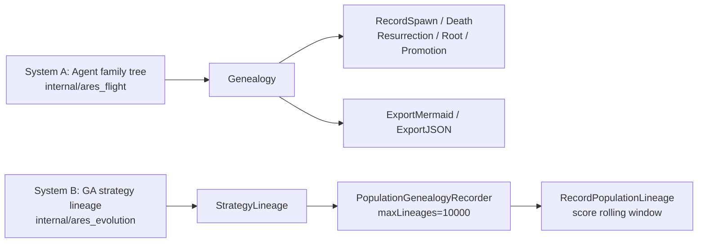

# Genealogy — tracking who descends from whom

> This article covers two **parallel** lineage systems in Ares, plus a selection operator that cares who your ancestors are. All the code is real:
> - System A: the Agent family tree — `internal/ares_flight/genealogy.go` (`Genealogy` / `LineageNode` / `ExportMermaid`)
> - System B: the GA strategy lineage — `internal/ares_evolution/genome_wiring_genealogy.go` (`PopulationGenealogyRecorder` / `RecordPopulationLineage`), with `StrategyLineage` in `interfaces.go`
> - Lineage-aware selection — `LineageRankSelection` in `internal/ares_evolution/genome/selection.go`

---

## 1. Two lineage systems



- **System A** records Agent lifecycle events (spawn / resurrect / death / promoted-to-leader), organized as a tree, mainly for visualization — `ExportMermaid` literally renders a mermaid flowchart.
- **System B** records strategy lineage as a flat list, mainly for diversity control (`LineageRankSelection`, fresh-mutant injection, guardrails).

---

## 2. System A: the Agent family tree (ares_flight)

`internal/ares_flight/genealogy.go`. Core types:

```go
type AgentRelation string
const (
    RelationSpawned     AgentRelation = "spawned"
    RelationResurrected AgentRelation = "resurrected"
    RelationPromoted    AgentRelation = "promoted"
)

type LineageNode struct {
    ID        string
    Type      string
    ParentID  string
    Relation  AgentRelation
    SpawnedAt time.Time
    DiedAt    time.Time
    IsAlive   bool
    Children  []*LineageNode
    Metadata  map[string]any
}

type Genealogy struct {
    roots []*LineageNode
    nodes map[string]*LineageNode
    mu    sync.RWMutex
}
```

Methods (each under read/write lock):

| Method | Purpose |
|--------|---------|
| `RecordSpawn(parentID, childID, agentType, meta)` | record a parent→child edge (empty parent ⇒ root) |
| `RecordResurrection(oldID, newID)` | mark old dead; new node inherits type+parent and adopts the old node's children |
| `RecordRoot(id, agentType, meta)` | record a parentless root (re-alive if already present) |
| `RecordDeath(id)` | mark dead + set `DiedAt` |
| `RecordPromotion(id)` | mark leader + write `promoted_at` metadata |
| `Descendants(id)` / `Ancestors(id)` | subtree / ancestor chain (root→self) |
| `IsAlive(id)` / `GetNode` / `Roots` | queries |
| `ExportMermaid()` / `ExportJSON()` | export a mermaid flowchart (`🤖` alive / `💀` dead / `👑` leader) or JSON |

`GenealogyCollector` in `internal/ares_flight/genealogy_collector.go` subscribes to the `EventStore` and feeds events into this tree — that's the event-driven assembly entry point.

## 3. System B: strategy lineage (GA)

The data structure `StrategyLineage` (`internal/ares_evolution/interfaces.go`):

```go
type StrategyLineage struct {
    ParentID          string  `json:"parent_id"`
    ChildID           string  `json:"child_id"`
    MutationType      string  `json:"mutation_type"`
    WinRate           float64 `json:"win_rate"`
    ScoreImprovement  float64 `json:"score_improvement"`
    ParentScore       float64 `json:"parent_score"`
    ChildScore        float64 `json:"child_score"`
    ImprovementSignificant bool `json:"improvement_significant"`
    Timestamp         int64   `json:"timestamp"`
}
```

A deliberately minimal interface — one method makes anything a recorder:

```go
type GenealogyRecorder interface {
    Record(ctx context.Context, lineage StrategyLineage) error
}
```

`PopulationGenealogyRecorder` (`genome_wiring_genealogy.go`) is the in-memory implementation:

```go
type PopulationGenealogyRecorder struct {
    mu          sync.RWMutex
    lineages    []StrategyLineage
    maxLineages int // default 10000 — drop oldest when exceeded
    scoreHistory map[string]*ScoreRollingWindow // agentID -> rolling window (size 3)
}
```

A companion `ScoreRollingWindow` (size 3, matching the promoter's `ImprovementWindow`): `Add` appends and evicts the oldest, `Mean` averages. Using it as the baseline instead of a single-point score is meant to **smooth noise** — strategy scores fluctuate as opponents change, so a 3-generation average is more stable.

### RecordPopulationLineage: the per-generation bridge

`RecordPopulationLineage(ctx, pop, recorder, parentSnapshot, prevGeneration)` (in `genome_wiring_genealogy.go`):

```
1. pop == nil || recorder == nil → return immediately
2. pop.Snapshot() → deep-copied agents + generation
3. build parentScores lookup (parent snapshot -> score)
4. loop agents:
   a. skip ParentID=="" or Version<=1
   b. dedupe: each (parentID, childID) pair recorded once
   c. resolve parent score (crossover-aware, see §6)
   d. prefer the rolling mean as baseline
   e. scoreDelta = agent.Score - baseline; >0 → winRate=1
   f. recorder.Record(lineage)
```

---

## 4. Lineage-aware selection: LineageRankSelection

When one lineage dominates, `LineageRankSelection` applies a penalty on top of the ranking weight so underrepresented lineages get a better shot. Defaults: `penaltyThreshold=0.4`, `penaltyStrength=0.5`.

```go
// computeLineageRankWeights (selection.go)
func computeLineageRankWeights(sorted []*mutation.Strategy, penaltyThreshold, penaltyStrength float64) (weights []float64, totalWeight float64) {
    // 1. count the share of each ParentID (empty ParentID normalized to "(root)")
    // 2. base weight = linear rank (best=N, worst=1)
    // 3. when share > threshold:
    //      excess    = (share - threshold) / (1 - threshold)
    //      penalty   = penaltyStrength * excess
    //      rankWeight *= (1 - penalty)
}
```

Example (threshold 0.4, strength 0.5):

| Lineage distribution | share | Weight change |
|----------------------|-------|---------------|
| uniform, 5 lineages @20% | ≤0.4 | no penalty |
| one lineage @60% | 0.6 | ≈ ×(1−0.5×0.333)≈×0.83 |
| one lineage @90% | 0.9 | ≈ ×(1−0.5×0.833)≈×0.58 |

`Select`: `SortByScore` → `computeLineageRankWeights` → weighted-roulette draw of n. The comment states the intent: **prevent lineage collapse in wired mode** (tournament inflates selection pressure; the lineage penalty balances it).

---

## 5. Quantifying lineageness and diversity

`Population.measureLineageDiversityLocked()` (`adaptive.go`) returns `(lineageDiv, dominantShare)`:

```go
lineageDiv     = len(uniqueParents) / n   // 1.0 = all agents have different parents
dominantShare  = maxParentCount / n       // share of the most common parent
```

Sampled into `DiversityReport` (top of `adaptive.go`): `Overall / Numeric / Categorical / Lineage / DominantLineageShare`. Its consumers are real:

- **doEvolve** (`population.go`): when `report.Overall < cfg.DiversityThreshold(0.15)` **or** `report.DominantLineageShare > 0.6` → `injectFreshMutantsLocked`. (The 0.6 threshold is corroborated by `population_config.go` / `diversity_test.go`.)
- **MetaController** (`meta_evolution.go`): `report.Lineage < 0.3` adds a `low_lineage_diversity` reason and may switch to `"lineage_rank"`.
- **Guardrails** (`guardrails.go`): `MaxLineageShare` defaults to **0.8**; above it raises a `lineage_concentration` `GuardrailWarning`.

---

## 6. Crossover lineage: two parents encoded with ×

A crossover child has two parents; `ParentID` is encoded as `parentA×parentB` (Unicode multiplication sign `\u00d7`):

```go
// crossover.go
func formatParentIDs(idA, idB string) string {
    return idA + "\u00d7" + idB
}
// child := ... { ID: generateChildID(a.ID,b.ID), ParentID: formatParentIDs(a.ID,b.ID), ... }
```

Lineage recording must handle this composite parent — `resolveParentScore` (`genome_wiring_genealogy.go`) treats a `ParentID` containing `\u00d7` by averaging the two parents' scores as the baseline:

```go
parts := strings.Split(parentID, "\u00d7")
if len(parts) == 2 { /* if both ps1 and ps2 resolve -> (ps1+ps2)/2 */ }
```

---

## 7. Honest boundaries (not landed / to be verified)

Two claims from the older 24.5 need flagging against the source:

| Older-draft claim | Rendered verdict |
|-------------------|------------------|
| "`RunIdleEvolution` captures a parent snapshot then calls `RecordPopulationLineage` each generation" | **True** — `RunIdleEvolution` in `genome_wiring_system.go` does `system.Population.Snapshot()` before evolving and calls `RecordPopulationLineage` after (logging-and-continue on error) |
| "one elite preserved per lineage (`PerLineageElites` / `PerLineageEliteCount`)" | The config fields are **real** in `population_config.go` (default `PerLineageElites:true`, `PerLineageEliteCount:1`); the implementation spans `population_guard.go`'s `preservePerLineageElites`. We don't re-render its internals line-by-line here |

And to be direct: this pass does **not** vouch for run figures like "lineage improvement 100% vs 3.7%". Those need a real multi-generation run and logs; the repo ships no committed run log to cite directly (see 24.6).

---

## 8. Summary

The two systems split cleanly:

- **Agent tree (A)** draws who was born/resurrected from whom — for visualization and provenance.
- **Strategy lineage (B)** records which strategy inherited from which — for **diversity control**: `LineageRankSelection` penalizes dominant lineages → underrepresented ones get a chance → `DiversityReport` (`DominantLineageShare>0.6`) triggers fresh-mutant injection → `MetaController` switches to `lineage_rank` on low lineage diversity → `Guardrails` (>0.8) warn.
- Crossover children encode both parents with `\u00d7`; lineage baselines average both parents' scores, so a "crossed-over child" still fits a single `ParentID` in the flat table.

In one line: **tracking "who descends from whom" is how we stop one bloodline from monopolizing the future genes.**