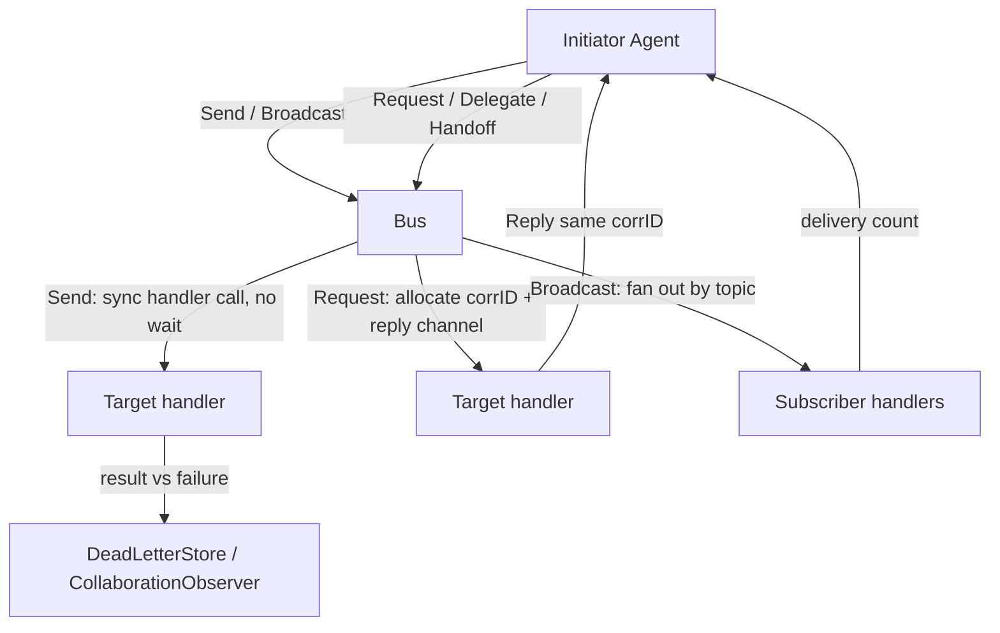
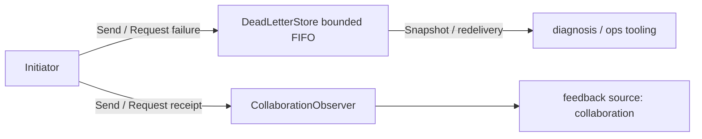
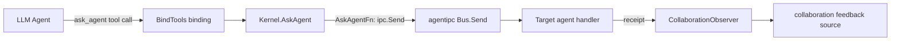

# ares Architecture Deep Dive (XXVI): Agent Communication — Agent IPC Primitives and the Syscall Tool Layer (0.3.x)

> Note: This article is grounded in the actual code (`internal/agentipc` — `bus.go` / `primitives.go` / `policy.go` / `deadletter.go` / `collaboration_observer.go` — and `internal/agentsyscall` — `syscall.go` / `plan.go`), the dedicated Agent-communication article in the docs series. Agents are peer cognitive processes (A ≡ B ≡ C); communication runs over a peer-mesh message bus, no Leader relay required.

## 1. Why Agent Communication Matters

In a multi-agent system agents must exchange messages — "I found X" / "help me verify Y" / "your conclusion conflicts with mine" (the archetypal collaboration phrases listed in `internal/agentipc/doc.go`). This is ARES's Kernel IPC pillar (P4), and the third of the three context layers (Task Shared / Agent Private / IPC Messages) — the first two live in `internal/agentfabric`; this layer is carried by this package.

Let's first separate duties: **task dispatch is the Scheduler's (Task Fabric) job; agent communication is IPC's job.** They are not the same thing:

| Dimension | Task Dispatch (taskfabric / Scheduler) | Agent Communication (agentipc) |
|-----------|----------------------------------------|--------------------------------|
| View | Who executes what task | Who needs to know what message |
| Path | Created via Task Fabric → scheduled → executed | Direct peer-mesh delivery |
| Semantics | Task execution, recoverable, replayable | Collaboration, request/reply, broadcast/subscribe, handoff |
| State | Durable Task | In-memory registry + immediate delivery |

**Core principle: agents express intent (Send / Request / Delegate / Handoff / Subscribe); the Kernel guarantees delivery.** Communication is a "collaboration channel", not a "task execution channel".

## 2. The Native Message Unit: Message

Every IPC message uses `Message` from `internal/agentipc/bus.go` (design §13: Context layer 3 — IPC Messages):

```go
type Message struct {
    ID            string    // unique message ID generated by the bus
    From          string    // sender agent ID
    To            string    // target agent ID ("" = broadcast to subscribers)
    Topic         string    // message subject (e.g. "verify-conclusion" / "handoff-task")
    CorrelationID string    // correlation id pairing a reply with its request
    Payload       any       // message body
    At            time.Time // send timestamp
}
```

The paired delivery function and sentinel errors (`Handler`, `ErrAgentNotRegistered`, `ErrNoHandler`, `ErrTimeout`, `ErrInvalidMessage`) are defined in the same package.

## 3. The Six Primitives: Bus

The core object is `Bus` (`internal/agentipc/bus.go`): a peer message bus mapping agent IDs to handlers. It maintains `handlers`, `subscribers` (topic → subscriber list), and `pending` / `pendingErr` (per-correlation reply channels / stashed errors). The full primitive set:

| Primitive | Semantics | Notes |
|-----------|-----------|-------|
| `Send` | fire-and-forget direct send | Invokes the target handler synchronously; waits for no reply |
| `Request` | synchronous request/reply | Allocates a correlation ID, waits for a reply, with a timeout |
| `Reply` | asynchronous response | The target handler answers later by correlation ID |
| `Delegate` | forward on behalf of | Forwards to the final target, preserving the end-to-end correlation ID |
| `Handoff` | task hand-off | Structured task payload + receiver acknowledgement; does NOT go through the Scheduler |
| `Subscribe` / `Unsubscribe` | subscribe / unsubscribe | Topic subscription, paired with `Broadcast` fan-out |

> Note: `doc.go` frames the set as Send / Request / Delegate / Handoff / Subscribe (+ Reply); the implementation adds `Broadcast` / `Unsubscribe` as supplementary entry points, listed all together here.



### Send vs Request: Two Collaboration Stances

- `Send(ctx, from, to, topic, payload) error` — fire-and-forget. The target handler is invoked synchronously in the caller's goroutine; a handler error is surfaced but no reply channel is set up — "fire and done", no paired reply.
- `Request(ctx, from, to, topic, payload, timeout) (*Message, error)` — synchronous request/reply. The bus allocates a correlation ID and registers a pending reply channel; the target handler must call `Reply` with the same correlation ID to complete the request. **Timeout has a sane default**: a `timeout <= 0` falls back to `defaultRequestTimeout = 30 * time.Second` (primitives.go, B16 — no indefinite blocking). The request runs in a managed goroutine with a recover boundary — if the handler panics, it is contained as one `ErrHandlerPanic`, failing exactly that single request rather than the whole process.

## 4. Delegate and Handoff

- `Delegate(ctx, delegator, to, topic, payload, timeout)` — forwards a request to another agent on the caller's behalf. The original requester's correlation ID is preserved end-to-end so the reply chains back. Semantics: "I can't handle this — let me ask someone who can".
- `Handoff(ctx, from, to, taskID, contextSnapshot, timeout)` — transfers a task's *ownership* from a yielding agent to an accepting agent. Payload is `{task_id, context, artifacts}` on the constant topic `handoff-task`; the receiver returns an acceptance reply. **Key point: this is a peer-to-peer task-transfer primitive — it does NOT go through the Scheduler.**

## 5. Publish/Subscribe: Subscribe / Broadcast / Unsubscribe

```go
func (b *Bus) Subscribe(agentID, topic string) error   // idempotent: duplicates de-duplicated
func (b *Bus) Unsubscribe(agentID, topic string)
func (b *Bus) Broadcast(ctx context.Context, from, topic string, payload any) int
```

`Broadcast` fans one message out to every subscriber's handler for a topic; a handler error does not stop the rest, and the successful-delivery count is returned. Subscribe de-duplicates the same agent on the same topic (B16).

## 6. Observability: DeadLetterStore and CollaborationObserver

IPC is not just communication — it is one input to the evolution loop (N-11 / GAP-3 closure):

- **DeadLetterStore** (`deadletter.go`): a bounded FIFO recording failed deliveries (`ErrAgentNotRegistered` / `ErrTimeout` / handler errors). Default capacity 1024 (`capacity <= 0` falls back). `Record` (oldest evicted), `Snapshot`, `Count` serve diagnosis and redelivery. Both Send and Request record failures.
- **CollaborationObserver** (`collaboration_observer.go`): each collaboration attempt with an observable receipt emits one `feedback.CollaborationOutcome`. `Send` and `Request` (and the Delegate / Handoff built on them) are observed; `Broadcast` is deliberately NOT observed (no single target to attribute the outcome to). The observer is invoked on the initiator's path, so it MUST NOT block — and it is called outside the bus lock.



## 7. The Syscall Layer: Kernel and Tools

`internal/agentsyscall` wraps IPC/collaboration capability into **LLM-callable tools** (W2 design: the real LLM executor decides whether to split work; the Kernel validates and enforces — "Agent decides. Kernel enforces."). `BindTools(binder, kernel)` registers four tools:

| Tool constant | Kernel syscall | Meaning |
|---------------|----------------|---------|
| `SpawnAgentTool` (`spawn_agent`) | `Kernel.SpawnAgent` | Spawn a peer Agent with a declared capability; validate quota and register it as a schedulable executor |
| `CreateTaskTool` (`create_task`) | `Kernel.CreateTask` | Create a sub-task in the Task Fabric (→ READY), leaves it to the Scheduler |
| `AskAgentTool` (`ask_agent`) | `Kernel.AskAgent` | Ask a target Agent a question on a topic (use when you know WHICH agent to ask) |
| `CreatePlanTool` (`create_plan`) | `Kernel.CreatePlan` | Compile the whole dependency DAG into one batch of tasks (optional bounded round-loop) |

`ToolSchemas()` returns the LLM-facing schemas for these tools and injects them into `resources.Registry`, alongside the built-in tools in the Chat API.

**The Kernel's `AskAgentFn` is the key injection point** (`syscall.go`):

```go
type AskAgentFn func(ctx context.Context, from, to, topic string, payload any) error

// WithAskAgent injects the collaboration primitive; SetAskAgent can replace it during
// serve assembly (after setupPeerRegistry). Production wire-up:
// aresrecovery.EvolutionAwareIPC.Send → agentipc Bus.
```

`ask_agent` is the ACT half of the collaboration channel (Step Y.2-ACT): it turns "which agent to ask" into an agent-visible, changeable decision. `Kernel.AskAgent` requires a non-empty target and a wired primitive (fail-loud if absent — never a silent no-op). **Note its semantics are a fire-and-forget send: `AskAgentResult.Accepted` means "the request was handed to the collaboration primitive", not "an answer is in hand".**



## 8. Dual-Track Dispatch Policy

`policy.go` shows how task dispatch (outside IPC proper) transitions: `ExecutionPolicy` enumerates `PolicyLegacy` (legacy leader+sub path, retained only as a library constant) and `PolicyTaskFabric` (Kernel path: Task Fabric → Scheduler → Agent). `PolicyFlag` is an atomic feature flag; `DualTrackDispatcher` keeps both paths coexisting, and in **shadow mode the inactive path also runs and outcomes are compared** (equivalence verification), with mismatches surfaced via `Mismatches()`. This is P4 D4's "parallel + feature-flag gradual cutover" made concrete.

## 9. Summary

| Primitive / Component | Package | Responsibility |
|-----------------------|---------|----------------|
| `Message` + `Handler` | `internal/agentipc` | IPC message unit and delivery callback |
| `Bus` (Send/Request/Reply/Delegate/Handoff/Subscribe/Broadcast/Unsubscribe) | `internal/agentipc` | Peer message bus and the full collaboration primitive set |
| `DeadLetterStore` | `internal/agentipc` | Bounded FIFO record of failed deliveries (default 1024) |
| `CollaborationObserver` | `internal/agentipc` | Collaboration receipts → feedback source |
| `DualTrackDispatcher` + `PolicyFlag` | `internal/agentipc` | Dual-track equivalence dispatch / feature flag |
| `Kernel` (SpawnAgent/CreateTask/AskAgent/CreatePlan) | `internal/agentsyscall` | LLM-callable syscall tool kernel |

**Design line: agents express intent, the Kernel guarantees delivery, and the evolution loop stays observable.** The communication primitives are the peer collaboration layer; task dispatch is the scheduling execution layer — orthogonal. And `ask_agent` turns a "collaboration intent" into a real, injectable, observable, evolvable tool, wiring the IPC from a library primitive into the agent's cognition loop.