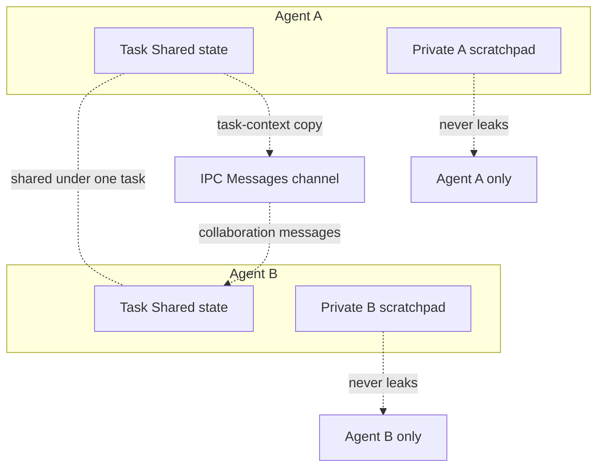
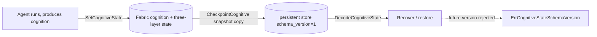

# ares Architecture Deep Dive (XXVII): Context Management — Three-Layer Context, Checkpointable Cognitive State, and the Prompt Gate (0.3.x)

> Note: This article is grounded in the actual code (`internal/agentfabric/context.go` + `agent.go` for the three-layer context and `CognitiveState`, `internal/llm` for the `maxPromptLength` prompt-length gate, `internal/ares_memory` for session memory), the dedicated context-management article in the docs series.

## 1. Why Context Management Is the Agent's Lifeline

The LLM context window is a hard constraint: agents accumulate history every turn, and tool results can run hundreds or thousands of tokens — a few dozen turns easily blow through the window. ARES doesn't treat "cram everything into the window" as a strategy. Instead it holds the budget with several **independent, each-manages-its-own-slice** mechanisms, spread across four layers:

| Layer | Real mechanism | Location | What it controls |
|-------|----------------|----------|------------------|
| 1. Cognitive state | Three-layer context isolation (Task Shared / Agent Private / IPC) | `internal/agentfabric/context.go` | Who can see what; private never leaks |
| 2. Persistence | Versioned `CognitiveState` + checkpointing | `internal/agentfabric/agent.go` / `context.go` | Persist only the checkpointable state; no hidden CoT |
| 3. Session | Session memory (TTL / LRU / structured messages) | `internal/ares_memory` | How history is organized, retained, and reclaimed |
| 4. Call | `maxPromptLength` hard gate | `internal/llm` | Over-long prompts rejected before the LLM call |

## 2. The Three-Layer Context: Task Shared / Agent Private / IPC

`internal/agentfabric/context.go` hard-codes the isolation requirement (design §13: Context three layers — don't share one brain): the `ContextLayer` enum defines three tiers:

```go
type ContextLayer int

const (
    ContextTaskShared ContextLayer = iota // shared task state: goal/constraints/artifacts/decisions/deps/checkpoints; all agents must see it
    ContextAgentPrivate                    // agent private state: reasoning/observations/hypotheses/scratchpad; never leaks
    ContextIPC                             // inter-agent message channel; carried by the IPC pillar (P4); this layer is the storage surface
)
```

The Fabric exposes read/write entry points and enforces isolation **by deep copy**:

- `SetTaskContext` / `TaskContext`: binds a copy of the task's Task Shared State to an agent; the agent can never mutate the caller's map.
- `SetPrivate` / `Private`: private scratchpad layer — **never leaks into Task Shared State or other agents** (§13 invariants #5/6).
- `ContextView`: a read-only snapshot pulling `TaskShared` and `Private` together, precisely so you can verify "private never bleeds into task".

Note **what the Fabric stores**: the `Agent` (in `agent.go`) holds only `taskContext` and `privateContext`; the IPC layer does not live in the Fabric — it is carried by `internal/agentipc`'s `Message` / `Bus` (the peer message bus from the previous article).



## 3. CognitiveState: Versioned and Checkpointable

An agent's "cognitive content" is explicitly modeled as `CognitiveState` in `internal/agentfabric/agent.go` — state that is **independently persistable**: the Runtime does NOT depend on hidden chain-of-thought, only on this durable state (§13 invariant #5):

```go
const CognitiveStateSchemaVersion = 1

type CognitiveState struct {
    SchemaVersion int   // struct version; 0 = legacy (pre-A2), accepted as compatible by DecodeCognitiveState
    Context       any   // active reasoning context (task goal + constraints)
    Observation   any   // latest observation from environment/tools
    WorkingMemory any   // intermediate reasoning scratchpad
    Decision      any   // current decision/hypothesis
    ToolState     any   // state of active tools (open files, connections…)
    Checkpoint    any   // durable progress pointer (links to taskfabric Checkpoint when executing a Task)
}
```

The paired versioned encode/decode and persistence (`context.go`):

- `SetCognitiveState`: writes state; a legacy state with `SchemaVersion==0` is upgraded to the current version at the boundary, so every stored state carries a version.
- `DecodeCognitiveState`: single-path decoding. Handles the native struct, `map[string]any` (after a JSON round-trip), and nil; **a future version returns `ErrCognitiveStateSchemaVersion`** — refusing silent misinterpretation, so the caller must migrate or reject the recovery.
- `CheckpointCognitive`: returns a snapshot for durable storage — a copy, so mutating it does not affect the live agent.



## 4. Session Memory: How History Is Retained and Reclaimed

The history fed to the LLM comes from the session memory in `internal/ares_memory`. The core implementation is `SessionMemory` in `internal/ares_memory/context/session.go`:

- **Bounded + TTL**: `NewSessionMemory(maxSize, ttl)`; beyond `maxSize` it `evictOldest` (LRU by `AccessedAt`, evicting the stalest session); a background `Cleanup` task runs on a half-TTL tick, removing sessions idle longer than `ttl` (`now - AccessedAt > ttl`).
- **Deep-copy returns**: `Get` / `GetMessages` return copies, so callers can't mutate internal session state.
- **Native message structure**: `Message` carries `TurnID`, `ToolCallID`, `ToolCalls`, `EventKind`, `ParentID`, `ArtifactRefs` — the structural metadata of one turn is preserved for turn-aware consumers.

The unified outer interface `MemoryManager` (`manager.go`) exposes `CreateSession` / `AddMessage` / `AddStructuredMessage` (with TurnID etc. metadata) / `GetMessages` / `BuildPromptMessages` / `DeleteSession`, plus `GetLatestSessionForAgent` (resolve an agent's latest session from checkpoint; backends that don't persist checkpoints return `ErrAgentCheckpointNotSupported`). The config surface is aligned by `MemoryConfig`: `MaxHistory` (max turns retained), `SessionTTL`, `MaxSessions`, with defaults in `DefaultMemoryConfig()`.

> Note: session memory governs *how* history is kept, *how much* is kept, and *when it's evicted* — but it itself does no token trimming. The real hard gate lives in the prompt-length check in the next section. The two are independent defense lines.

## 5. maxPromptLength: The Last Hard Gate Before an LLM Call

`internal/llm` performs an **explicit length check** on the prompt before submitting it to a provider (`generate.go`):

```go
// Default cap: 8192 (internal/llm/client.go)
const maxPromptLength = 8192

// Config surface: config.MaxPromptLength (yaml: max_prompt_length; 0 = use default)
func (c *Client) promptMaxLength() int {
    if c.config != nil && c.config.MaxPromptLength > 0 {
        return c.config.MaxPromptLength
    }
    return maxPromptLength
}

// The count is in runes (utf8.RuneCountInString), not bytes — multi-byte
// characters like CJK are not wrongly rejected against a byte limit (M8).
if utf8.RuneCountInString(prompt) > c.promptMaxLength() {
    return fmt.Errorf("prompt exceeds maximum length of %d characters", c.promptMaxLength())
}
```

The key point: this is a **front gate** — an over-limit prompt is rejected before it reaches the provider, rather than being shoved into the window and truncated implicitly by the provider. It is not "compression"; real control of history size comes from §2, §3, and §4 (three-layer isolation limits what's visible, checkpointable state is naturally the leanest mental model, and session whitespace is bounded by TTL/turn count).

## 6. Summary

| Defense line | Mechanism | Metric / guarantee |
|--------------|-----------|--------------------|
| Three-layer isolation | `ContextLayer` Task Shared / Agent Private / IPC | Private never leaks (verifiable via `ContextView`) |
| Checkpointable cognition | `CognitiveState` + `SchemaVersion` | Persist only checkpointable state; future versions rejected |
| Session memory | `SessionMemory` (TTL + LRU + structured `Message`) | Bounded history, reclamation, whole-session access |
| Prompt gate | `maxPromptLength` (default 8192, by runes) | Over-limit prompts rejected before the LLM call |

**Design line: context management is not a "universal trimmer" but four independent, orthogonal defenses, each individually verifiable — isolation decides who sees what, checkpointing decides the minimal persistent set, session memory decides the shape of history, and the prompt gate backstops the length boundary.** Together they make an agent's "history + tool round-trips + per-agent visible state" explicitly budget-managed within a finite window, instead of leaving truncation to the provider implicitly.